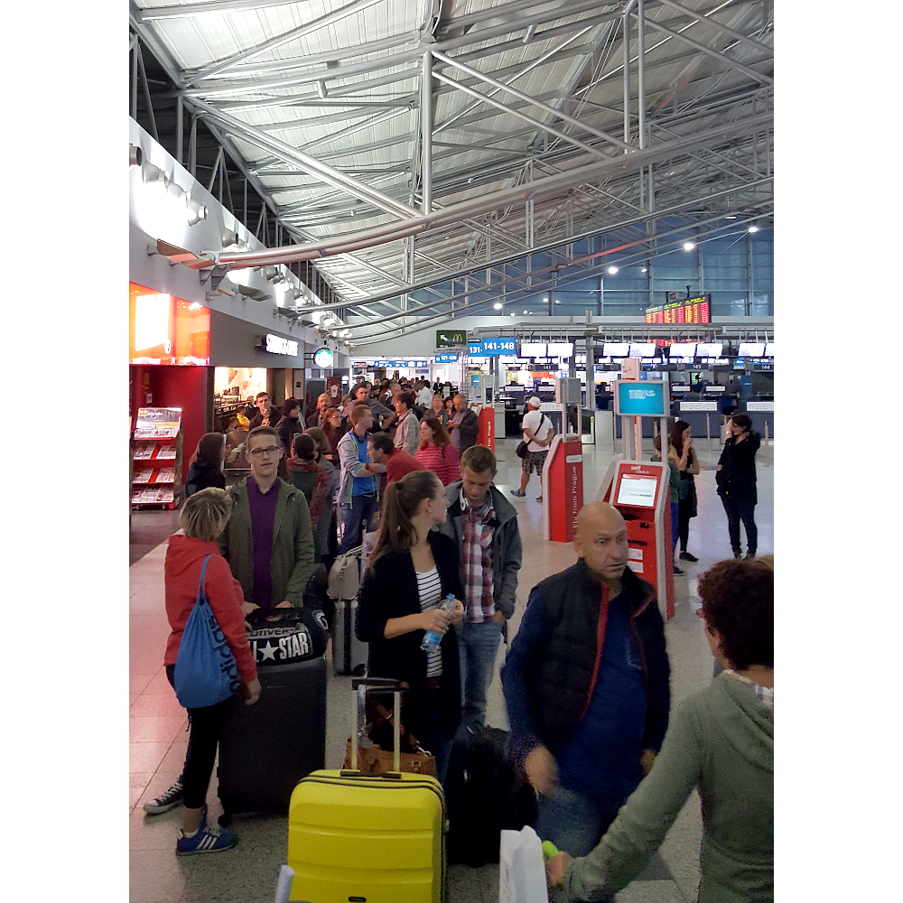
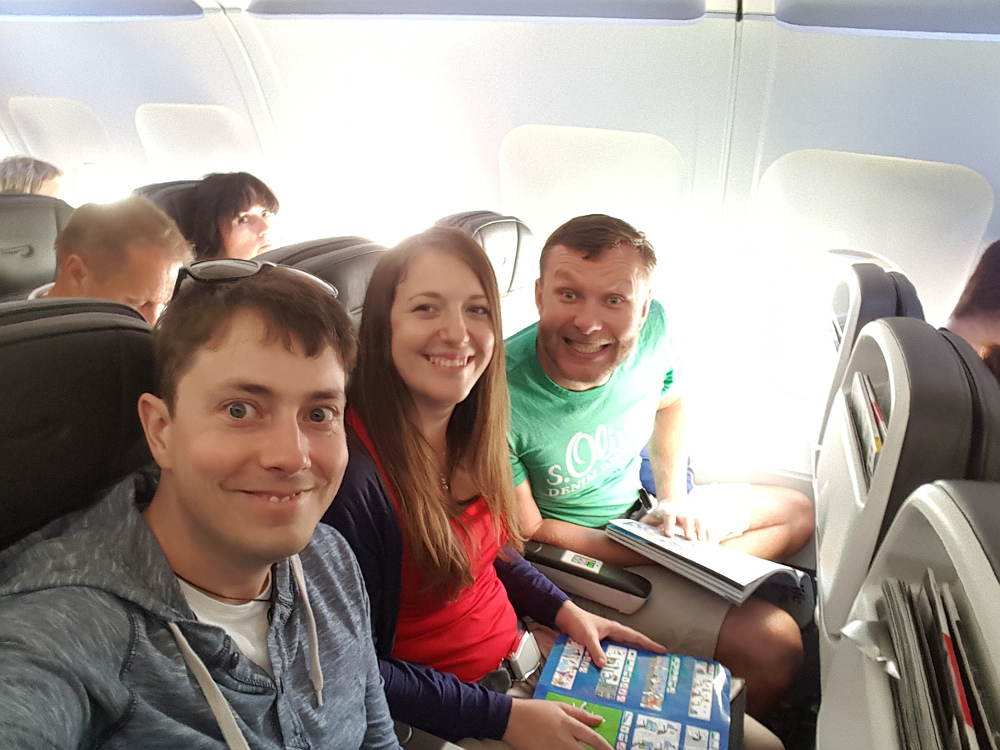
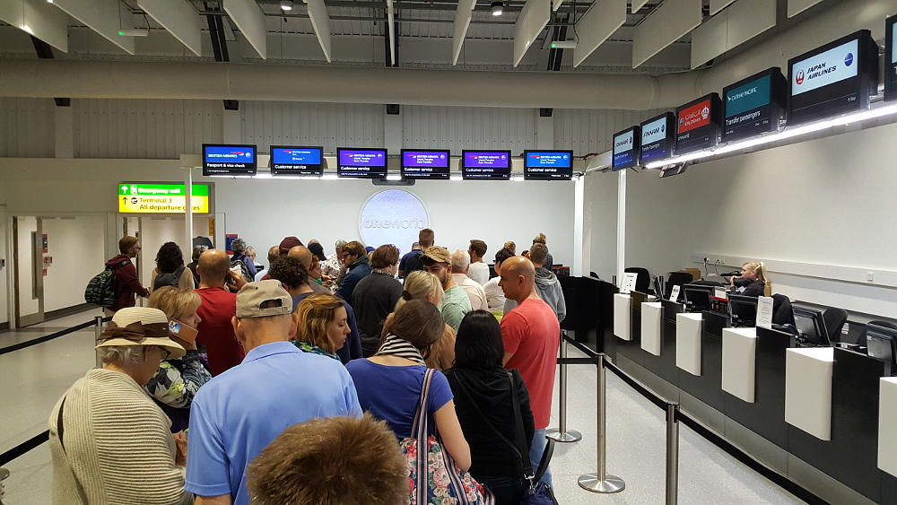
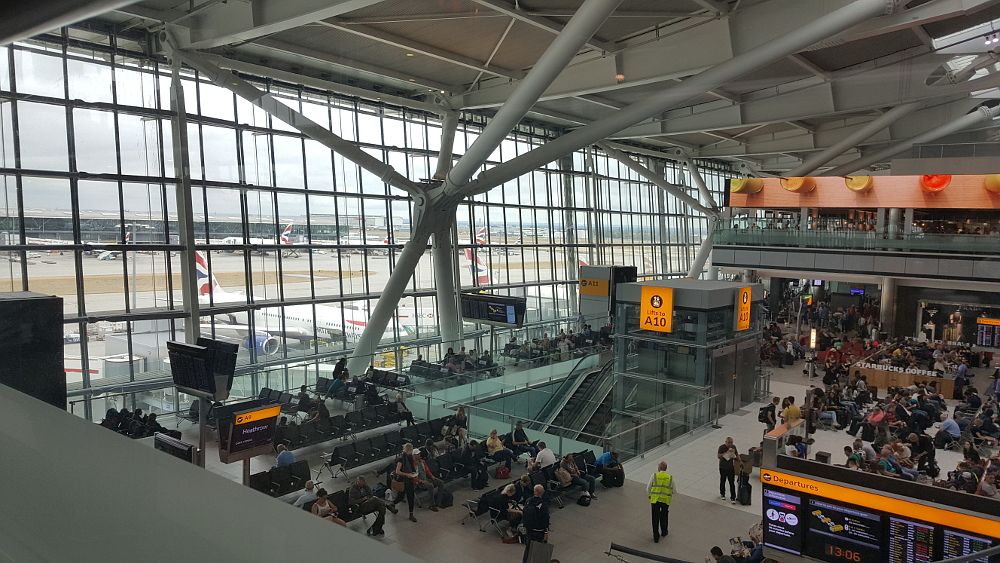
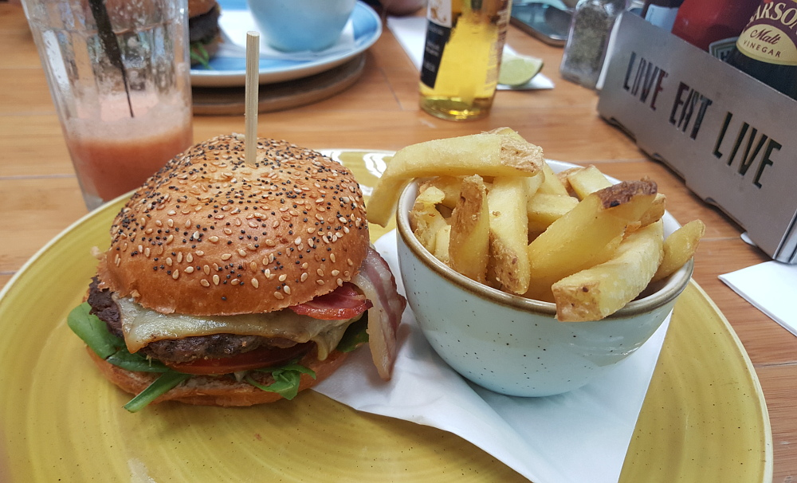
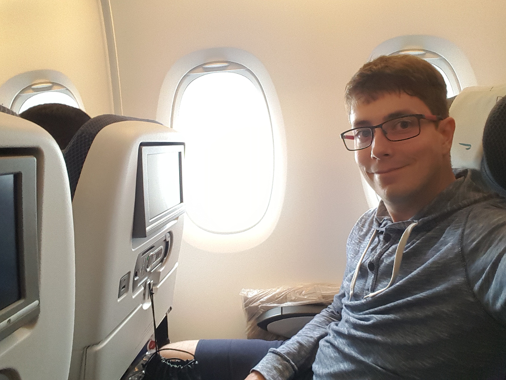
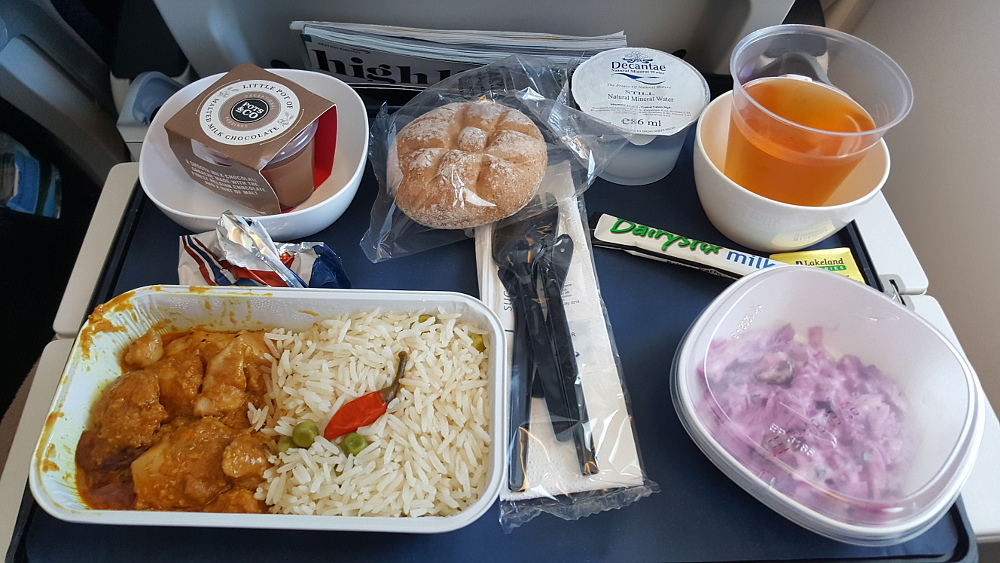
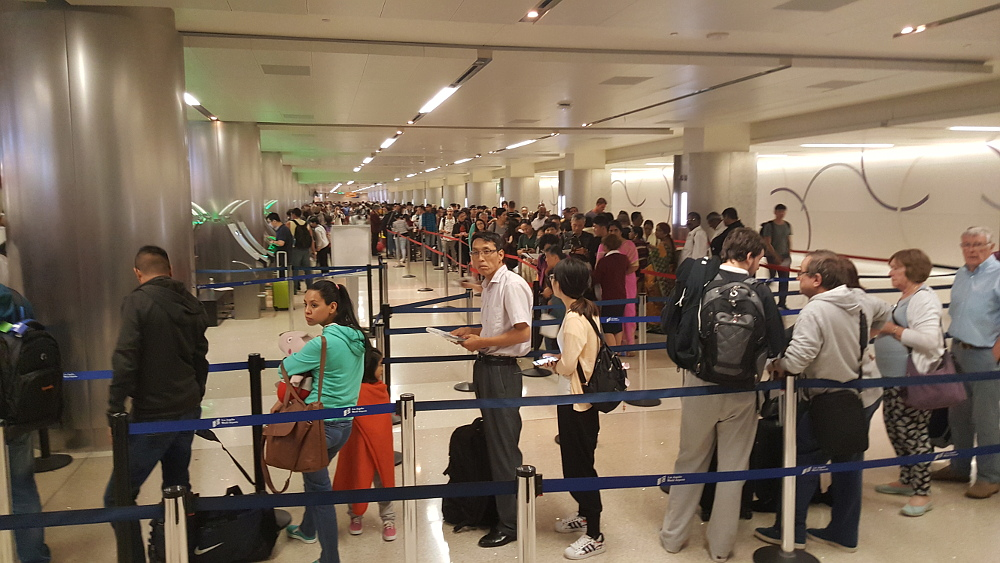
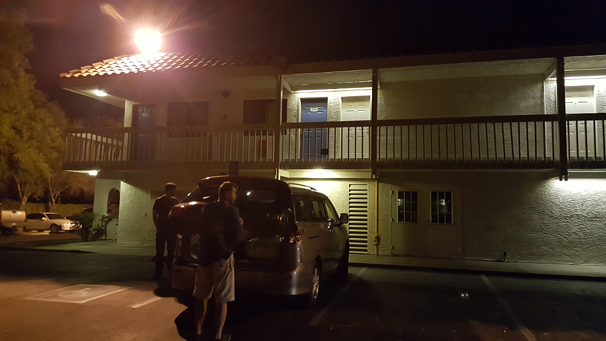

# 6.9.2016 - Vážení "před", přílet do USA se zpožděním

## 3:30

Vstáváme.

Vážím se na váze, abych, až se vrátím, věděl, kolik jsem v USA přibral. Váha ukazuje 80,4 kg.

Snídáme a jedeme na letiště.

## 4:30

Parkujeme na letišti Václava Havla v Praze. Vykládám kufr z auta a pak míříme do letištní haly zahřát se.

Vyhlížíme zbytek výpravy - Čermise s Renčou a Borise. Mezitím si nechávám zabalit kufr do fólie, aby se během přepravy nepoškodil či nezašpinil. Během balení se objevují Čermis s Renčou s ospalým úsměvem na tváři. Přiznávají se k tomu, že jsou v Praze už od včera a že noc přespali tu v hale. Po vzájemném představení s Kseniou se stavíme do pomalu se prodlužující fronty u odbavení. Odlétat do Londýna bychom měli v 6:50.

Dozvídáme se, že společnost British Airways, se kterou máme dnes letět, má zásek v počítačovém systému a odbavení tudíž bude zdrženo.

Loučím se s Kseni a smutně koukám, jak prochází kolem fronty lidí a opouští letištní halu a sama míří domů dospat dnešní spánkový deficit. Příští 3 týdny se spolu neuvidíme.

## 6:00

Fronta za námi roste.

## 7:05

15 minut po původním plánovaném odletu našeho letadla do Londýna se konečně dostáváme na řadu k odbavení a k palubním lístkům. Naše letadlo do Londýna má zpoždění a je možné, že náš let z Londýna do Los Angeles nestihneme.

##  8:30

Konečně jsme všichni, Čermis s Renčou, Boris i já na palubě našeho letadla do Londýna.

## 8:51

Odlétáme z pražského letiště s dvouhodinovým zpožděním, takže náš přípoj do Los Angeles v Londýně určitě už nestihneme.

## 10:55 -> 9:55

Přistáváme v Londýně. Naše letadlo mělo odlétat do Los Angeles v 9:45, ale je také zpožděno z důvodu záseku počítačového systému, který, jak se ukazuje, ovlivnil lety společnosti British Airways na celém světě. Bohužel, jeho zpoždění není dostatečné na to, abychom ho stihli, tak pospícháme na zákaznické centrum, pro náhradní let.

## 10:30

Stavíme se do fronty u zákaznického centra British Airways.

Při čekání ve frontě a brouzdání na internetu zjišťujeme, že díky zpoždění máme podle evropské směrnice nárok na náhradu a kompenzaci od aerolinek, tak, zatímco stojíme ve frontě, zkoumáme naše možnosti, jak si tu náhradu u British Airways nárokovat.

## 11:50

Přicházíme na řadu a dostáváme náhradní let do Los Angeles, který odlétá v 16:10.

Míříme tedy k autobusu, který by nás měl dovézt k Terminálu č. 5, a tam se stavíme do další fronty.

## 12:10

Po další celní a bezpečnostní prohlídce vstupujeme do odletové haly letiště, kde budeme čekat následující 4 hodiny. Hledáme tedy nejprve místo, kde se najíme.

## 12:45

Usedáme ke stolu v místní restauraci Giraffe s výhledem do odletové haly a dáváme si tu první burger naší výpravy.

Po jídle si jdeme najít místo v odletové hale. Po usednutí brouzdáme internetem a zjišťujeme naše možnosti, jak nárokovat kompenzaci od British Airways za zpoždění. Čermis na webu aerolinek nalézá patřičný formulář, který všichni postupně za sebe vyplňujeme a odesíláme ke zpracování.

## 15:15

Už jsem na cestě k našemu letadlu.

## 16:00

Jsme konečně na palubě letadla a čekáme, až se vydá na cestu přes Atlantik.

## 16:30

Letadlo se dává do pohybu a roluje na dráhu.

## 16:40

Zvedáme se ze země a opouštíme tak evropský kontinent.

## 18:40

Dostávám večeři na palubě letadla.

## 3:25 -> 19:25

Přistáváme na mezinárodním letišti v Los Angeles.

## 19:40

Stavíme se do další velké fronty, tentokrát na vstupu do USA.

## 20:30

Stále jsme ve frontě na vstupní kontrolu, ale už se blížíme k našemu odbavení, které je na dohled. 

## 21:20

Po úspěšné vstupní kontrole jedeme letištním autobusem do autopůjčovny Thrifty Car Rental, kde máme rezervované auto. Tam se stavíme do další fronty.

## 22:50

V půjčovně dostáváme na výběr z několika možností aut z kategorie minivan, a tak si několikaminutové prohlídce aut zaparkovaných na parkovišti volíme Nissan Quest, který nám nabízí nejvíce pohodlí a prostoru.

Projíždíme branou parkoviště a míříme k našemu ubytování, kterým je Motel 6 ve městečku Pomona na hranici Los Angeles. Řízení se ujímá Boris. Seznamuje se s ovládáním a automatickou převodovkou auta, což nakonec zvládá, a tak jedeme vstříc vysněné sprše a spánku vzdálených 75 km.

## 0:45

Jsme na hotelu a tak jdeme na pokoj.

## 1:45

Jsme konečně všichni v posteli, jdeme spát a tím končí náš vyčerpávající 33 hodinový den.