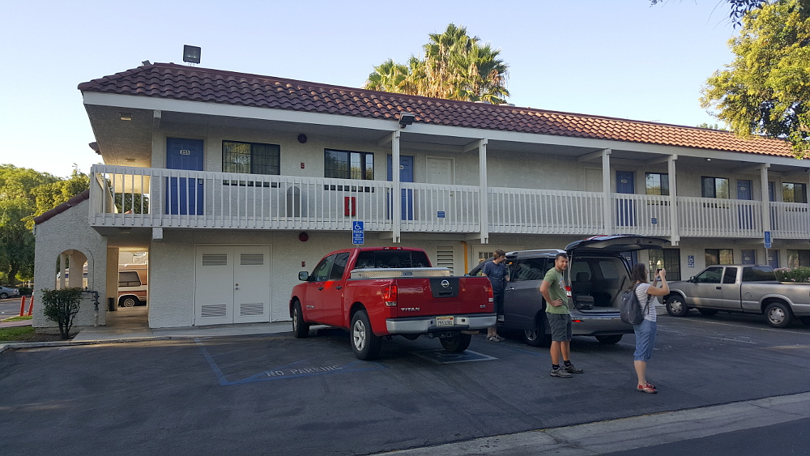
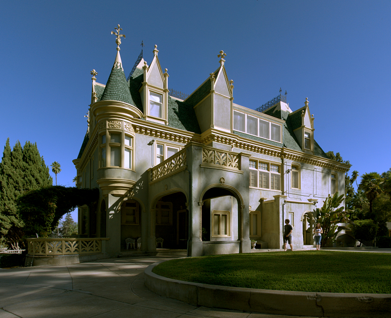
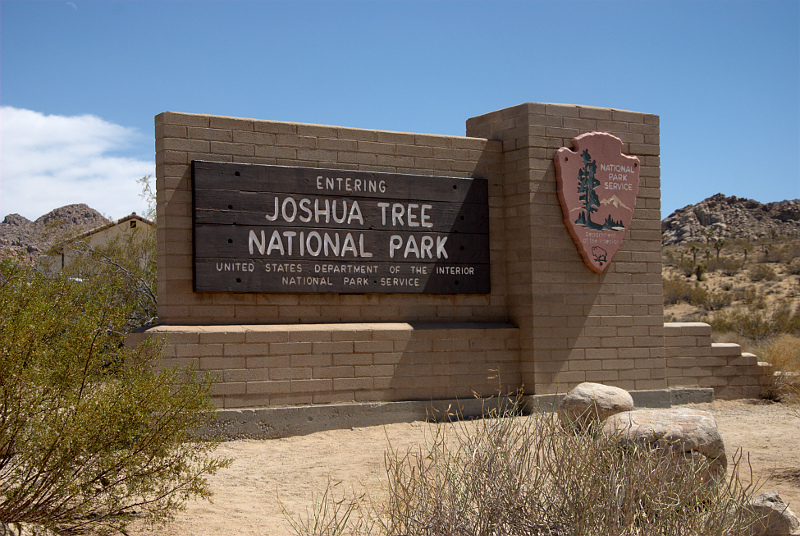
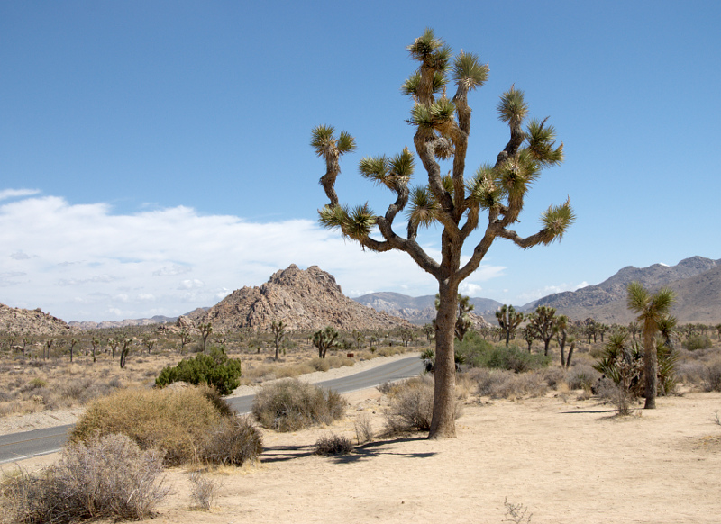
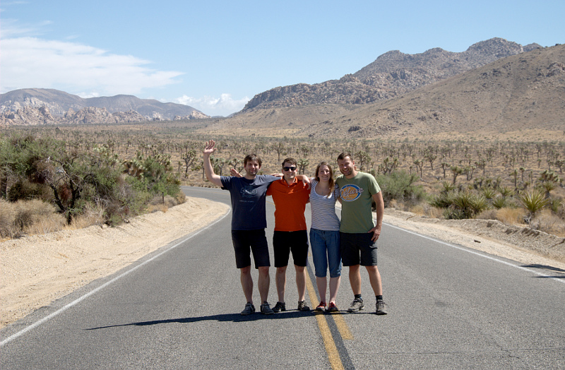
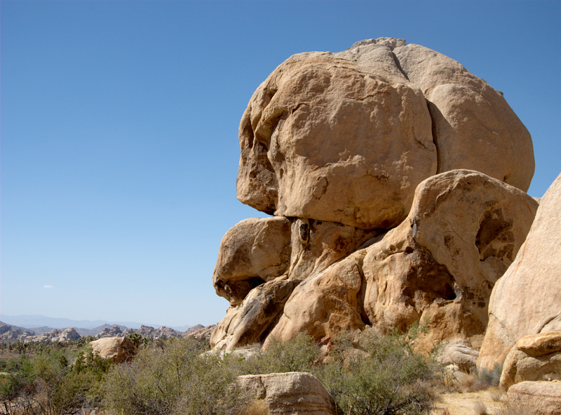
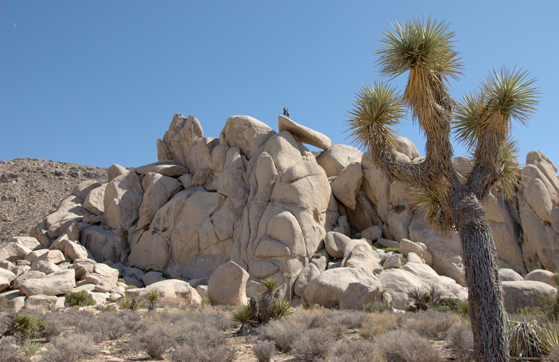
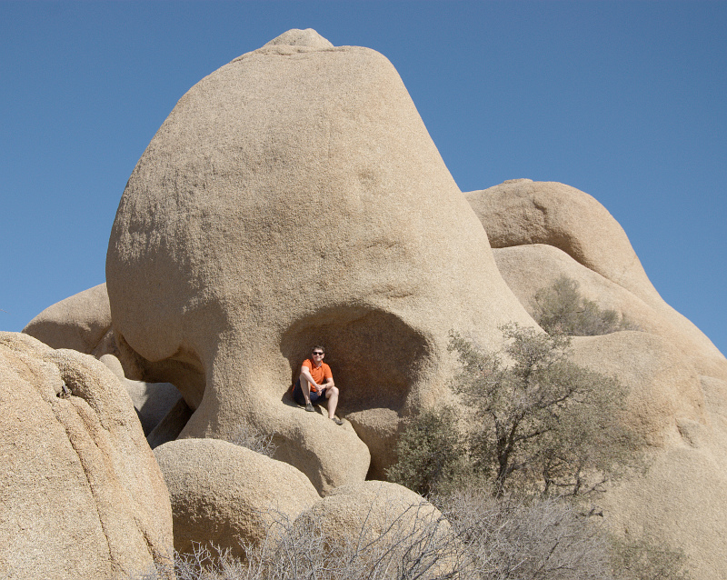
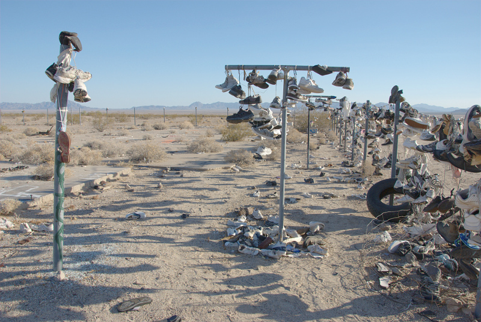

# 7.9.2016 - Vjezd na soukromý pozemek, konečně online, Joshua Tree Park 
## 6:30

Budíme se po necelých 5 hodinách spánku, protože už nejsme schopni usnout. Vydatná dávka včerejšího polospánku z letadla nejspíš přesvědčuje mozek, že se mu už nechce spát, takže kolem 7:00 společně vstáváme.

## 8:00

Opouštíme pokoj a vydáváme se na cestu za prvním cílem dnešního dne.

Volantu se ujímá Čermis, který se seznamuje s ovládáním našeho auta a všichni se bavíme tím, jak prudce mu funguje brzda, stejně jako včerejší první pokusy Borise.

## 8:30

Naším cílem se stává stará viktoriánská vila Kimberly Crest z 19. století, která stojí na 1325 Prospect Drive, v městečku Redlands ležícího na naší cestě do Joshua Tree Park.
   
Dílčím úkolem se stává návštěva obchodního domu, abychom tam nakoupili stany, karimatky a jiné zásoby, které nám chybí. Já si dávám za úkol najít pobočku T-Mobile, kde si chci koupit místní SIMku s internetem.

## 9:00

Přijíždíme k vile a díky zlepšujícím se navigačním schopnostem Renči a navigace v mobilu vjíždíme přes zákaz vjezdu a po chvilce i druhý přímo před hlavní vchod vily, zaznívá "Tam tudy přeci nemůžeš!" a Čermis pravdivě odpovídá "Jinudy to nejde!" a tak tedy vjíždíme na verandu a dále.

Naše jízda končí v úzkém místě, kde mezi plotem a autem místních obyvatel zaparkovaným naproti není dostatek místa pro naše auto, tak Čermis obratně couve a parkuje na dvoře před vilou. Vystupujeme z auta a prohlížíme si krásnou vilu a její okolí. Po chvíli si všímáme šedých veverek a diskutujeme o tom, jestli jsou přerostlé a vykrmené, nebo jen jiného druhu, než jsme zvyklí z Evropy.

Odjíždíme se skvělým zážitkem plným adrenalinu a vzpomínek na krásnou viktoriánskou vilu.

## 10:30

Nacházíme obchodní dům Redlands Mall, kde chceme nakupovat zásoby, ale zjišťujeme, že většinu toho, co potřebujeme tu nemají. Nacházím tu ovšem pobočku T-Mobile a kupuji si tedy SIMku s místním číslem a tarifem s internetem.

Perličkou momentu se stává objev českého taveného sýra Veselá kráva mezi luxusními sýry.

## 11:00

Vyrážíme směr národní park Joshua Tree.

## 12:15

Nacházíme velké obchodní centrum Walmart Supercenter, kde konečně nakupujeme stany a zásoby a náhodou zde potkáváme mladý český pár, který je tu také na dovolené.

Po nákupu ve Walmartu nám už zbývá pouhých 5 km do parku Joshua Tree.

## 13:20

Vjíždíme do parku Joshua Tree a od milé paní u brány se dozvídáme, že je zde možné i kempovat. Všichni se shodujeme, že na takovém vyprahlém místě by se nám kempovat nechtělo.

Krátce po vjezdu se otevírají nádherné pohledy na krajinu plnou mohylových vrchů a stromů Joshua Tree, které jak zjišťujeme nejsou ve skutečnosti stromy, ale juky krátkolisté.

Potkáváme dva německé turisty, kteří nám pořizují společnou fotku. Dozvídáme se, že onen němec před 4 lety byl v Praze a moc se mu tam líbilo.

## 14:40

Zastavujeme se u většího kopečku, kde se Čermis s Borisem rozhodují vylézt na vrch a užít si výhledu. V Renče klíčí nervozita a přeje si, aby už byl Čermis v pořádku dole.

Chystám se kluky vyfotit a zatímco čekám dole, objevuji skálu ve tvaru hlavy indiána.

Vše dopadlo dobře, takže jedeme dál.

## 15:20

Zastavujeme se u skály ve tvaru lebky, kde se rozhoduju nechat se vyfotit v jejím očním důlku a Renče se daří záběr, ve kterém není ani jeden z mnoha přítomných turistů.

## 15:50

Opouštíme Joshua Tree Park a naším novým a dnes již konečným cílem se stává městečko Flagstaff, kde chceme přenocovat.

Potřebujeme tankovat benzín a tak nacházíme benzínku K-Mart, kde zjišťujeme, že nevíme, na co naše auto jezdí, a tak hledáme štítky po autě, v návodu, v techničáku, ale nikde nic. Nakonec Boris volá do autopůjčovny, kde nám potvrzují naše podezření - auto jezdí na benzín.

## 16:25
 
Začíná naše cesta do Flagstaffu. Chvíli po začátku této etapy naší cesty se zastavujeme pro panoramatické foto a po chvilce potkáváme kojota, který na nás zvědavě kouká na kraji silnice.

Cestou rezervuji hotel ve Flagstaffu - Mountain View Inn. Během vytváření rezervace volím čas příjezdu na dobu kolem 23:00, načež nám Booking v potvrzení sděluje, že nejpozdější možný termín je do 21:00. Po krátkém telefonátu do hotelu máme potvzený pozdější příjezd, jedeme s klidným srdcem a začínáme se těšit na postel.

## 17:30

Děláme si malou zastávku u zvláštního místa, které je opuštěné a je plné starých párů bot pověšených za tkaničky na zbytcích plotu.

Cestou si Čermis pouští Výlet pana Broučka na Měsíc, což většinu ostatní posádky auta bezpečně uvede do šlofíkového režimu.

## 18:40

Opouštíme Kalifornii na hranících s Arizonou přes řeku Colorado.

Kousek za hranicemi se stavjeme na pauzu na kafe a svačinu v místě zvaném Pilot Travel Center.

## 19:20

Svačina končí, přebírám klíčky od auta a na zbytek cesty do Flagstaffu řídím já.

## 22:30

Konečně přijíždíme do Flagstaffu, kde vlivem únavy marně hledám spojku a řadící páku, abych na křižovatce před benzinkou vyřadil, což naši cestu o kousem prodlužuje o pár mil zajížďky, ale nakonec se vracíme k benzince, kde ještě tankujeme benzín a pak už si to šineme rovnou k hotelu.

Check-in probíhá během 3 minut a konečně se všichni blížíme ke sprchám a ke svým postelím.

## 00:20

Zhasínáme a jdeme definitivně spát.