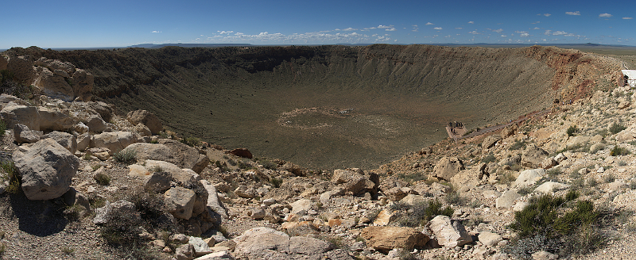
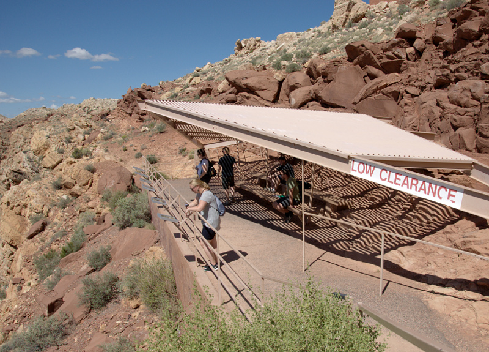
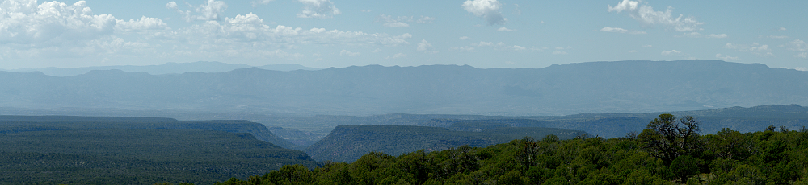
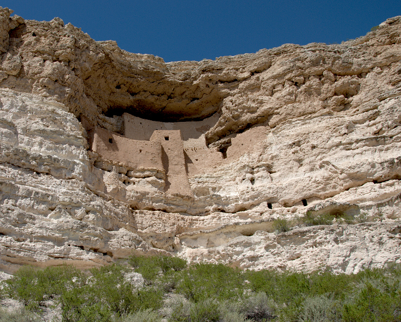
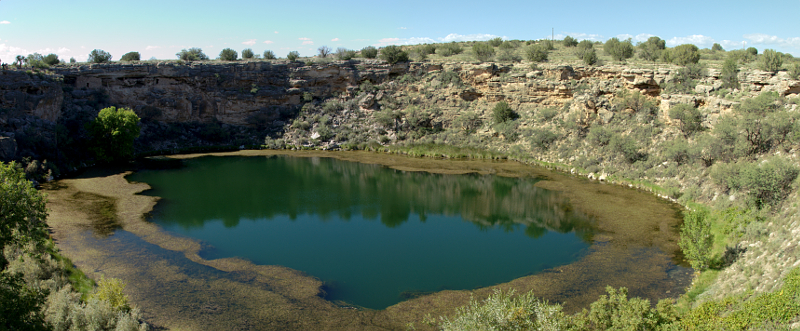
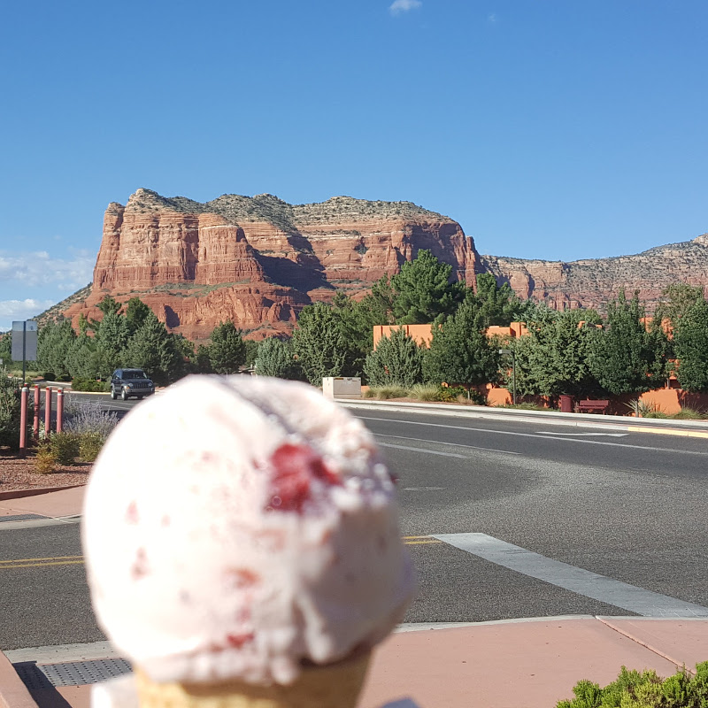
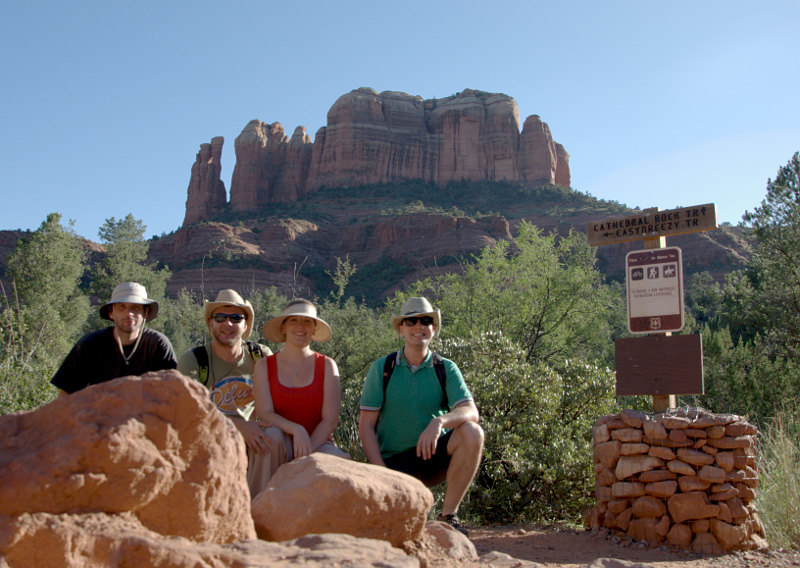
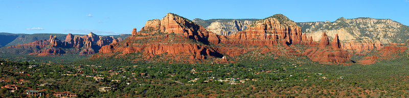
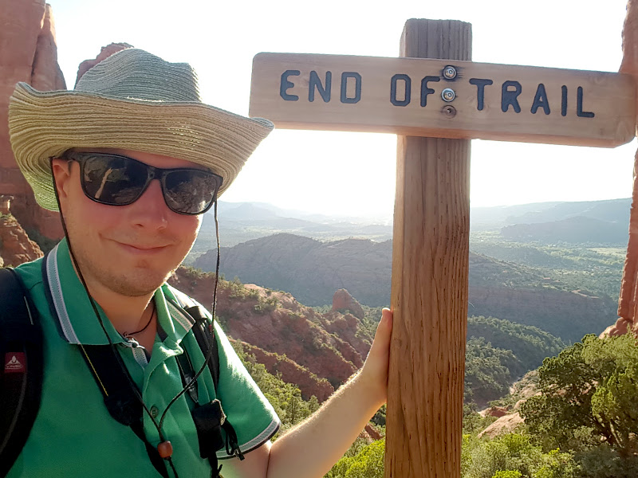

# 8.9.2016 - Vlak ve Flagstaffu, kráter po meteoru, Montezuma Castle, Montezuma Well, Cathedral Rock

## 06:30

Vstáváme a sdělujeme si svoje dojmy a zážitky z noci, kdy nás pravidelně budil nákladní vlak, jehož trať vede přímo za zdmi hotelu, a strojvedoucího, který k tomu ještě intenzivně houkal. Dalším rušivým elementem během noci byl hukot odsávání v koupelně, kdykoliv šel někdo v noci na záchod.

## 7:30

Čermis s Renčou se rozhodují ulovit nedalekou kešku (GeoCaching) a vydávájí se pro ni.

## 8:00

Čermis s Rečou se vracejí s tím, že kešky našli a ulovili hned dvě, což se projevilo na velmi usměvavé náladě Renči.

Balíme věci, nakládáme do auta a míříme za naším dnešním prvním cílem, kterým je [kráter po dopadu meteoru v Arizoně](http://meteorcrater.com/).

## 8:20

Cestou, ještě ve Flagstaffu nakupujeme zásoby v místním obchodě, kde jsme velmi příjemně překvapeni přívětivostí a příjemným přístupem obou prodavačů.

## 8:30

Jsme na cestě ke kráteru a kocháme se z auta krajinou, která je velmi odlišná od Mohavské pouští, kterou jsme viděli včera. Je tu spoustu stromů, a krajina připomíná českou vysočinu.

## 9:00

Blížíme se ke kráteru krajinou, které je jedna velká placka, a na horizontu už vidíme jasné obrysy kráteru.

## 9:10

Přijíždíme do návštěvnického centra, kupujeme vstupenky a prohlížíme si, co si tu pro nás připravili. To nás přivádí do obchodu se suvenýry, kde kupujeme magnetky na lednici jako suvenýr.

Prohlížíme si připravenou poučnou výstavu a pak se konečně jdeme podívat na samotný kráter.

Zatímco já zběsile fotím, zbytek se prochází po připravených betonových cestách.

## 10:30

Scházíme se ve stínu na malém odpočívadle, které je uvnitř kráteru pod úrovní jeho horizontu. Žasneme nad nesmírným tichem a klidem, kterým vnitřní prostor kráteru velmi silně působí.

## 11:00

Protože jsme ke vstupnému dostali poukaz ja jedno cookie ke koupi sendviče v místní pobočce Subway, rozhodli jsme se, že dnešní oběd vyřešíme zde. Vychází najevo, že pro všechny až na mě je to vůbec první návštěva Subway. Po snedení veškerého jídla jsme všichni spokojeni.

## 11:30

Po obědě vyrážíme k našemu dnešnímu druhému cíli - národnímu monumentemu [Montezuma Castle](https://www.nps.gov/moca/index.htm). Cesta k němu vede zpět do Flagstaffu a pak dále k městečku Camp Verde, poblíž něhož se monument nachází.

U Flagstaffu nás trochu trápí navigace, ale nakonec správnou cestu přeci jen nacházíme.

## 12:45

Cestou se zastavujeme na scénické vyhlídce na údolí Oak Creek.

## 12:50

Jak jedeme dále, otevírá se nám pohled na rudé skalní útvary a autem se ozývá první "wow", které nám vydrží až do večera.

## 14:00

Přijíždíme k monumentu Montezuma Castle a v návštěvnickém centru kupujeme klobouky proti slunci a magnetky na lednici a míříme rovnou k samotnému monumentu.

U něj potkáme čiperného staříka, který tu jako dobrovolník působí jako průvodce a ochotně a s úsměvem nám vypráví historii i fakta ohledně indiánů, kteří zde kdysi žili. Onen monument je totiž obydlím indiánů, kteří ho vybudovali ve skále a jeskyních - tzv. pueblo. Velmi příjemný pán.

## 15:00

Jedeme se podívat k dalšímu pueblu, tentokrát vybudovanému na přírodní vodní nádrži v jámě v zemi, kterou indiáni používali jako studnu, nese název [Montezuma Well](https://en.wikipedia.org/wiki/Montezuma_Well).

## 15:30

Míříme k dalšímu dnešnímu cíli, k rudým skalním útvarům [Catedral Rock](https://en.wikipedia.org/wiki/Cathedral_Rock) u městečka Sedona.

## 15:40

Cestou se stavujeme v obchůdku Dollar General, kde kupujeme mimo jiné zásoby vody na dalších pár dní.

## 16:25

Dáváme si pauzu v městečku Village of Oak Creek, kde si na dohled na Cathedral Rock dáváme kafe, zmrzlinu a nějaký ten zákusek.

## 16:45

Pokračujeme v cestě.

## 16:50

Přijíždíme ke Cathedral Rock, parkujeme a žasneme nad jeho přírodní krásou.

Vydáváme se na trail, který by nás měl dovést za místo s širokou vyhlídkou do okolí, na kterou se moc těším, že ji si ji vyfotím při západu slunce.

Renča na půli cesty pro nevhodné kalhoty zastavuje s tím, že tu na nás počká.

Zkoušíme fotit otevírající se scenérie mobilem, který ovšem takové světelné podmínky nezvládá. Porovnáváme ho s mojí zrdaclovkou a těšíme se na výsledné fotky, až je "vyvolám".

## 17:40

Docházíme na konec trailu, kocháme se výhledy po krajině a shodujeme se na tom, že náročný výstup stál za to.

Teď už nás čeká jen cesta dolů k autu a opakované pohledy do zeleného údolí poseté rudými skalami zalitými zapadajícím sluncem.

## 18:20

Vracíme se k autu, kde zjišťuji, že jsem se cestou otřel o kaktus. Vytahuji ze zadní části svého boku spustu malých trnů.

Čermis se rozhodl zkusit najít kešku, je-li tu někde schovaná, a tak se mu snažím sdílet internet ze svého mobilu, ale marně hledáme silnější signál. Po 10 minutách myšlenku kešky opouštíme a vyrážíme zpět do Flagstaffu, kde nás už čeká sprcha, jídlo a postel.

## 18:40

Cesta nás vede přes kaňon Oak Creek Canyon, který nás všechny udivuje, až na Renču, která ve vzrůstajícím šeru šeroslepne a přestává vidět detaily.

## 19:00

Končí rudé skály a začíná prudké stoupání serpentinami z kaňonu.

## 19:30

Přijíždíme k našemu dnešnímu motelu Super 8 ve Flagstaffu.

## 20:30

Po povinné sprše všech zúčastněných vyrážíme ven za vidinou burgeru, který si nacházíme ve fast foodu Jack in the Box.

K burgeru si dáváme každý jiný nápoj na zkoušku a Čermis zjšťuje, že root-beer není nic dobrého. Zkoumáme jeho chuť a docházíme k názoru, že připomíná kolu s kuličkovými žvýkačkami, které si pamatujeme z dětství.

## 21:45

Vetšina jde spát, zatímco já ještě pracuji na fotkách a deníku.

## 23:00

Jdu konečně taky do postele a tím končí náš dnešní den.