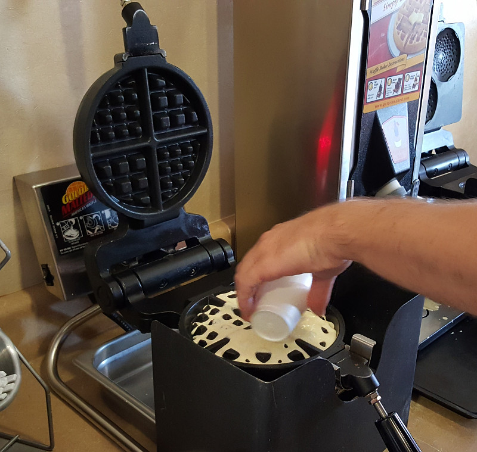
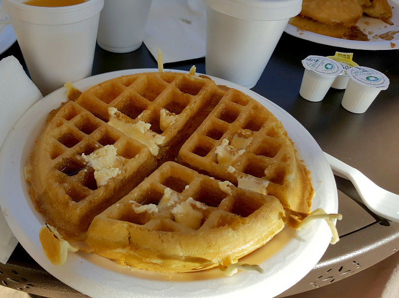
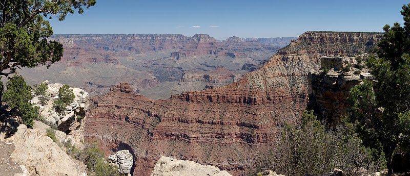
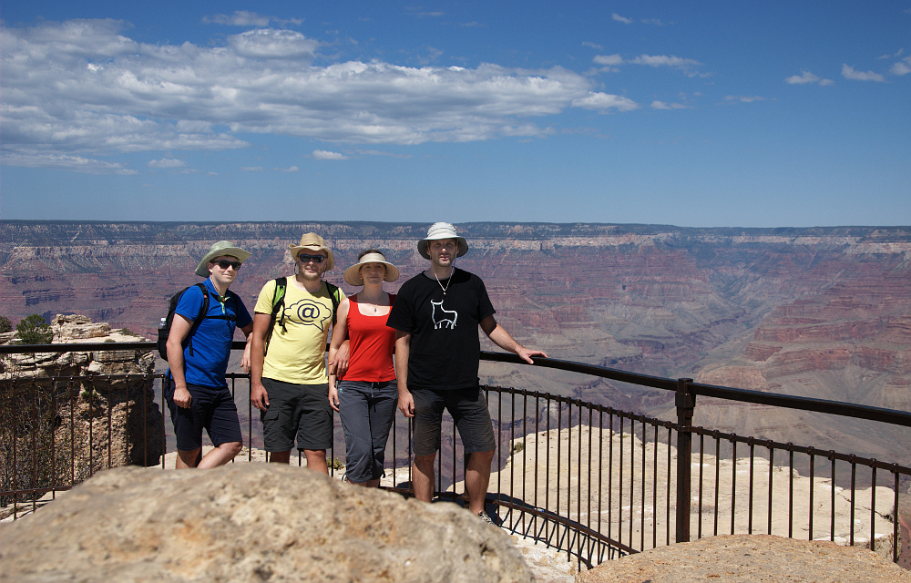
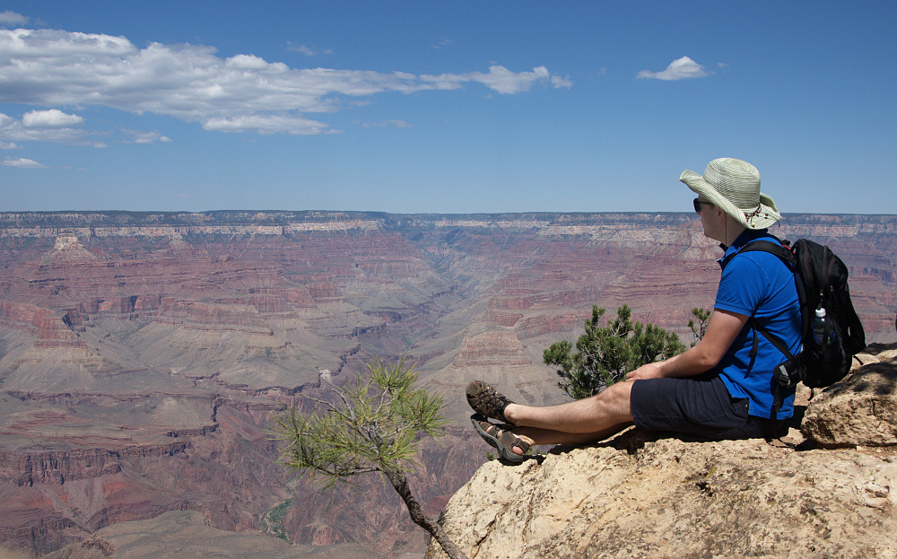
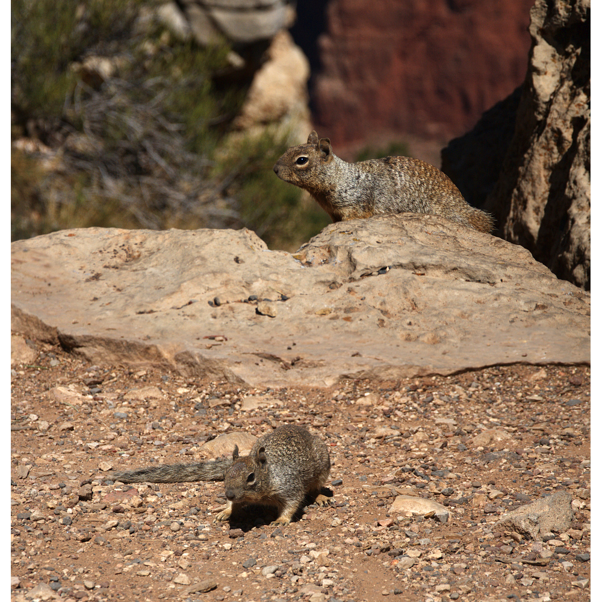
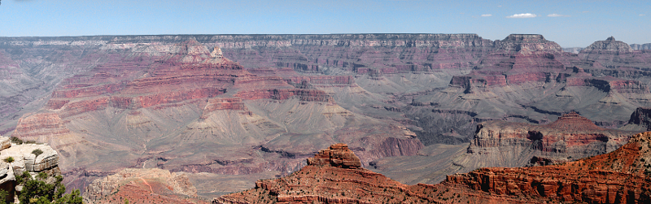
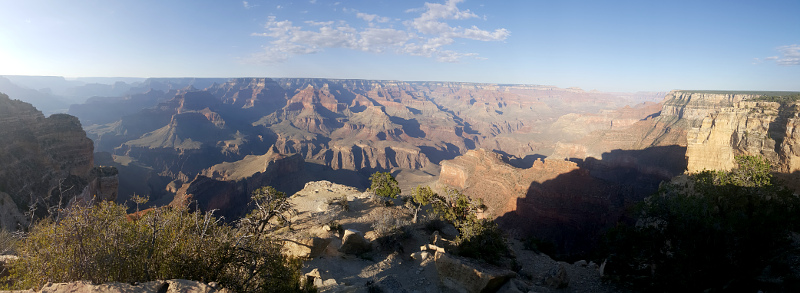

# 9.9.2016 - Grand Canyon, první stanování

## 7:40

Vstáváme.

## 8:20

Jdeme na snídani, kterou nám připravili v motelu. Snídaně je připravena ve vestibulu motelu a nacházíme tu horkou kávu, studené mléko, jablečný a pomerančový džus a co se nám líbí nejvíce, vaflovač a nádrž s dávkovačem vaflového těsta.

Z toho si připravujeme čerstvé vafle a poléváme je připraveným javorovým sirupem.

U snídaně začínáme plánovat náš den. Hlavním a jediným cílem je Grand Canyon a vodopád Havasu Falls.

## 9:00

Stále plánujeme cestu s tím, že vodopád vynecháme vzhledem k tomu, že je sucho a je pravděpodobně bez vody a také proto, že cesta k němu by nám zabrala příliž mnoho času, který jsme chtěli věnovat Grand Canyonu.

Hledáme také ubytování na večer kolem města Page. Z nabídek ubytování na internetu zjišťujeme, že ubytování formou motelu je v dané oblasti pro nás příliž drahé, a tak se rozhodujeme, že dnešní noc strávíme ve stanu v některém z kempů.

## 10:15

Opouštíme motel, klíčků od auta se ujímám já, a tak se vydáváme na cestu ke Grand Canyonu.

## 10:30

Zastavujeme se u benzínky Safeway ve Flagstaffu a tankujeme plnou nádrž.

Pokračujeme v cestě.

## 12:00

Po klidné a příjemné cestě krajinou vysočiny plné borovic projíždíme vstupem do Národního parku Grand Canyon.

Hledáme místo k zaparkování, míjíme ceduli, na které je uvedeno, že všechna místa u parkoviště 1-2, ke kterému jsme dojeli, jsou plná a že máme pokračovat k parkovištím A, B nebo C. I přes varování vjíždíme na parkoviště 1 a zkoušíme najít volné místo pro naše auto. Nacházíme jich hned několik a tak na jednom z nich parkujeme.

## 12:10

Rozhodujeme se, že se vydáme pěšky cestou Rim Trail, která vede po okraji kaňonu a kde na několika místech jsou zastávky kyvadlového autobusu místní červené linky, takže máme jistotu pro případ, kdy by nám došly síly. Můžeme pak dojít na nejbližší zastávku, z níž by nás autobus, který jezdí každých 10-15 minut, odvezl zpět k autu.

## 12:50

Vstupujeme do místního návštěvnického centra, kde kupujeme magnetky na lednici jako suvenýry. Poté už se vydáváme na cestu podél okraje kaňonu.

Hned první pohled, který se otevírá asi po 5 minutách chůze z návštěvnického centra, nás ohromuje svou krásou. Kaňon je tak hluboký a široký, že naše oči už nejsou schopny vnímat a trojrozměrnost vzdálených stěn.

Připravuji svůj foťák pro použití dálkové spouště, a tak si pořizujeme naši první společnou fotku u Grand Canyonu.

Poté už jdeme po cestě dál.

Všude kolem jsou vidět cedule se zákazem krmění či dokonce přibližování se k divoké přírodě. Ta se tu ukazuje všudypřítomnými veverkami.

## 15:30

Zastavujeme se v Bright Angel Lodge v restauraci postavené přímo u kaňonu, kde si všichni dáváme hovězí burger dle vlastního výběru. Funguje to tak, že si k masu volíme typ žemle, sýru, omáčky, přílohy a dodatečné chuťové vložky. Pro sebe volím ciabattu, cheddar, BBQ omáčku a salát z čerstvé zeleniny s dresinkem, který nese název restaurace. Ostatní si také sestavují svůj burger.

Největším hitem se stala omáčka chimichurry, kterou si ke svému burgeru objednala Renča.

## 16:40

Končíme oběd, platíme a odcházíme z restaurace na další prohlídku Grand Canyonu.

## 17:00

Nastupujeme na autobus červené linky a necháme se odvézd k vyhlídce Power Point.

## 17:30

Po prohlídce kaňonu z vyhlídky nastupujeme na další autobus červené linky a jedeme k další vybrané vyhlídce - Hopi Point, které by mělo být nejbližším místem, kde je v kaňonu vidět řeka Colorado, která pomohla kaňon vytvořit a protéká jím.

## 17:45

Bereme si další autobus, tentokrát k vyhlídce Pima Point.

Cestou v autobuse obdivujeme řidiče, sympatického a příjemného staříka, kterého jeho práce evidentně baví. Vzpomínáme na prodavače z obchodu ve Flagstaffu, kteří byli stejně zapálení do své práce a srovnáváme je s prodavači v ČR, kteří bývají už od začátku nepříjemní, na rozdíl od těch, co jsme viděli včera. Boris prohlásí hlášku ve smyslu "Sice prodávájí hovna s kečupem, ale stejně jsou příjemní a ochotní". Čermisovi se to přirovnání líbí tak, že se směje.

## 18:25

Míříme autobusem na konečnou vyhlídku, Hermits Rest, kde máme 10 minut, než pojede zpět. Začíná už zapadat slunce.

## 18:45

Jedeme zpátky k autu a všichni v autobuse, včetně nás se snaží z jedoucího autobusu přes okénka vyfotit západ slunce nad Grand Canyonem.

## 19:00

Nastupujeme do autobusu modré linky, který nás už odveze přímo k mávštěvnickému centru, kde máme auto.

Lidé nastupují do autobusu v hojném počtu a řidič nejprve žádá, aby se ti, co už jsou vevnitř, posunuli hlouběji, aby mohli lidé venku také nastoupit. Pak varuje, že pokud tak neučíní, začne zpívat. Za 2 minuty se z reproduktorů uvnitř autobusu ozývá jeho zpěv :)

## 19:30

Přicházíme k autu a měmíme plán na nocleh ve stanu buď v kempu přímo zde v národním parku (Grand Canyon Mother Campground), nebo v tom, který je vně kousek za hranicemi u městečka Tusayan jménem Camper Village, pokud by ten místí měl plno.

Ukazuje se, že plno má, tak jedeme ke Camper Village.

## 20:00

Přijíždíme ke kempu, chvilku čekáme na obsluhu na recepci a pak se registrujeme (2 stany + auto).

## 20:20

Parkujeme auto na nám přiděleném místě a stavíme stany.

## 21:30

Postupně zalézáme do stanů, abychom mohli vstřebávat dnešní zážitky a vyspat se na zítřek.