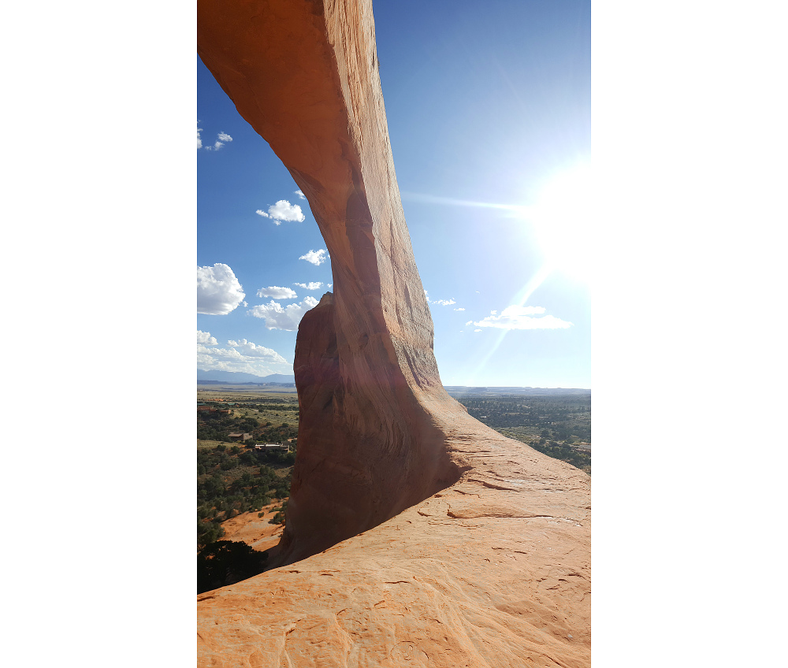

# 11.9.2016 - Národní park Canyonlands, Newspaper Rock, Wilson Arch, Moab

## 7:20

Vychází slunce mezi mraky a hrozí, že dnes bude oblačno.

## 9:10

Všichni společně vstáváme.

## 9:40

Společně odcházíme do vestibulu hotelu, kde na nás čeká snídaně připravená hotelem.

## 10:35

Máme sbaleno a odjíždíme k našemu dnešnímu cíli, kterým je národní park Canyonlands a cestou k archeologické zajímavosti a záhadě, Newspaper Rock.

Klíčků od auta a řízení se pro dnešek ujímá Boris.

## 10:40

Stavujeme se v místním obchodě pro zásoby vody.

Uvědomuji si, že jsem na hotelu v lednici zapomněl svoje balení jerky, a tak se vracíme.

## 11:00

Jsme zpět u hotelu, kde si vyzvedávám svoje jerky, a tak se můžeme vydat na cestu.

## 11:30

Ve městečku Monticello se zastavujeme u benzínky Shell, kde tankujeme benzín a kupujeme si kafe na cestu.

## 12:20

Přijíždíme k Newspaper Rock a prohlížíme si nepochopitelné výjevy zaznamenané do skalní stěny.

Zde mezi dalšími návštěvníky potkáváme starší pár z Brna, který je tu taky na výletě, svět je vskutku malým místem a o náhody v něm není nouze :)

Ochutnáváme mentolky Altoids a shodujeme se, že jejich chuť a vůně připomíná Toi Toi.

## 13:15

Projíždíme vstupní branou do národního parku Canyonlands. Zaznívají obavy, zda-li nám zde platí náš Annual Pass, či jestli nebude nutné zaplatit vstup za naše auto, ale obavy se ukazují jako zbytečné, ranger v bráně nás vesele pouští dovnitř bez sebemenších problémů.

## 13:30

Zastavujeme se na první vyhlídce, na oblouk ve skále připomínající dřevěnou botu - Wooden Shoe Arch.

## 13:45

Zastavujeme podruhé, tentokrát abychom se podívali na skalní útvar připomínající slona zvaný Elephant Hill.

Chvíli zde zůstáváme. Na pár minut se vzdaluji od ostatních a vnímám a užívám si hluboký klid, hřejivé slunce a šumění větru, který se prohání mezi zaoblenými červeno-bílými skalami.

## 14:20

Dojíždíme na konec cesty autem a nastupujeme na místní pěší trail, který slibuje prohlídku místních rudých skal.

## 15:40

Vracíme se k autu, vyprahlí ale nadšení z toho, co jsme viděli.

U auta zjišťujeme, že jsou zablokované zadní dveře do kufru a nejdou otevřít. Po krátkém zkoumání přicházíme na to, že je to způsobeno skřípnutím popruhu v mechanismu zámku.

Nemá cenu to tu teď řešit, a tak jedeme dále.

## 16:05

Opouštíme národní park.

## 17:00

Zastavujeme u skalního útvaru Wilson Arch, který na nás velmi působí, a tak si ho jdeme podrobně prohlédnout a pořídit pár fotek.

## 17:25

Pokračujeme v cestě dále.

## 17:45

Přijíždíme do městečka Moab, kde hledáme místo, kde se najíme a také ubytování pro dnešní noc.

## 17:50

Nacházíme Moab Grill, který vypadá slibně, a tak se necháme usadit k rohovému stolu.

## 19:15

Velmi spokojeni a najedeni odcházíme z restaurace a začínáme se rozhlížet po dnešním ubytování. Ochutnal jsem tu podle svého plánu hotdog připravený z hovězího masa, který byl vynikající.

Městečko žije turismem, a tak najít pro nás volné místo bude výzva.

## 20:20

Po několika neúspěšných pokusech v místních hotelech končíme v chatce v místě zvaném Moab Rim RV Campark, kde dostáváme luxusní chatku se sprchou, kterou všichni rádi absolvujeme.

## 22:00

Po chvíli povídání si unavení jdeme lehnout a spát.
