# 12.9.2016 - Národní park Arches, první déšť, Dead Horse Point

## 7:15

Vstáváme, když nám vycházející slunce zalévá chatku i přes zatažené žaluzie jasným světlem.

## 8:50

Odjíždíme od kabinky, abychom odevzdali klíče a mohli se vydat na cestu. Pro dnešní den se řízení ujímá Čermis a Renča se tak stává naším palubním navigátorem a DJem.

Na recepci by nás mělo čekat překapávané kafe.

Kafe ale není tak velké, jak bychom si přáli, a tak se rozhodujeme, že najdeme nějaké místo ve městě a tam koupíme něco na zub ke snídani a také řádnou dávku kafe.

## 9:00

Dojíždíme k místní benzínce Chevron, kde si svou touhu po kávě konečně naplňujeme.

## 9:30

Nasedáme do auta a odjíždíme směrem do národního parku [Arches](https://www.nps.gov/arch/index.htm), který je naším dnešním cílem, respektive jeho [oblouky ve skalách](https://www.nps.gov/arch/planyourvisit/upload/ARCHmap.pdf). 

Projíždíme městečkem Moab, kde si Renča chce pořídit pár fotek, např. starý dřevěný dům připomínající doby divokého západu, ve kterém dnes prodávájí spotřební elektroniku :)

## 9:35

Boris s Čermisem si všímají nabídky raftů po řece Colorado, a tak se zastavujeme, aby kluci mohli zjistit více informací.

Mezitím Renča jde vyfotit další zajímavost, klasický stánek s kukuřicí, který hraje všemi barvami.

## 9:50

Kluci zjistili, že je možnost plavby raftem na 4 hodiny za $54 na hlavu, a tak diskutujeme o tom, zda-li plavbu podniknout.

Vzhledem k tomu, že je málo vody a její proud je minimální a plavba by tedy nebyla tak zábavná, se nakonec rozhodujeme, že zážitek vynecháme.

Jedeme tedy dále k národnímu parku Arches.

## 10:00

Přijíždíme ke vjezdu do parku, kde ovšem stojí skoro míli dlouhá fronta aut. Google nám sděluje svůj odhad doby strávené ve froně na 13 minut.

## 10:13

V půlce fronty nás ranger na základě našeho annual passu pouští boční cestou a tak se dostáváme před první polovinu fronty.

## 10:14

Skutečně vjíždíme do parku - Google se spletl jen o jedinou minutu.

## 10:20

Zastavujeme u vyhlídky na pohoří [La Sal](https://en.wikipedia.org/wiki/La_Sal_Mountains).

Prohlídku zvládáme z auta, nestojí za to vystupovat :).

## 10:30

Stavíme u vyhlídky Courthouse Towers, kde si prohlížíme skalní útvary [Sheep Rock](http://www.summitpost.org/sheep-rock/288178) připomínající ovci, [Three Gossips](http://www.summitpost.org/a-close-up-view-of-the-three/131719/c-154843) představující tři drbny a [The Organ](https://en.wikipedia.org/wiki/Arches_National_Park#/media/File:The_Organ_at_Arches_National_Park_Utah_Corrected.jpg) údajně vypadající jako varhany.

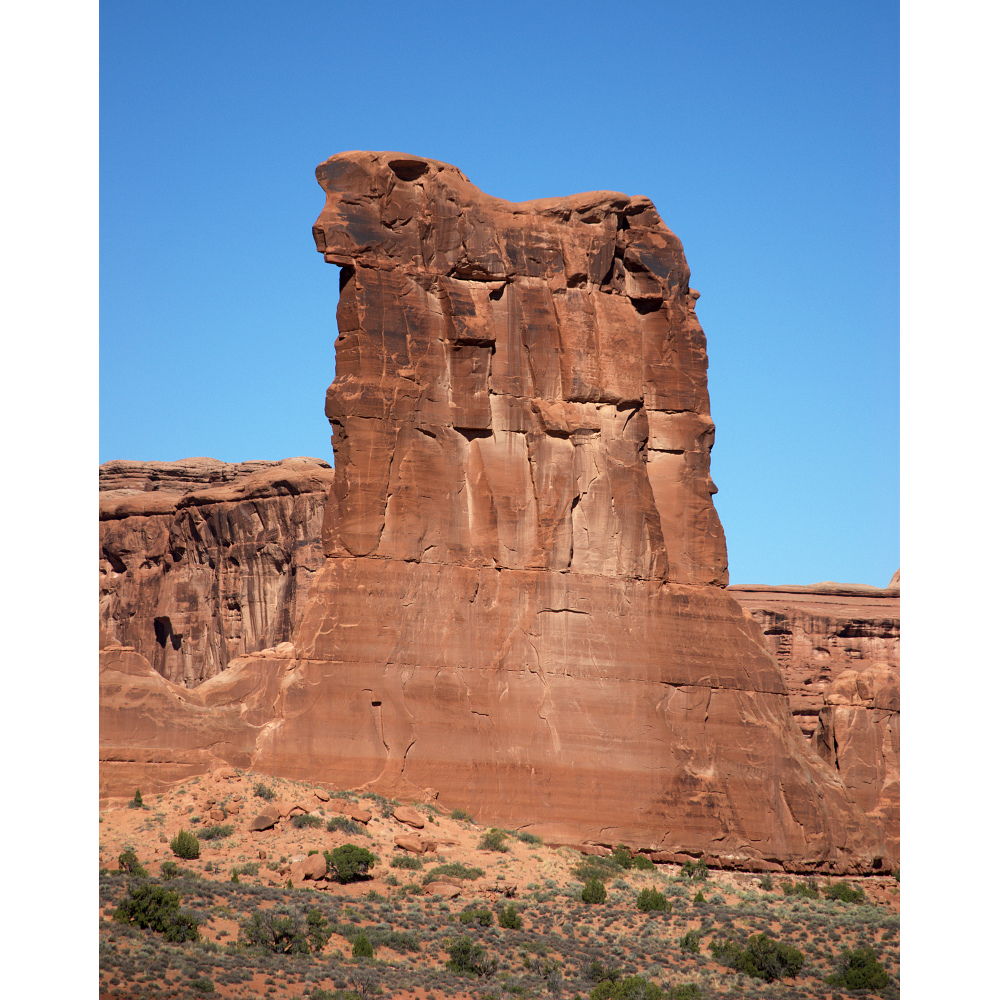

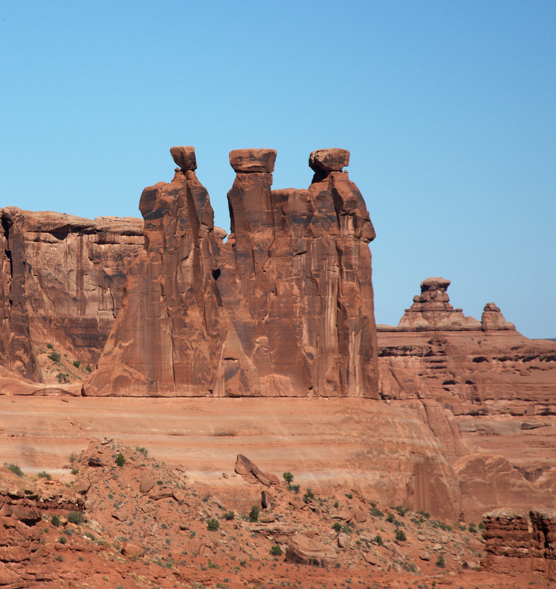

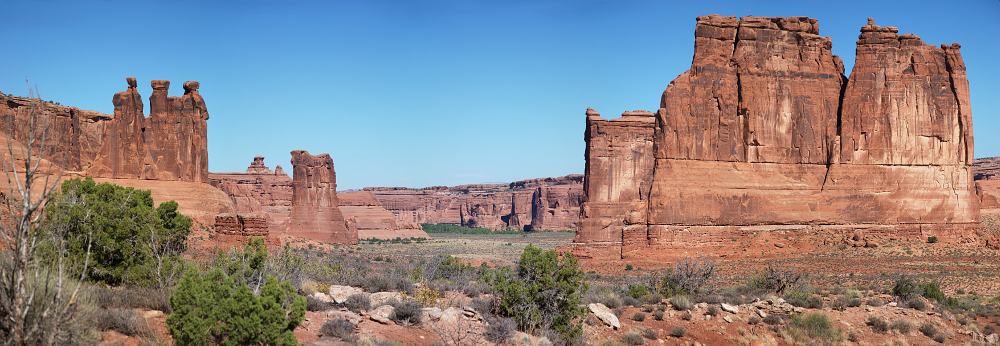

Boris tu objevil také útvar, připomínající ruku se zdviženým prostředníčkem :)

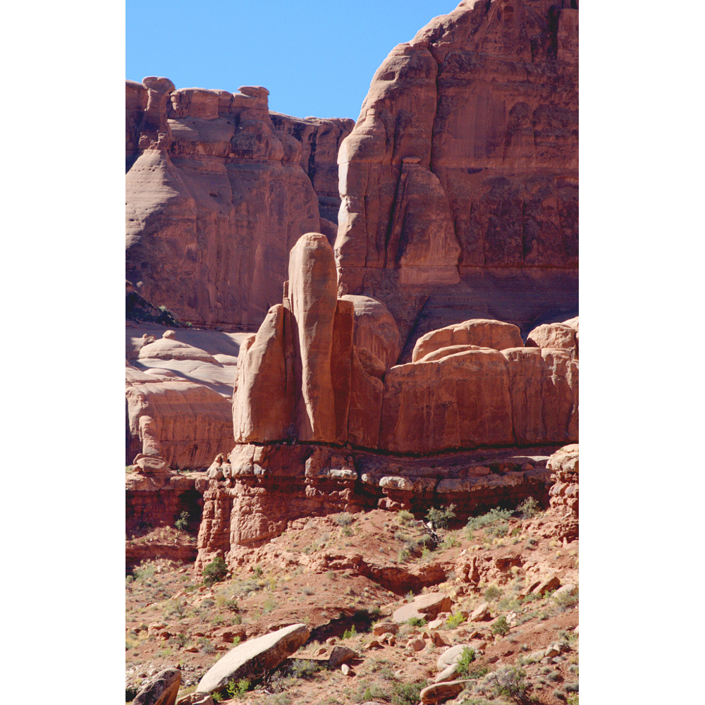

## 10:45

Jsme u vyhlídky na vybalancovaný balvan [Balanced Rock](https://en.wikipedia.org/wiki/Balanced_Rock) a vydáváme se na trail kolem něj.

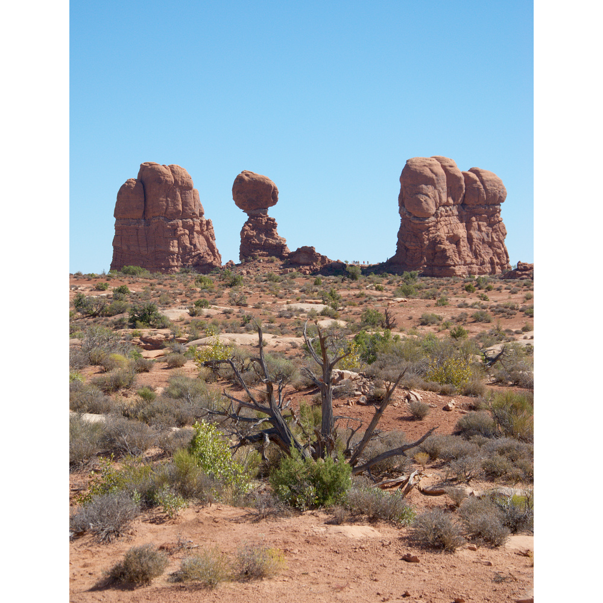

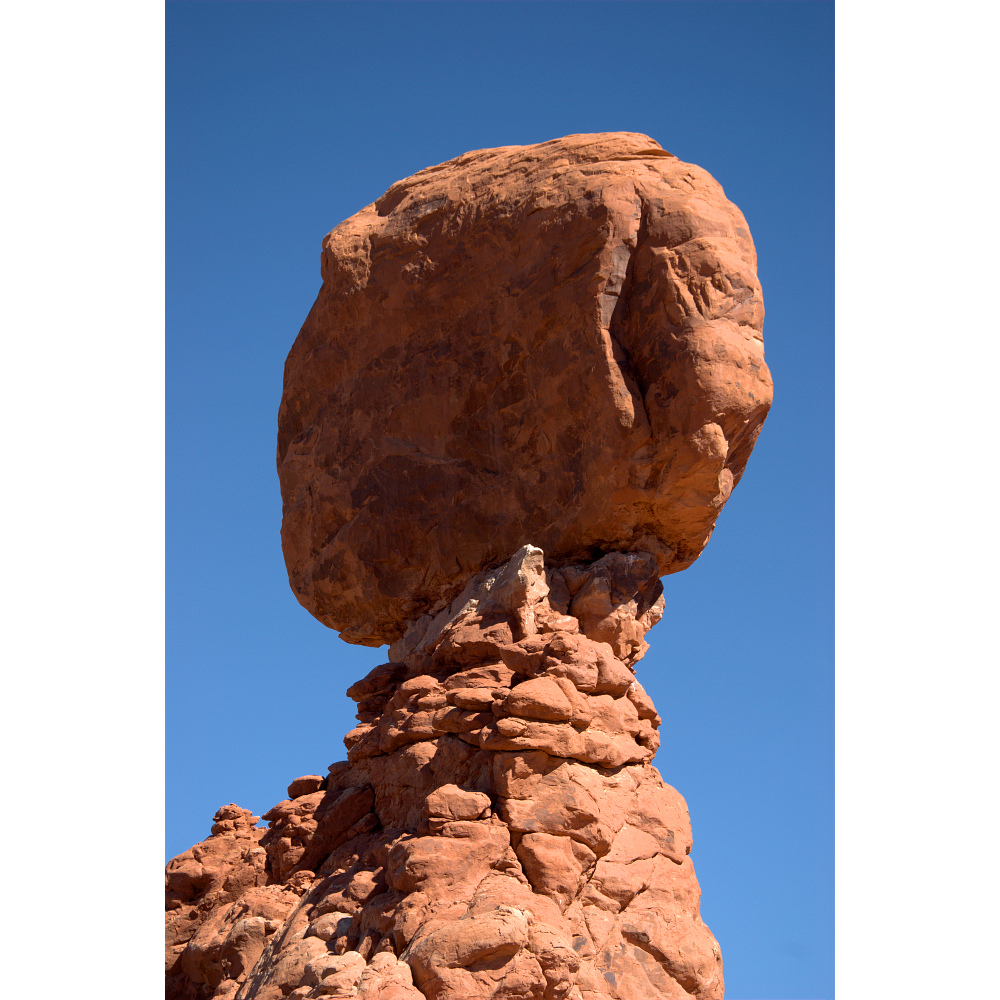

## 11:20

Jsme zpět u auta, navštěvujeme nedaleké toalety a míříme dále.

## 11:30

Přijíždíme k další vyhlídce a trailu, tentokrát k obloukům [Double Arch](https://utah.com/hiking/arches-national-park/double-arch-trail) a [The Windows a Turret Arch](https://utah.com/hiking/arches-national-park/the-windows-trail).

Je tu ovšem plné parkoviště, tak musíme zkusit zaparkovat u dodatečného parkoviště, které je o něco níže.

## 11:35

Parkujeme a jdeme po trailu k Double Arch.

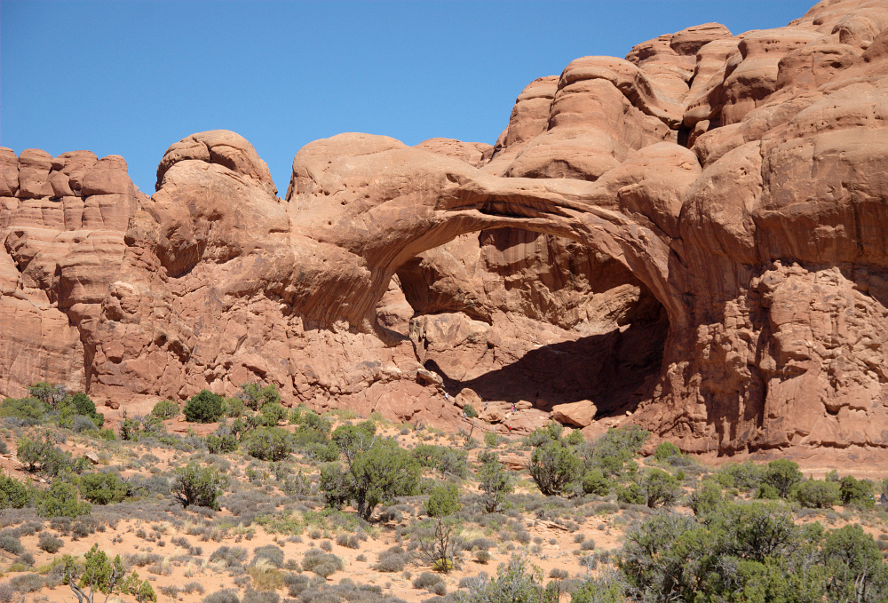

## 11:50

Jsme u Double Arch a žasneme nad tím, čeho jsou příroda a čas schopni.

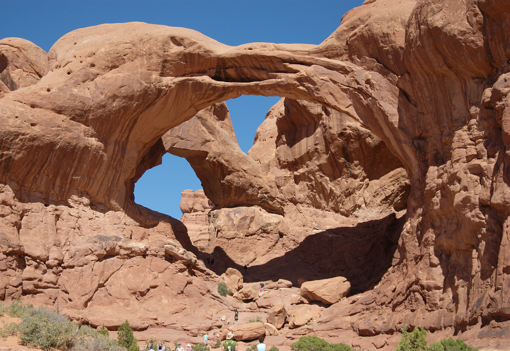

## 12:25

Jdeme po dalším trailu a blížíme se k Turret Arch.

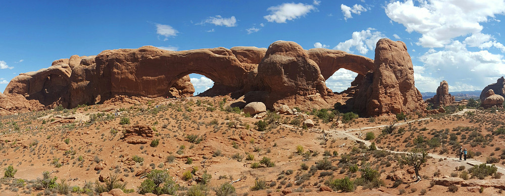

Tady se rozdělujeme na dvě skupinky, Čermis s Renčou jdou dále k jižnímu oknu (The South Window), zatímco já s Borisem hledáme dokonalé místo, odkud vyfotit Turret Arch a Windows společně v zákrytu, což se nám nakonec daří.

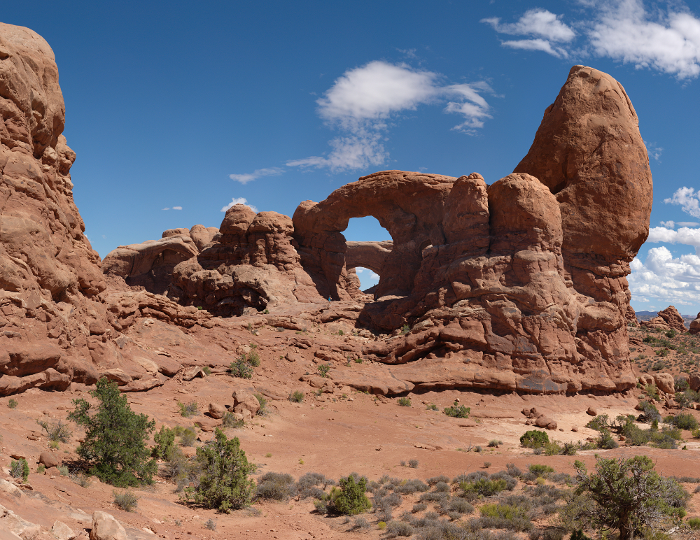

## 12:50

Procházíme kolem jižního okna.

## 13:00

U druhé strany jižního okna se Boris odděluje a jde svou cestou, zatímco já zůstávám sám na zbytku trailu, což si velmi užívám pro krásu okamžiku a klidu šumícího větru mezi skalami.

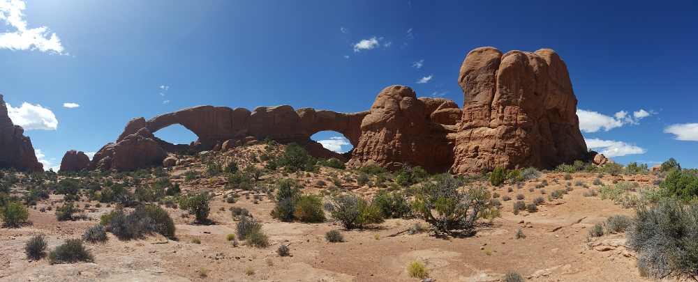

## 13:25

Všichni se společně potkáváme u auta a vyrážíme dále.

## 13:40

Jdeme na trail k vyhlídce na oblouk Delicate Arch.

## 13:50

Přicházíme k vyhlídce, Čermis s Renčou zůstávají, zatímco já a Boris jdeme po plošině dále k vyššímu bodu, odkud bude mnohem lepší záběr na oblouk.

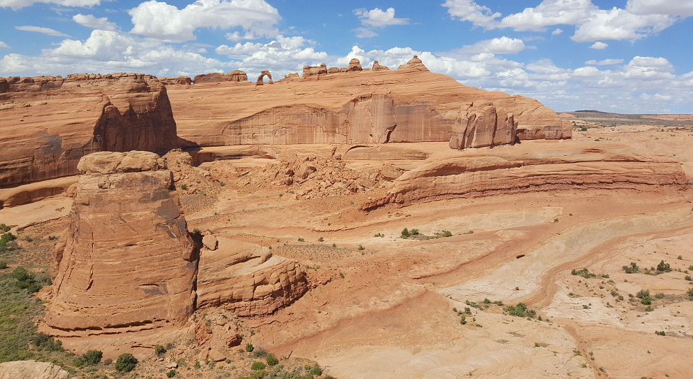

## 14:05

Po pár stovkách metrů docházím na místo, kde je oblouk krásně vidět bez toho, aby překrýval něco jiného, než oblohu.

## 14:20

Jsme zpět v autě a vyrážíme směrem k dalšímu bodu našeho programu, Devil's Garden.

## 14:30

Zajíždíme s autem k vyhlídce na Salt Valley, ale pohled z auta nám stačí, a proto ani nezastavujem a nevystupujeme a jedema dál.

## 14:31

Jsme u vyhlídky na další skalní útvar, tentokrát Fiery Furnace.

## 14:40

Odjíždíme od vyhlídky a jedeme k poslednímu cíli, Devil's Garden, kde by mělo být až 7 oblouků.

## 14:50

Projíždíme kolem Skyline Arch, kde se na krátko zastavujeme a z auta prohlížíme, než pokračujeme v cestě.

Zastihává nás tu první déšť naší výpravy, i když jen ve formě krátké a lehké přeháňky. Rozhodně mi ale přijde ve dnešním vedru osvěžující.

## 14:52

Projíždíme místním kempem, který vypadá až neskutečně luxusní. Každé místo má obdélníkový asfaltový plácek na zaparkování auta, litinový válec na rozdělání táborového ohně, u něj lavičku a místo na postavení stanu. Čermis je z toho nadšený a nevěří vlastním očím a prohlašuje toto za to nej, co tu zatím viděl.

Další krátká přeháňka zpříjemňuje atmosféru.

## 14:55

Déšť ustává.

## 15:00

Přijíždíme k parkovišti u Devil's Garden a vydáváme se na trail k místním obloukům.

Zastavujeme a koukáme postupně na Tunnel Arch, Pine Tree Arch a Landscape Arch, který vypadá, že už dlouho nevydrží. U něj se s Čermisem a Renčou usuzujeme, že máme pro dnešek už dost a že se vrátíme k autu, ale Boris jde ještě o kousek dál, aby si prohlédl i další oblouky. Nakonec vidí Navajo Arch a Private Arch, ze kterého ale prý moc nadšený není.

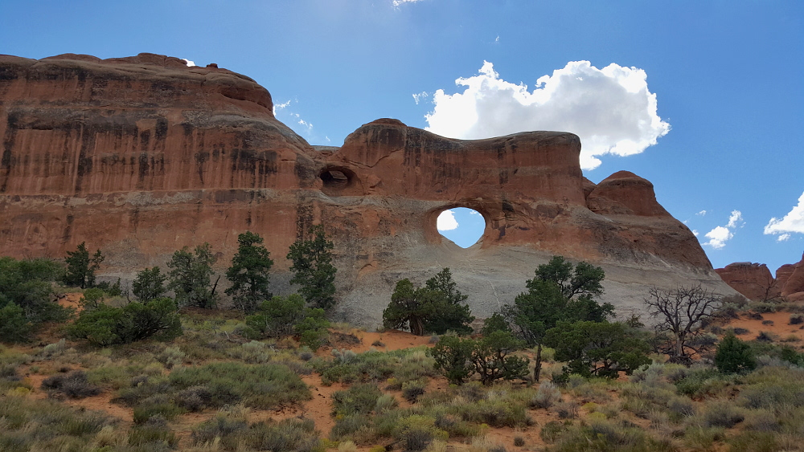

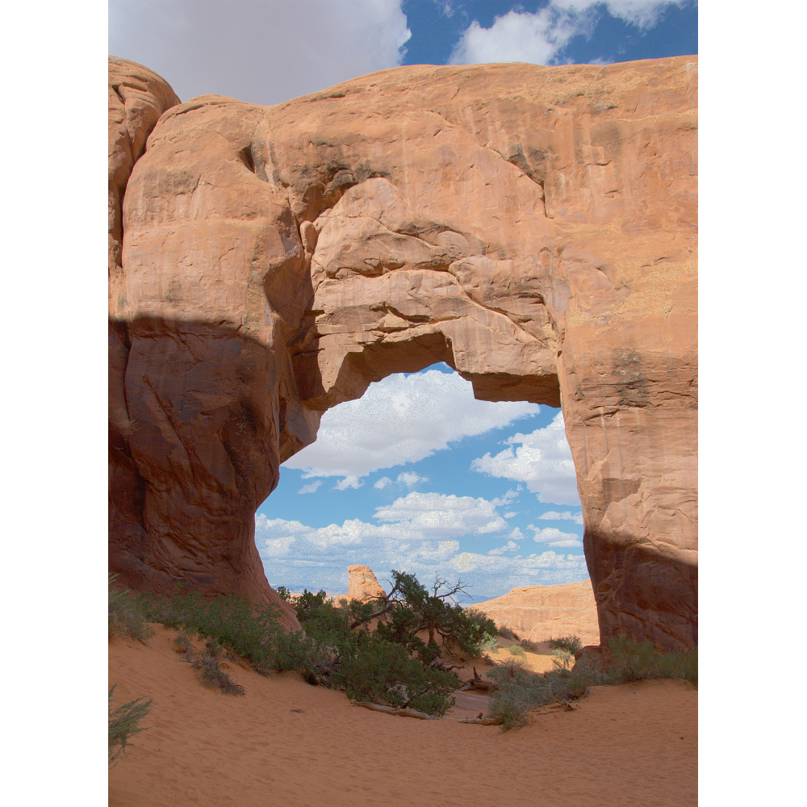

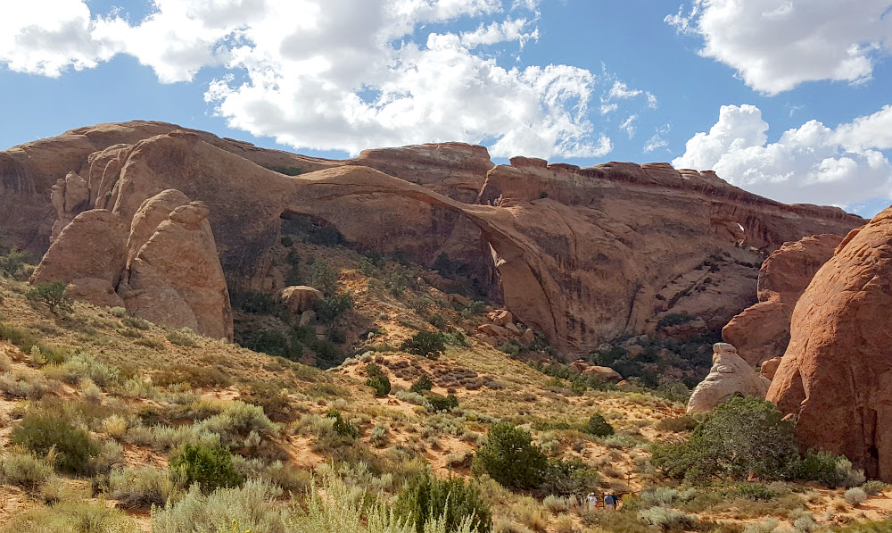

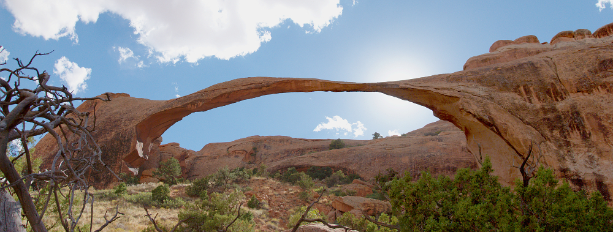

## 16:20

Jsme zpět v autě a čekáme na Borise. Čekání si zpestřujeme ochutnávkou bizonního jerky, jehož intenzivní masová chuť divočiny nám všem chutná.

## 16:44

Boris se vrací, a tak vyrážíme někam na večeři cestou k vesnici Bicknell, kde chceme pro dnešek zakotvit na noc.

## 17:10

Opouštíme hranice národního parku Arches.

## 17:45

Vjíždíme do parku Dead Horse Point, který ovšem není národním parkem, a tak nám zde neplatí náš Annual Pass, takže platíme $10 vstupného a jedeme k vyhlídce.

## 17:55

Přijíždíme k vyhlídce u návštěvnického centra a jdeme se kouknout do údolí.

## 18:03

Hledáme vstup do návštěvnického centra, abych si tu mohl koupit magnetku na lednici, který nakonec najdeme, ale pán u pokladny nám s lítostí oznamuje, že právě zavřel. Zkoušíme ho přemluvit, aby ještě prodal tu magnetku, ale máme smůlu. Nestihli jsme to o 3 minuty :)

## 18:10

Na parkovišti mám signál internetu, tak ještě, než se vydáme na cestu, hledám na booking.com ubytování poblíž vesnice Bicknell a nacházím a nakonec objednávám pokoj v hotelu Snuggle Inn, ve vesničce Loa.

## 18:15

Opouštíme park a míříme do Loa.

## 18:55

U místa Crescent Junction najíždíme na dálnici 70, kde potkáváme zatím nejvyšší povolenou rychlost 80 mil/hod.

## 19:10

Zastavujeme u benzinky Conoco ve městečku Green River, kde bereme benzín a dáváme si večeři v místním Burger Kingu.

Potkáváme tu starší český pár z Lanškrouna, o kterém se dozvídáme, že jsou také na 3týdenním výletu po USA. Svět se mi najednou zdá tak malým :)

## 19:55

U benzinky nacházím klasický telefonní automat s dírkami perforovanými do tvaru sluchátka a nápisem PHONE, který znám z amerických filumů, což mi dělá radost :)

## 20:00

Vyrážíme dál.

## 21:50

Přijíždíme do Loa k hotelu Snuggle Inn, kde na hlavních dveřích nacházím na papíře vytištěný vzkaz jmenovitě pro mě, že náš pokoj je č. 5 a že klíčky jsou ve dveřích :)

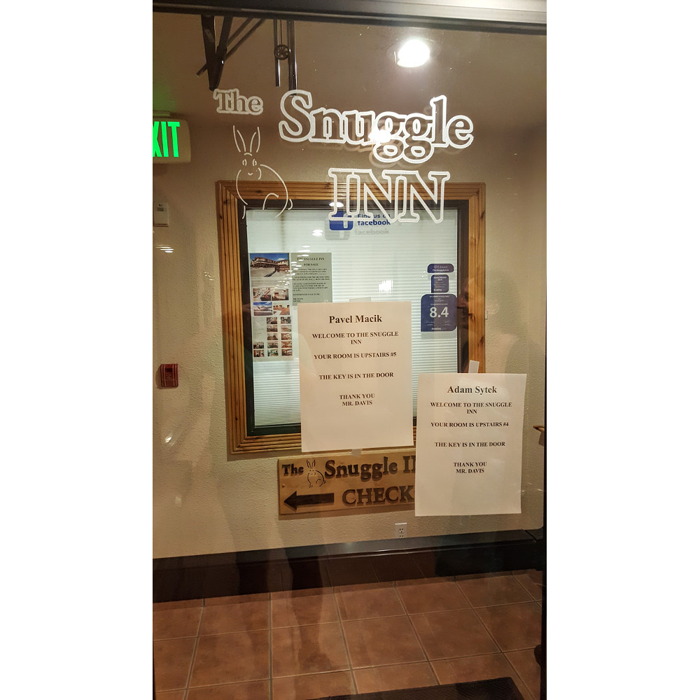

Fascinuje nás interiér hotelu a Renča ho přirovnává k venkovským hotelům, ve kterých se odehrávaly příběhy Jessicy Flatcherové v seriálu To je vražda, napsala.

## 23:40

Všichni kromě mě už jsou v posteli, já ještě píšu deník a vyvolávám nějaké fotky.

## 01:15

Ulehám i já a tím uzavírám dnešní den.

