# 13.9.2016 - Vysočina a národní les Dixie, nejvyšší bod, palcové kroupy, burger a koláč u Burr Trail Grill, národní park Bryce

   * 8:30

Vstáváme.

   * 9:10

Čermis a Renča jdou ven za lovem kešky.

   * 10:20

Nasedáme do auta a vydáváme se na cestu. Za volant si opět sedá Čermis.

   * 10:40

Zastavujeme u benzinky Howie's pro kafe a WC a pak jedeme dál.

   * 11:00

vjíždíme do národního lesa Dixie

   * 11:15

Stoupáme do vyšších nadmořských výšek a děláme si zastávku na vyhlídku po krajině.

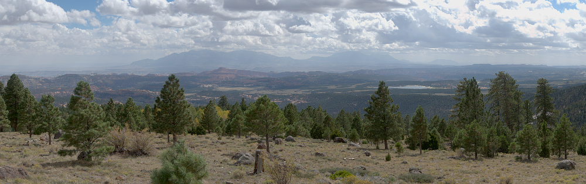

   * 11:45

Dosáhli jsme pro tuto chvíli nejvyššího bodu naší cesty, 9600 stop nad mořem.

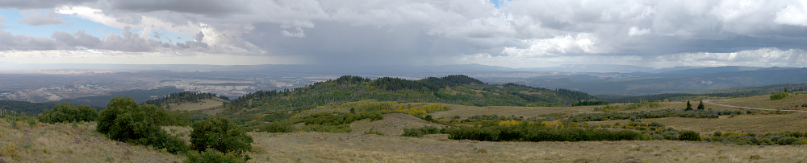

Jak se tak rozhlížím po krajině, a vidím všechny ty krávy a jejich rozlehlé pastviny, na kterých se krmí, napadá mě myšlenka, že by toto mohlo být to místo, kde budou mít dobrý venkovský burger, připravený z místních krav.

   * 12:10

Zastavujeme se na oběd u Hell's Backbone Grill, kde ale zjišťujeme, že nemají burger. Jdeme tak k sousedům, Burr Trail Grill, který vypadá velmi venkovsky, kam chodí místní a ne turisti. Už po vstupu hlavními dveřmi nás v nose pohladí lahodná vůně pečeného masa proložená sladkou vůní, která slibuje i nějaký ten domácí koláč.

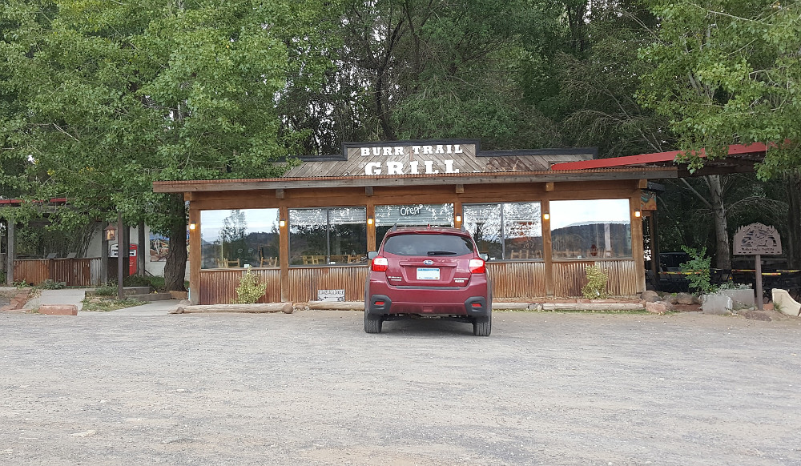

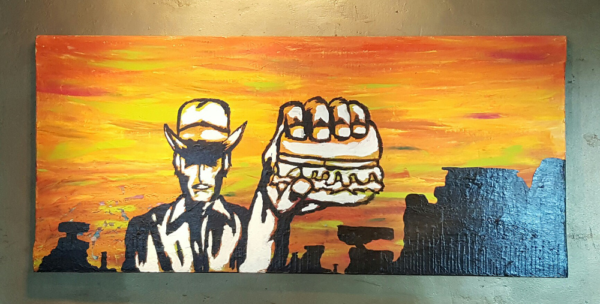

Všichni si dáváme burger a po nakouknutí do chladícího boxu s domácími koláči i koláč jako desert. Už dlouhou dobu mi při jídle neběhal mráz po zádech slastí jako při vychutnávání tohoto koláče (dal jsem si Ginger Berry, což jsou borůvky a zázvor).

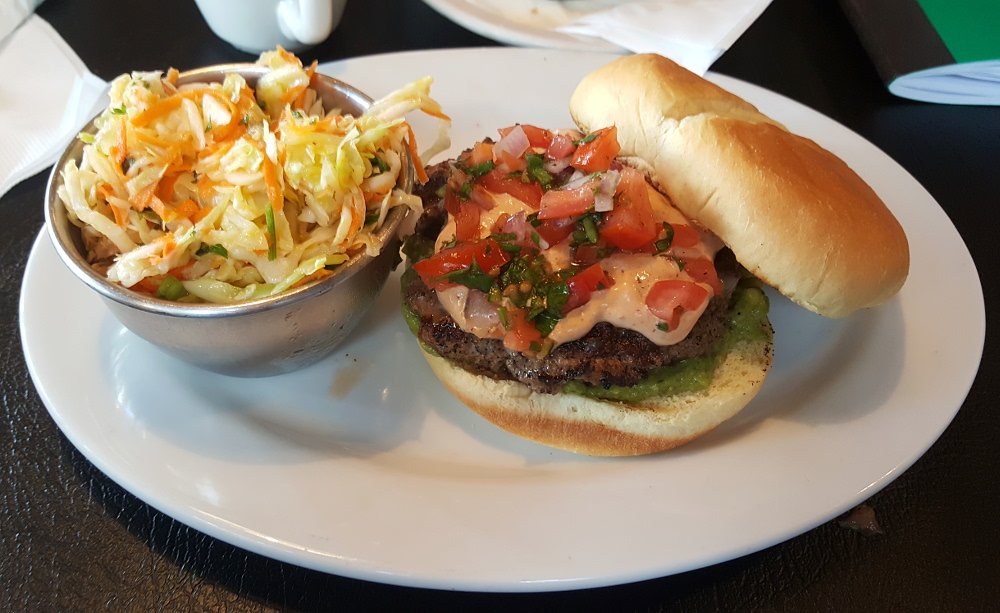

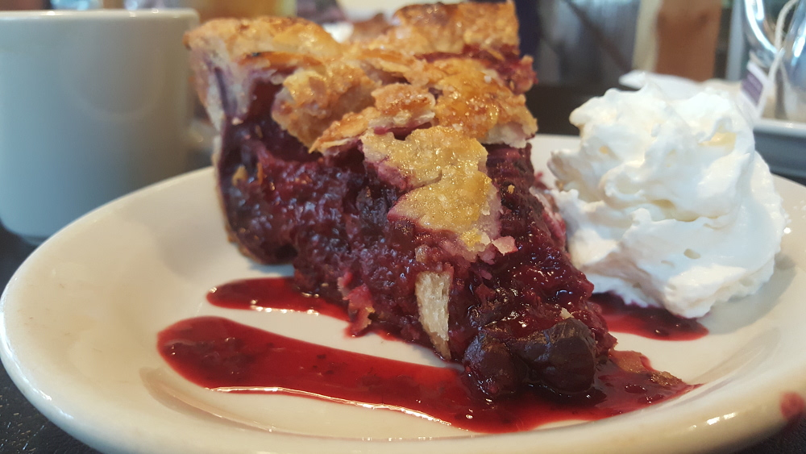

   * 13:20

Odcházíme z hospůdky s břichy plnými málem až k prasknutí a pokračujeme v naší cestě do národního parku Bryce.

Začíná pršet.

   * 13:33

Z nevinného deště se stává prudký déšť doprovázený kroupami o velikosti 1-2 cm v průměru.

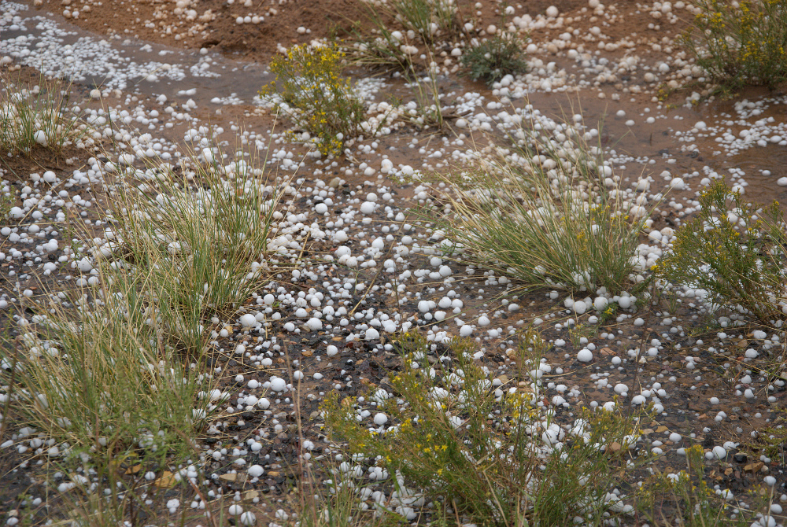

   * 13:36

Je po dešti a vyjasňuje se.

   * 15:20

Po krásné scénické cestě, která je podle pána na recepci hotelu Snuggle Inn jedna z deseti nejkrásnějších míst k vidění v celých USA, vjíždíme branou do národního parku Bryce, na který se nejvíc těší Renča.

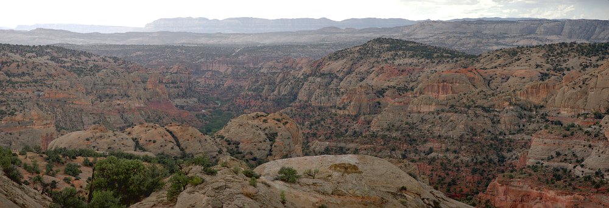

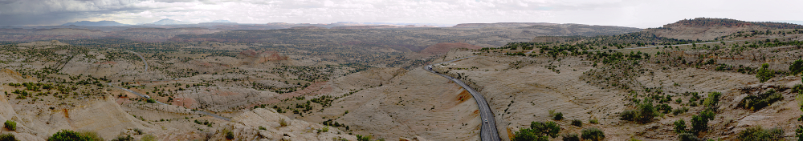

Parkujeme u parkoviště nedaleko návštěvnického centra s tím, že se případně svezeme místním kyvadlovým autobusem.

   * 15:30

Jsme na lovu magnetků na lednici v návštěvnickém centru.

Nakonec kupujeme i pončo proti dešti, protože počasí slubuje déšť.

   * 15:55

Vyrážíme na zastávku autobusu.

   * 16:10

Nastupujeme do autobusu a jedeme k zastávce Inspiration Point u vyhlídky do kaňonu.

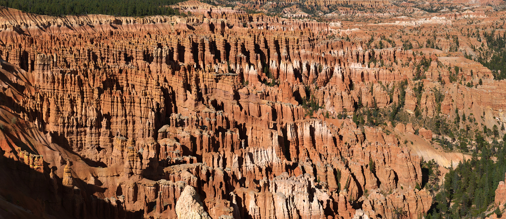

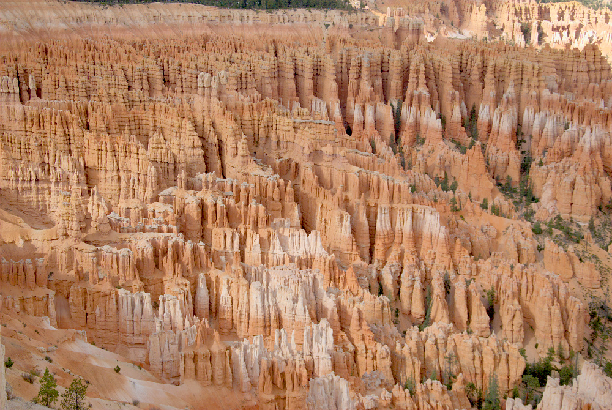

Naším plánem je vystoupit zde, jít trailem dolů do kaňonu a pak zase vystoupat u další zastávkky autobusu Sunset Point, který by nás pak měl dovézt zpět k autu.

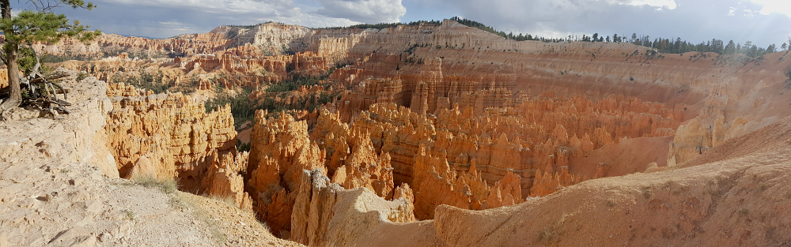

   * 16:50

První náznaky deště ostatní vedou k tomu, že vytahují ponča, a jakmile je mají na sobě, pršet přestává a vysvitá sluníčko :)

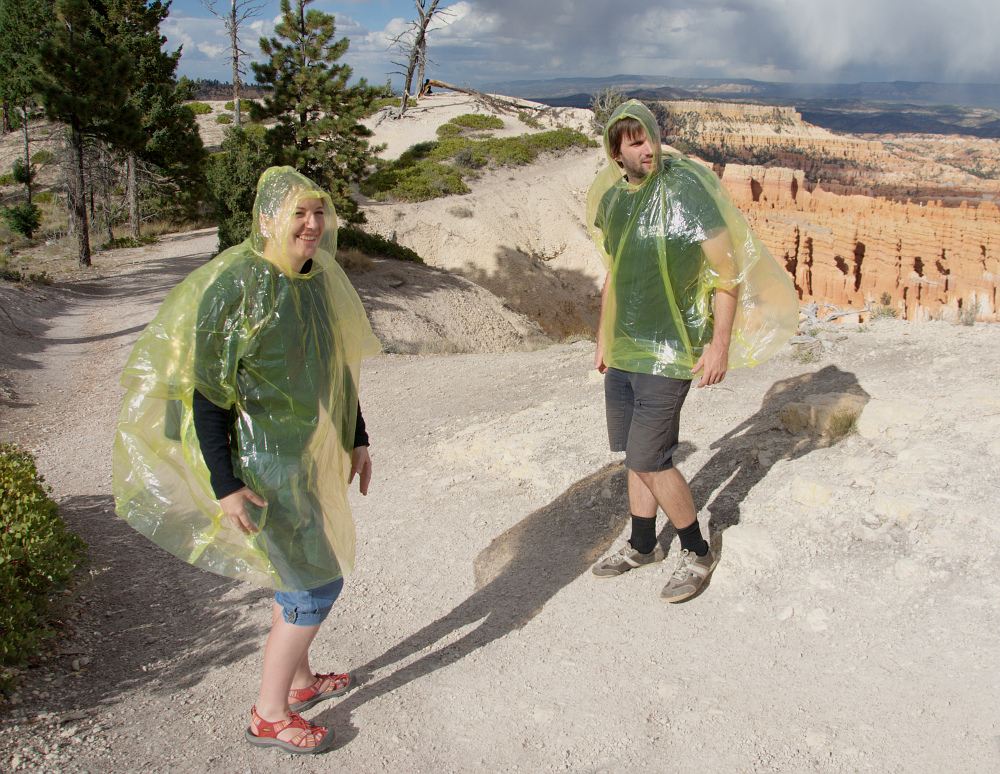

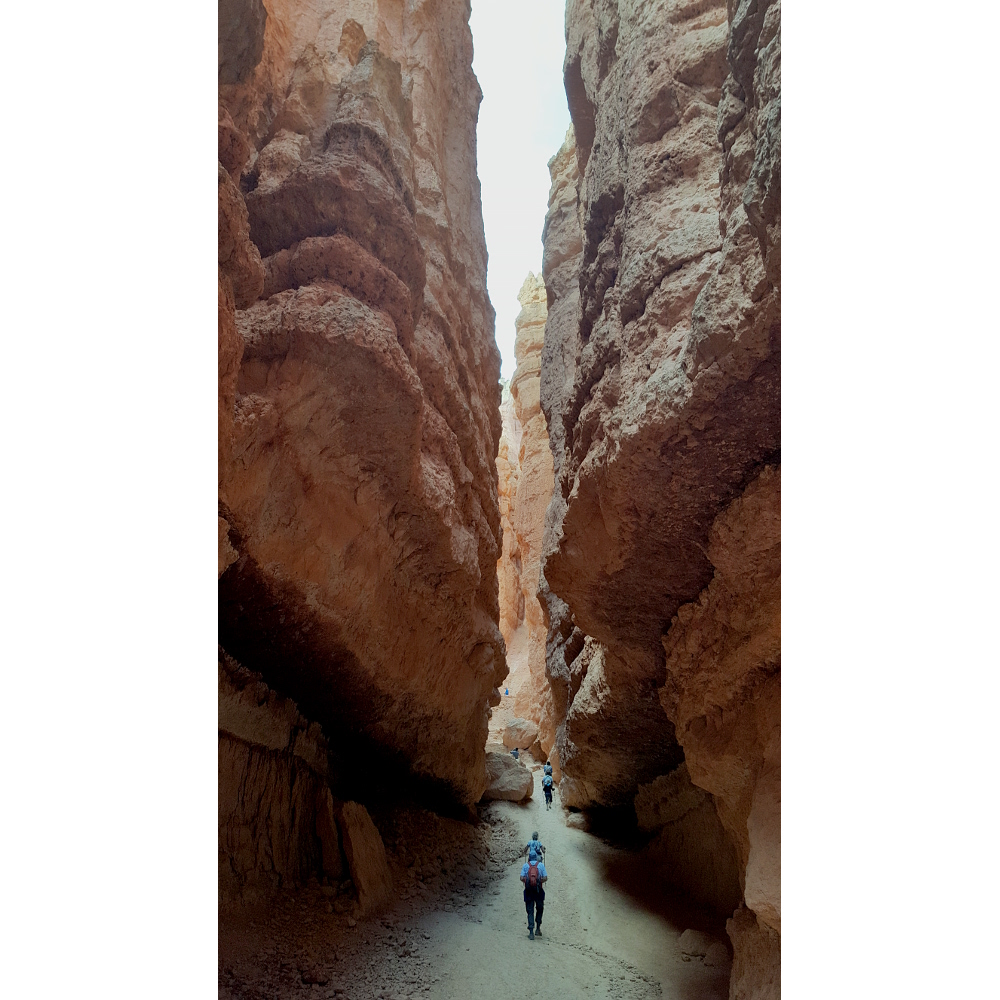

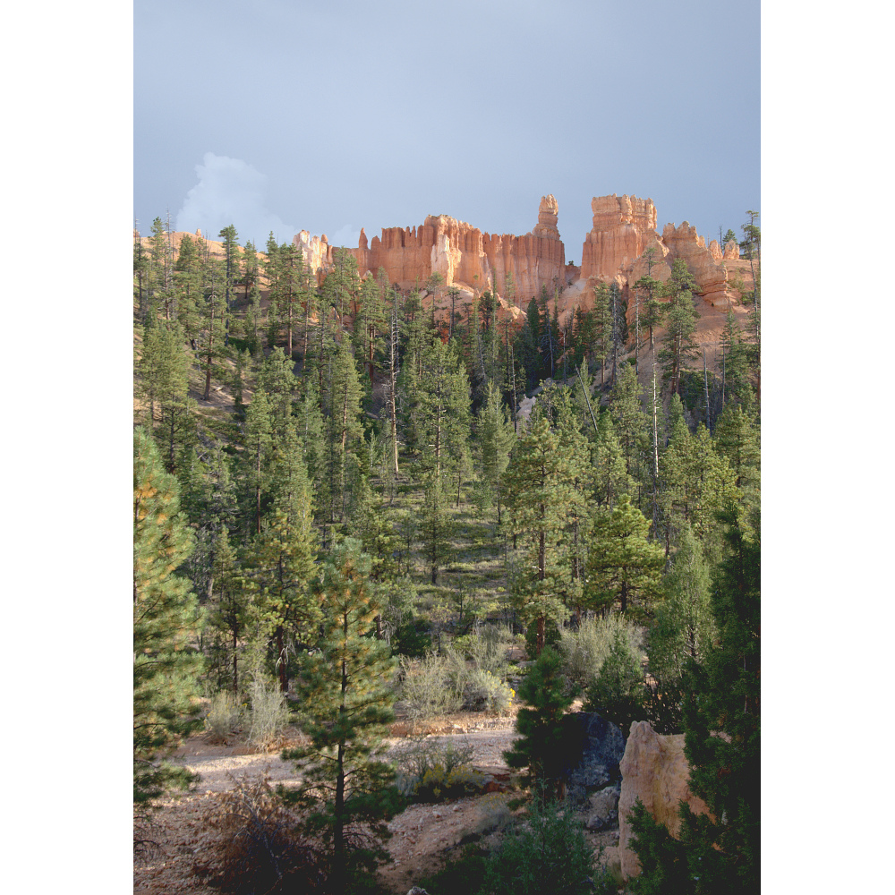

   * 18:40

Jsme už na cestě vzhůru z kaňonu k zastávce autobusu, když nás konečně dostihává vydatný déšť, ve kterém se našli i malé kroupy. Pěkně jsme zmokli.

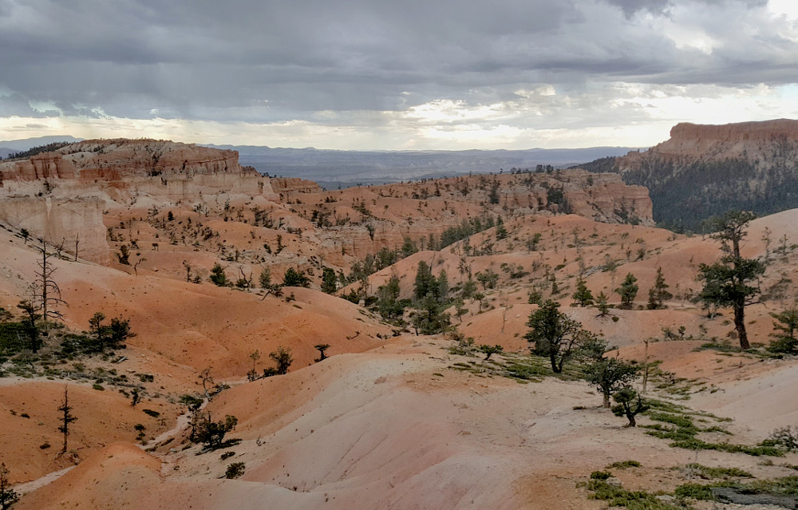

   * 19:00

Jsme u zastávky autobusu, ale je to Bryce Canyon Lodge, ale nevadí, autobus nás k autu i tak doveze.

   * 19:30

Jsme v autě a hledáme ubytování na Bookingu poblíž národního parku Zion, kam jedeme zítra.

Nacházíme hotel ve městečku Cedar City, Cedar Rest a tentokrát platí Boris.

   * 20:00

Cestou do Cedar City stavíme u benzinky Red Canyon Conoco a tankujeme benzín. S placením je teď řada na mě.

   * 20:10

Jedeme dál. Cestou dopisuju deník za včerejšek a cesta mi tak rychle ubíhá.

   * 21:20

Přijíždíme k hotelu, kde je pán na recepci zmatený a o naší rezervaci z Bookingu prý nic neví, ale nevadí, daný pokoj za stejnou cenu nám dává i tak, takže spát kde máme :)

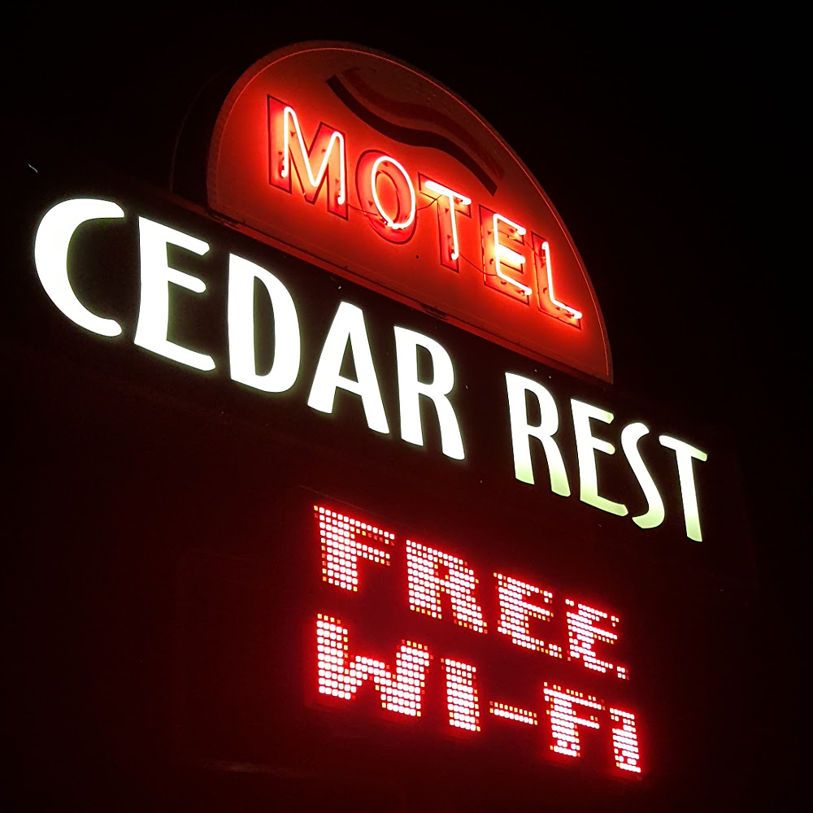

   * 23:00

Všichni až na mě už jsou v posteli, já ještě vyvolávám fotky a dávám je do alba.

   * 00:30

Na psaní deníku už nemám síly, takže to nechávám na zítra a jdu už taky spát.

