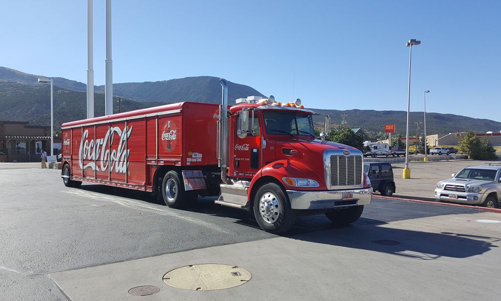
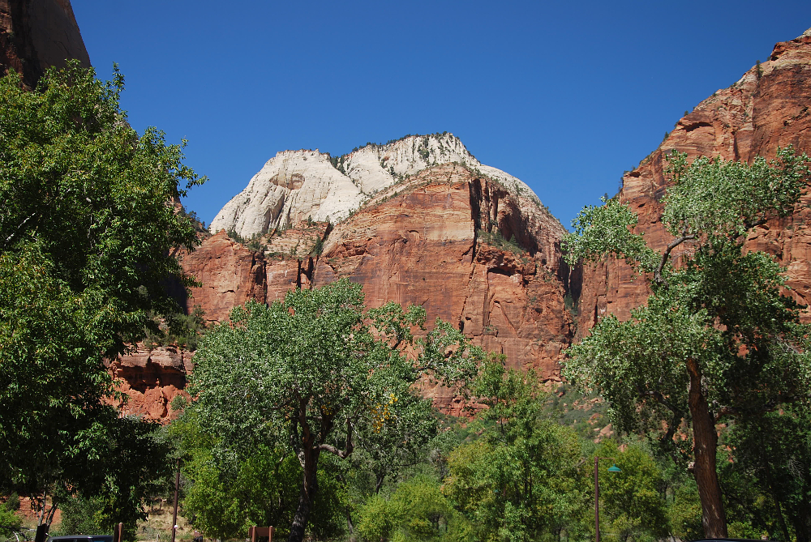
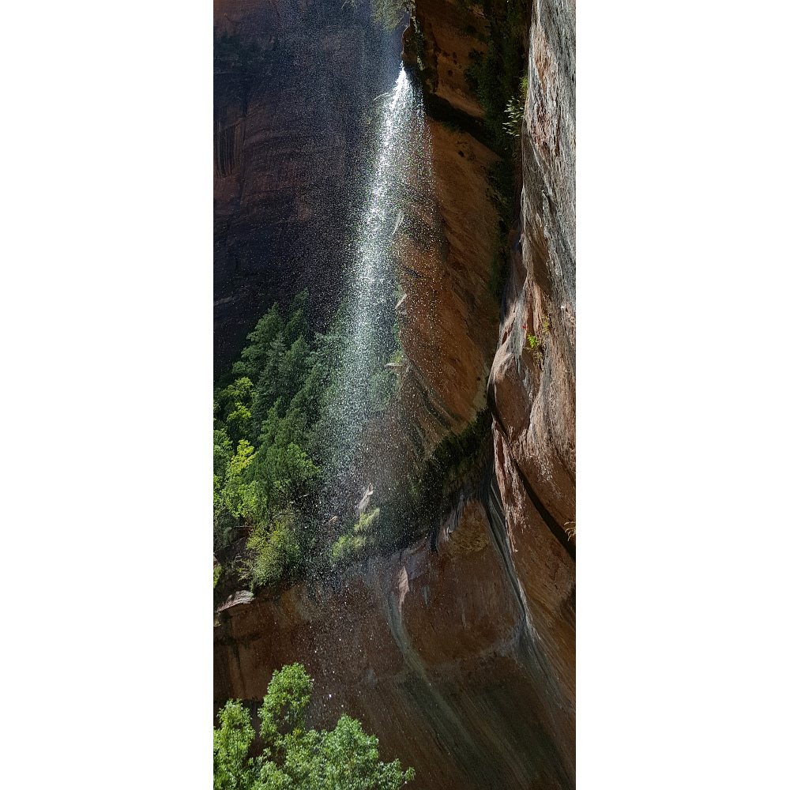
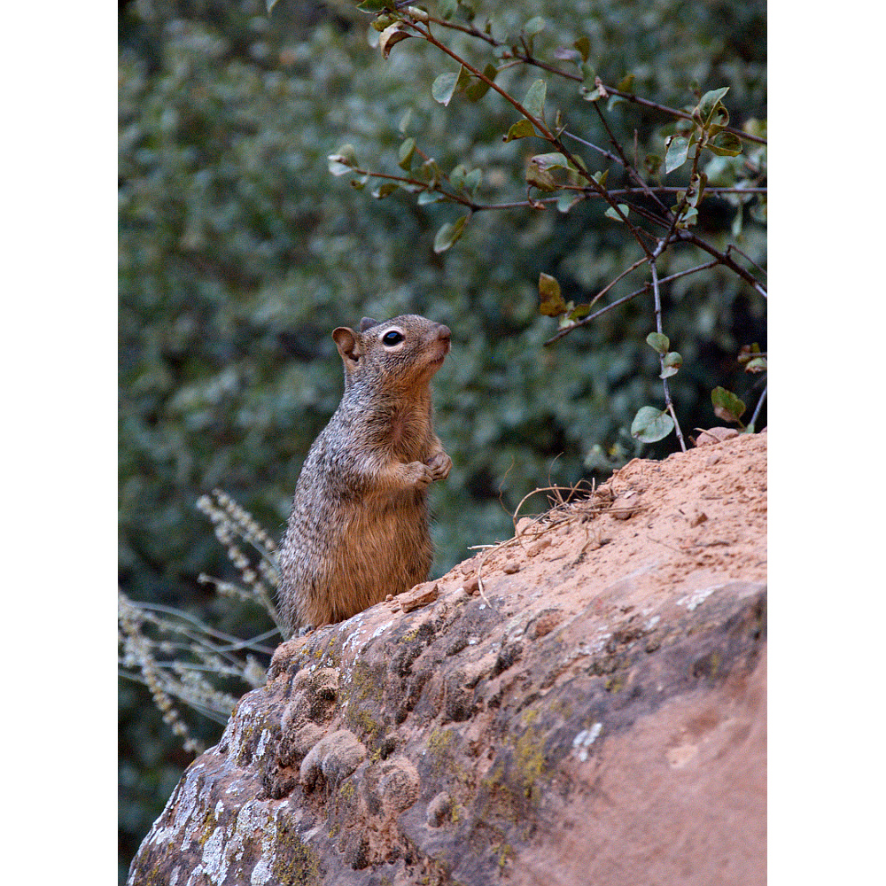
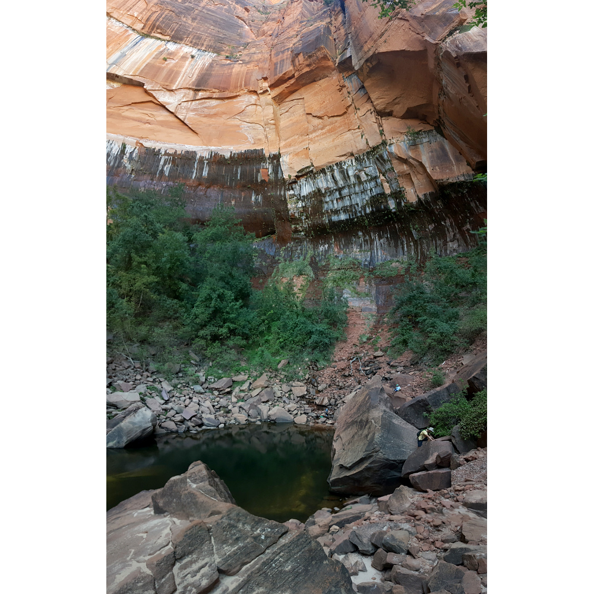
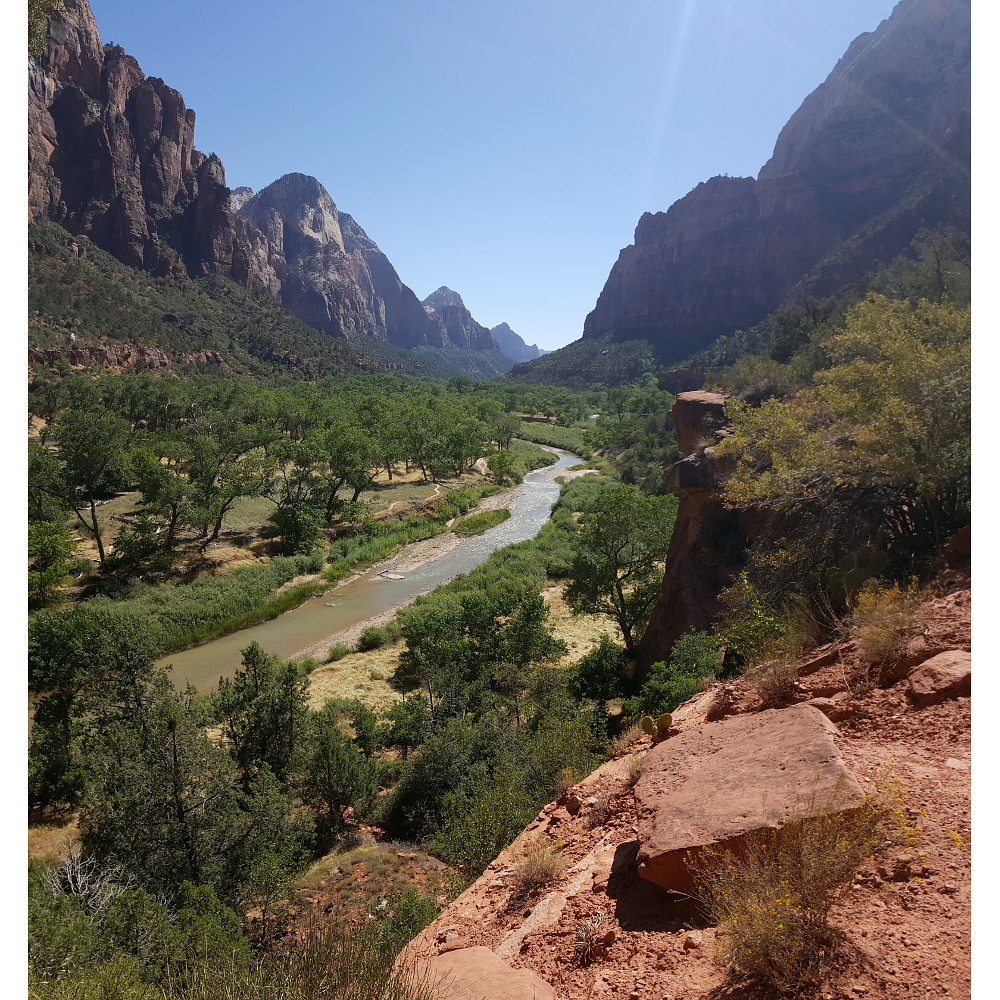
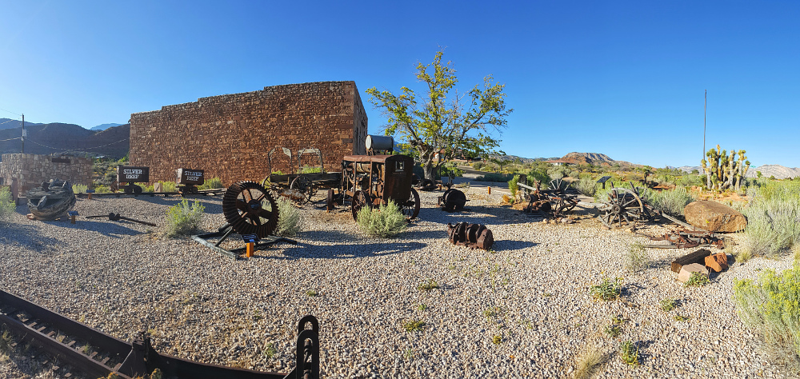
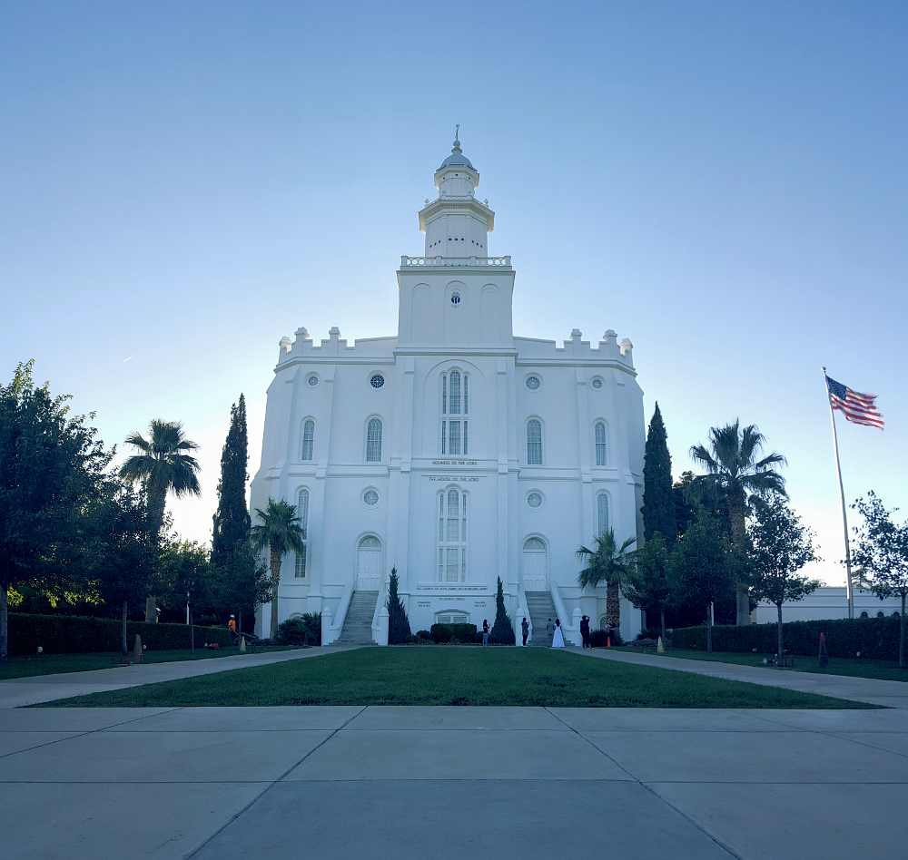
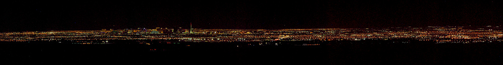

# 14.9.2016 - Národní park Zion, Silver Reef, Utah Temple

## 9:30

Vstáváme.

## 9:50

Zjišťujeme, že snídaně byla jen do 9:00, a tedy že jsme ji propásli.

Renča s Čermisem se vydávají na lov kešky.

## 10:20

Odjíždíme od hotelu a hledáme místo, kde bychom si koupili naši ranní kávu.

## 10:25

Zastavujeme u benzínky ještě v Cedar City, kde kupujeme kávu a něco ke snídani.

U ní stojí americká klasika, jejíž vyfocení si nemůžu nechat ujít - náklaďák Coca-Cola :)

## 10:45

Probuzeni kafem jedeme dále směrem k našemu dnešnímu cíli, národnímu parku Zion.

## 11:35

10 minut před parkem se začínají objevovat cedule s nápisem "Parking full, park here". Potřebujeme ale mapu parku, takže to zkusíme k návštěvnickému centru, třeba budeme mít kliku.

Všímáme si zastávky místního kyvadlového autobusu, tak tu přeci nacházíme místo k zaparkování, necháváme tu auto a k návštěvnickému centru jedeme autobusem.

## 12:10

Vstupujeme bránou do národního parku, kde dostáváme i mapu, a míříme do návštěvnického centra za lovem magnetek na lednici.

## 12:40

Už nastupujeme do autobusu linky Zion Canyon Line na zastávce č. 1 a míříme ke smaragdovým jezírkům.

Cesta kaňonem je úžasná a nabízí nádherně barevné pohledy. Od skal, jejichž barva střídá rudou, růžovou až bílou, přes zelené stromy a trávu až po modrou oblohu.

## 13:00

Jsme venku z autobusu a nastupujeme na trail, který nás přivede k jezírkům.

## 13:15

Zaznívá čeština z úst staršího páru, který hledá, kde tu přistál ten anděl. Hledali skalní útvar [Angel's Landing](http://www.zionnational-park.com/zion-angels-landing-trail.htm).

Cesta ke smaragdovým jezírkům nás vede přímo pod sympatický vodopád, který nás příjemně osvěžuje v horkém dni. 

Všude kolem pobíhá spousta zvědavých veverek, které zřejmě slyšely české rčení o těch  lázeňských :)

## 14:00

Jsme u horního ze tří jezírek, kde jsem trošku zklamaný, že nevidím onu slibovanou smaragdovou barvu jezírka. Na druhou stranu skalní stěna, která ho obepíná je i tak krásná. Z barev jednotlivých vrstev skály a fleků, které tu zanechala tekoucí voda, je tu vymalovaný obraz skal u moře. Alespoň tak to vidí moje fantazie :)

Cestou zpět dolů se otevírá úžasný pohled na údolí v celé jeho kráse, opravdová oáza zalitá sluncem.

## 15:15

Na zastávce č. 6 nasedáme na autobus, který nás vyhlídkovou trasou doveze zpět k návštěvnickému centru.

## 15:25

Vystupujeme ještě na zastávce č. 9, abychom se podívali na kousek trailu k části parku [Narrows](https://www.nps.gov/zion/planyourvisit/thenarrows.htm), kde je kaňon úzký, který by nás měl dovést k místu, kde je kaňon jen asi 3-10 metrů široký a kolem 700 metrů hluboký a navíc tímto místem protéká řeka Virgin.

## 15:35

Uvědomujeme si, že nemáme ani čas ani vhodné vybavení, jako uzavřené ponožkové boty nebo vycházkovou hůl, a tak otáčíme a vracíme se k autobusu.

## 15:45

Jsme zpět na zastávce č. 9 a sedáme si do autobusu, jehož cesta končí u návštěvnického centra na zastávce č. 1.

## 16:15

U zastávky č. 2 předčasně opouštíme autobus, abychom se podívali do místního muzea historie lidí. Nacházíme tu i WiFi připojení k internetu :)

## 16:30

Už snad definitivně míříme k zastávce č. 1, k návštěvnickému centru.

## 16:35

U návštěvnického centra se stavíme na konec fronty na autobus jiné linky, který nás přiblíží k autu.

## 16:50

Autobusem, ve kterém je pro nás místo, konečně jedeme k autu.

Jedeme bez Borise, který si zapomněl svůj klobouk u muzea. Plán je takový, že zatímco on najde svůj klobouk a vrátí se k návštěvnickému centru, my nasedneme do auta a přijedeme pro něj.

## 17:05

Jsme u auta a jedeme pro Borise.

## 17:10

Nabíráme Borise a jedeme směrem do St.George, kde je [Utah Temple](https://www.lds.org/church/temples/st-george-utah?lang=eng), úplně první mormonský kostel v USA.

## 17:40

Opouštíme hranice národního parku Zion.

## 17:50

Děláme si zastávku u Silver Reef, kde je místní ztracené město kolem stříbrného dolu a vybudované muzeum.

## 18:05

Pokračujeme do St. George

## 18:30

Stavíme a prohlížíme si první mormonský kostel v St. George - Utah Temple.

## 18:45

Příjemně překvapeni odjíždíme dál a začínáme se poohlížet po nějakém tom jídlu.

## 18:50

Vidíme Taco Bell, které jsme ještě neochutnali, tak tu zastavujeme jdeme na to.

## 19:40

S plnými břichy nasedáme do auta a jedeme směr Las Vegas.

## 19:50 -> 18:50

Opouštíme Utah a vjíždíme na pár mil do Arizony.

Překračujeme časovou zónu, ve které je čas o hodinu opožděný.

## 19:15

Přejíždíme hranici z Arizony do Nevady.

## 20:05

Už se setmělo a jak se blížíme k Las Vegas, otevírá se nám první výhled na světelnou skvrnu uprostřed pouštní tmy.

Žasneme a zastavujeme u krajnice, abychom se pokochali a zkusili pořídit nějaké fotky.

## 20:30

Zastavujeme u našeho dnešního noclehu, hotelu Aviation Inn.
