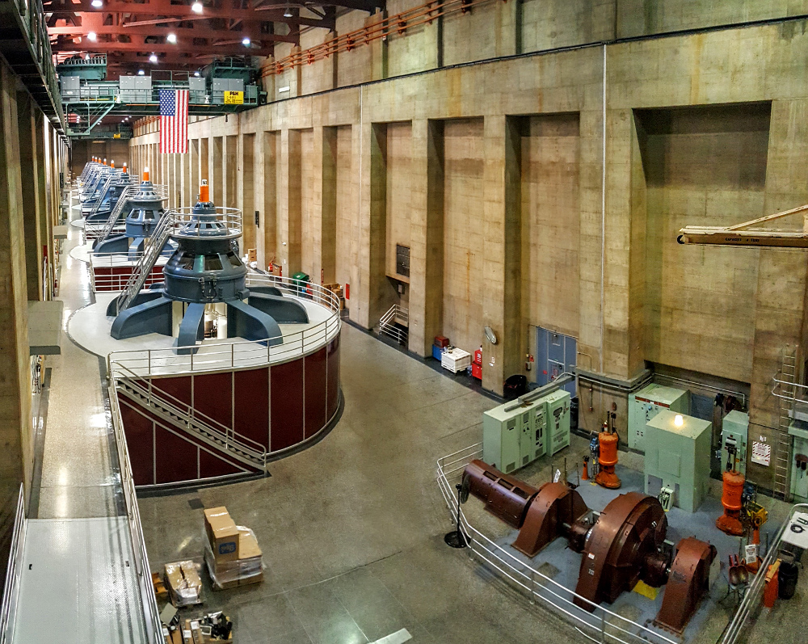
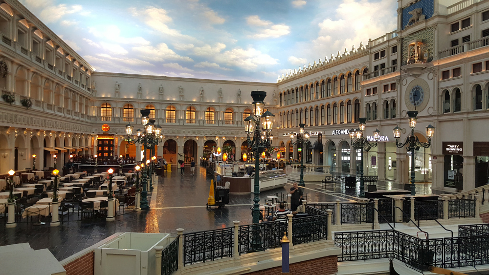

# 15.9.2016 - Přehrada Hoover Dam, Las Vegas

## 7:00

Nemyslel jsem si, že jméno hotelu Aviation Inn bude tak výstižné, když mě poprvé budí hluk nad hotelem prolétající stíhačky z nedaleké letecké základny.

## 9:00

Definitivně, ale pomalu vstáváme.

## 10:00

Čermis s Renčou vyrážejí na lov místní kešky.

## 10:15

Opouštíme hotelový pokoj a vydáváme se k cíli dnešního dne, přehradní hrázi [Hoover Dam](https://cs.wikipedia.org/wiki/Hooverova_p%C5%99ehrada) na jezeru Lake Mead.

Volantu a řízení se pro dnešek ujímám já.

## 11:10

Vjíždíme branou do národního parku Lake Mead.

## 11:40

Vstupujeme do návštěvnického centra s vidinou suvenýru ve formě další z magnetek na lednici.

## 12:15

Pokračujeme v cestě k přehradě.

## 12:25

Děláme si zastávku na vyhlídce a prohlížíme si samotné jezero Leak Mead v celé jeho kráse.

## 12:45

Konečně vjíždíme na hráz přehrady Hoover Dam.

## 12:50

Placené parkoviště za $10, které se liší od neplaceného stříškou chránící auto před horkým sluncem, jsme nechali za sebou a parkujeme u jednoho z neplacených, které je jen o 5 minut pěšky dále od hráze.

Vystupujeme a máme krásný výhled na hráz ze strany jezera Lake Mead.

Míříme pěšky na hráz.

Při pohledu na jezerní stranu hráze je jasně vidět, kam až sahala hladina jezera v roce 1983, kdy byla nevýše v historii, a jak je v jezeře v současnosti málo vody.

## 14:10

V rámci placené prohlídky vodní elektrárny, která je součástí přehrady, jedeme výtahem do jejích útrob a dozvídáme se o historii i principech, na kterých přehrada funguje.

## 14:45

Jsme zpět na denním světle a stojíme na vyhlídce z druhé strany hráze, která není volně přístupná.

## 15:50

V rychosti jdeme do návštěvnického centra porozhlédnout se po další magnetce.

## 16:00

Odjíždíme z přehrady a míříme do centra Las Vegas, kde nás čeká dvoudenní ubytování v hotelu [Circus Circus](https://en.wikipedia.org/wiki/Circus_Circus_Las_Vegas).

## 17:00

Stavíme u benzínky Chevron v Las Vegas a bereme benzín.

## 17:20

V nedaleké restauraci Denny's si dáváme večeři.

## 18:30

Pokračujeme na hotel.

## 20:30

Ubytovaní a umytí vyrážíme na večerní prohlídku hotelů a casin na známé části Las Vegas, Strip.

V kasinu našeho hotelu Circus Circus utrácím $10 ze svého rozpočtu na kasina, který jsem si stanovil na $100, za žetony do automatů a sedám si k jednomu z nich, abych se u něj pobavil a zahrál si. Nejprve během prvních 4 roztočení vyhrávám asi 20 žetonů, které postupně do automatu opět vracím.

Blíží se konec mých kreditů a když za poslední z nich točím naposledy, padá mi šťastná sedmička a hned třikrát :)

Prvních pár vteřin věřím, že jsem pokořil kasino a vyhrál jackpot, ale když se nic neděje, chladnu a zjišťuji, že tři sedmičky jsou výhra pouze tehdy, pokud bych hrál za 2 a více žetonů. Automat mě takto rafinovaně provokuje, abych do něj začal házet víc a víc, ale já se nedám, poslední žeton si nechávám na památku a odcházím od automatu s hlavou vztyčenou a v dobré náladě. Pokračujeme v prohlídce hotelů a kasín.

Cesta nás vede do hotelu Venetian, uvnitř kterého jsou postavené uličky a náměstí z Benátek.

## 1:00

Vracíme se na hotel a utahaní jdeme spát.
