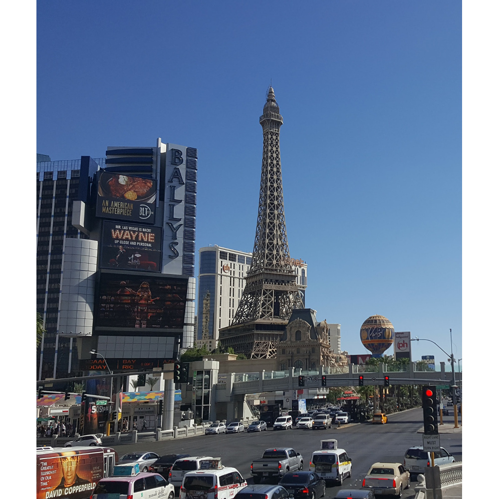
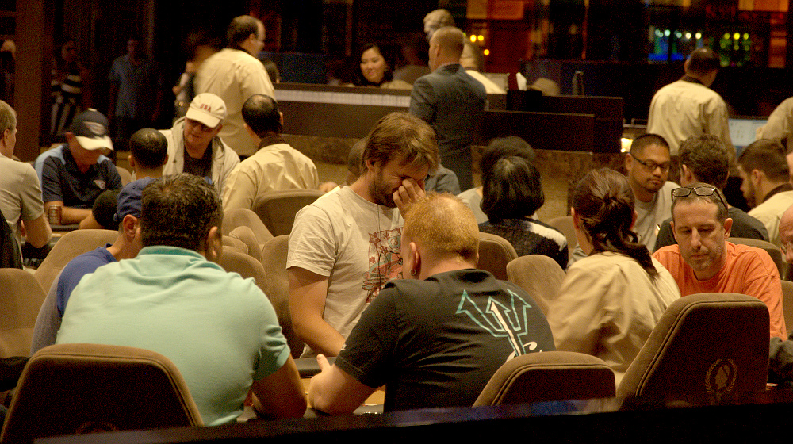
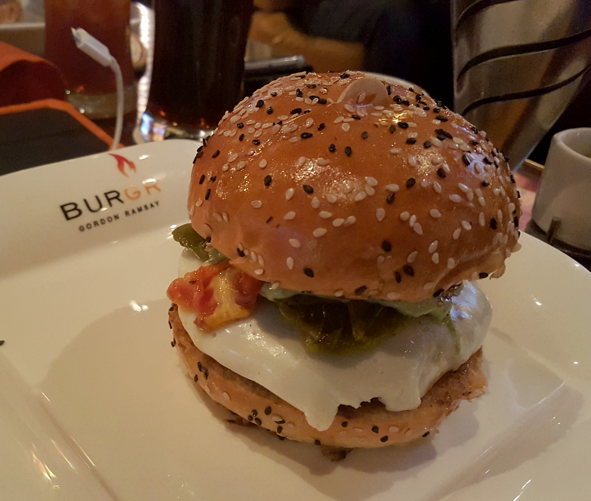

# 16.9.2016 - Las Vegas, výprava za paměťovou kartou, Madame Tussauds, BurGR - Gordon Ramsay, Cheesecake Factory, kostky v casinu

   * 11:30

Vstáváme

   * 13:15

Vyrážíme z pokoje vstříc Las Vegas

Tentokrát se rozdělujeme, Renča s Čermisem si jdou projít hotel, casina  a jiné atrakce na Las Vegas Stripu, Boris si jde zahrát turnaj v pokeru do casina v Caesarově paláci a já se chystám prohlédnout si Caesarův palác, ochutnat burger v restauraci Gordona Ramsaye a origiální cheescake v Cheesecake Factory a podívat se do muzea voskových figur Madame Tussauds.

Bereme si společný taxik u hotelu, který nás s Borisem nejprve vyhodí u Caesarova paláce a pak Renču s Čermisem doveze na druhý konec Stripu.

   * 13:30

Stojím sám uprostřed Caesarova paláce, beru do ruky foťák, že něco nafotím, a zjišťuji, že je bez paměťové karty. Nechal jsem ji v hotelovém pokoji na stole, když jsem včera večer stahoval fotky do počítače.

Nevadí, je tu spoustu obchodů, určitě některý z nich kartu bude prodávat.

   * 15:20

Zjišťuju a přiznávám si, že moje představa o tom, že tu koupím SD kartu, byla naivní.

V několika obchodech mi doporučovali podívat se po obchodech naproti přes ulici, tak jdu zkusit štěstí tam.

   * 15:45

Naproti přes ulici nacházím obchod s digitální technikou, kde SD kartu konečně kupuji a můžu začít fotit i na foťák, nejen na mobil.

Vyrážím tedy směr Madame Tussauds.

   * 16:00

Kupuji lístky a jdu na průzkum voskových figur.

   * 16:30

Viděl jsem Samuela L. Jacksona, Bruce Willise, několik verzí Elvise, Luise Armstronga, všechny Jamese Bondy pohromadě, několik herců a hereček, které znám od vidění, ale jejich jména ne, i spoustu sportovců, herců a hudebníků, které jsem v životě neviděl :)

Opouštím muzeum a hladový a natěšený mířím k restauraci BurGR Gordona Ramsaye.

Cestou potkávám místo, kde Boris stále ještě hraje turnaj v pokeru.

   * 17:20

Přicházím k restauraci BurGR a stavím se do fronty čítající na 20 lidí, abych mohl být obsluhou usazen ke stolu.

S Borisem jsem domluvený, že se ke mě přidá, tak mu dávám vědět.

   * 17:45

Konečně přicházím na řadu, tak si říkám o stůl pro dva.

Asi za 5-10 minut Boris přichází, tak si objednáváme každý svůj burger.

   * 18:45

Po snědení ultimátního burgeru s luxusními hranolkami s lanýžovou majonézou odcházíme s Borisem zpět do Caesarova Paláce, kde mám v plánu ochutnat originální cheesecake od Cheesecake Factory.

   * 19:30

Jsme u Cheesecake Factory a stavíme se do další fronty k usazení ke stolu.

   * 19:45

Konečně sedíme a objednáváme si cheesecake.

Po dalších 5 minutách už bořím svoji vidličku do jednoho z nejlepších desertů, jaký jsem kdy ochutnal.

   * 20:15

Končíme a míříme pěšky na hotel.

Cestou se zastavujeme na představení s vodní fontánou a ohněm před hotelem Mirage, představující soptící sopku.

Během návratu na hotel se nám otevírá ulice s úžasným pohledem na jednu z dominant Las Vegas, věž Stratosphere Tower.

   * 22:20

Přicházíme na hotel.

Studuji pravidla hry, kterou si chci za chvíli v casinu zahrát.

   * 22:40

Beru svůj zbývající rozpočet na sázky v Las Vegas, $90 a odcházím dolů do casina, zahrát si a pobavit se za hě u stolu s kostkami.

Pro velice nepravděpodobný případ, že bych vyhrával, nastavuji si limit výhry $200, se kterým bych hru případně skončil.

   * 22:55

Začínám hrát položením první sázky na stůl

   * 23:20

Končím posledním hodem kostkami, při kterém přicházím o poslední žetony ve hře.

Odcházím zpět na pokoj o $90 chudší, a o intenzivní a nezapomenutelný zážitek bohatší.

   * 23:30

Přicházím na pokoj a jdu napsat něco do deníku a vyvolat ještě nějaké fotky.

Renča a Čermis se vracejí na pokoj taky, a tak si vyměňujeme svoje zážitky.

   * 2:00

Jdu konečně spát.
