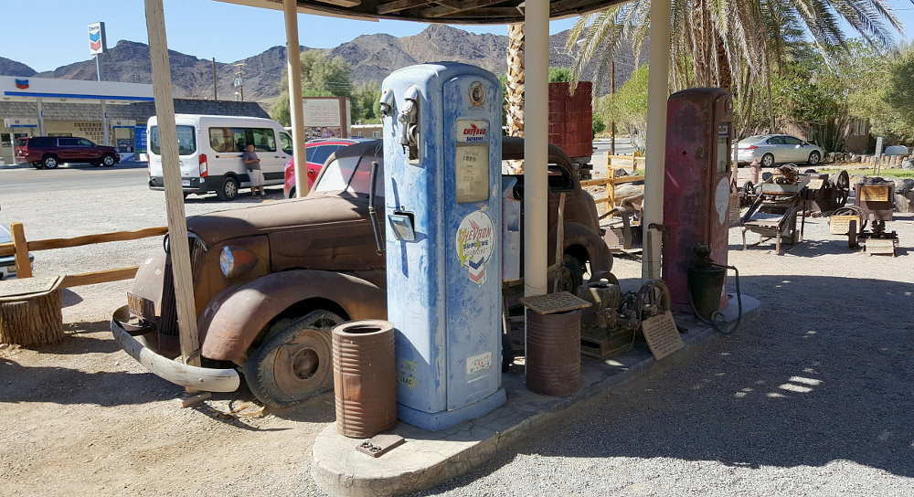
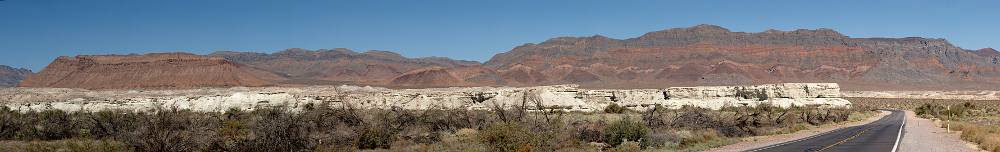
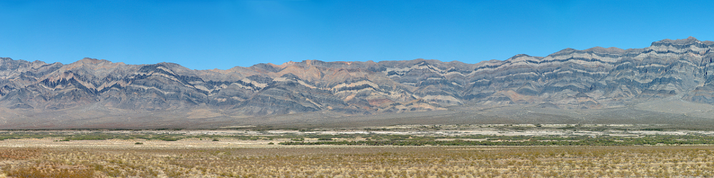
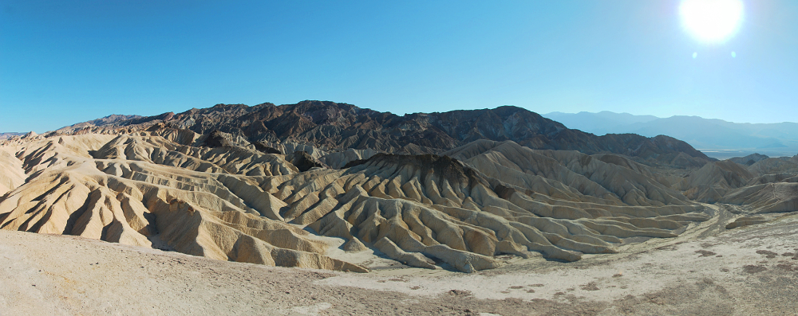
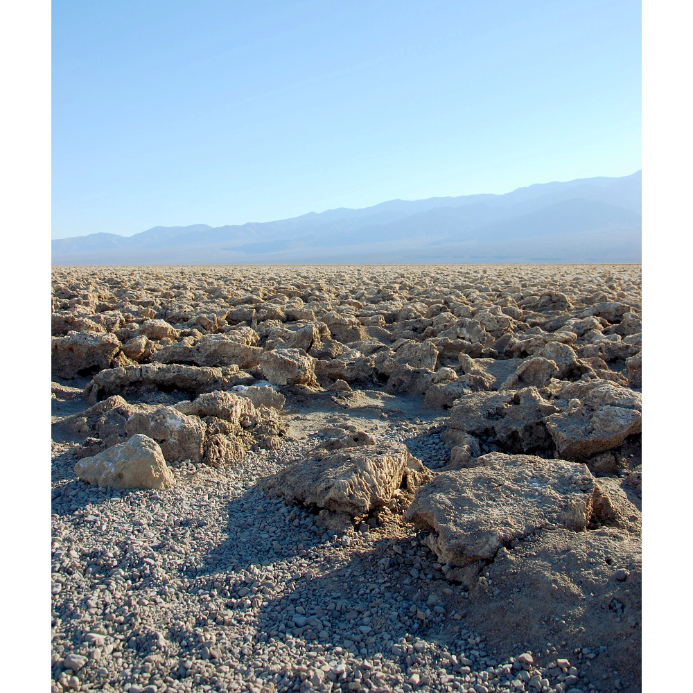
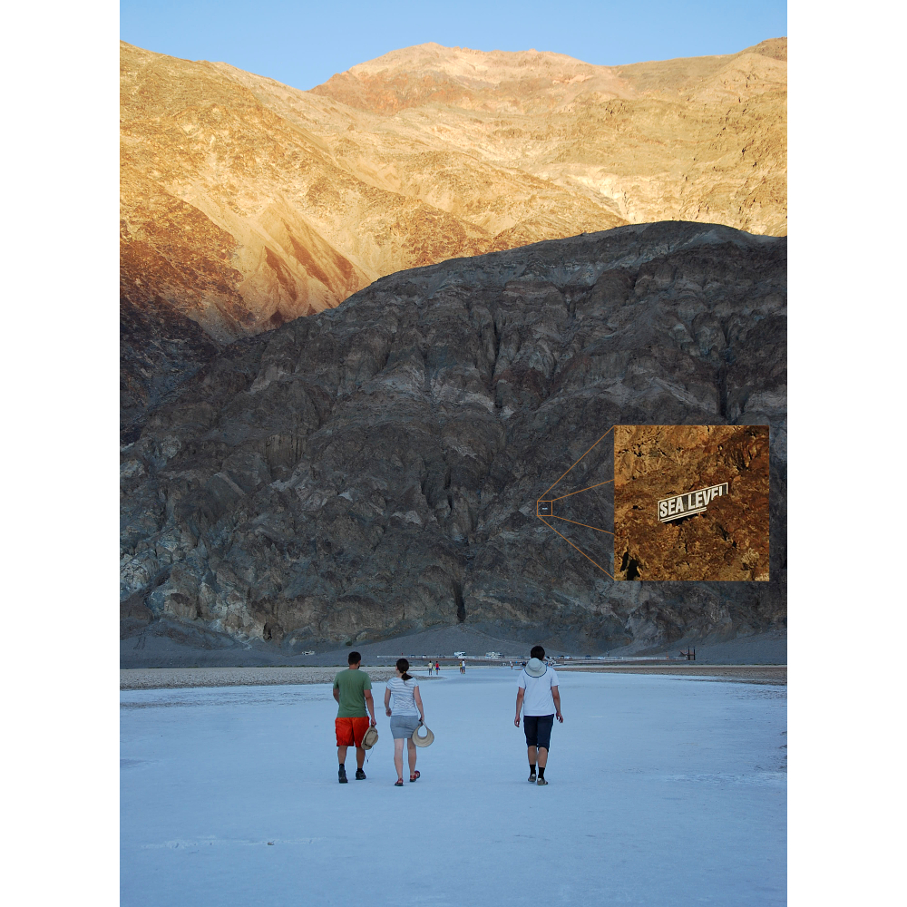
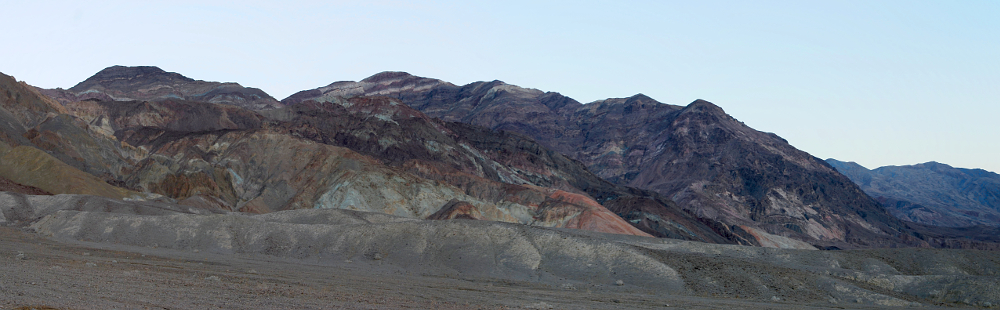

# 17.9.2016 - Death Valley (Údolí smrti) - Zabriskie Point, Devil's Golf Course, Badwater, Artists Pallete, bydlení s krbem

   * 10:00

Probouzíme se a pomalu vstáváme a začínáme balit.

   * 11:00

Odcházíme z hotelu a míříme k autu.

   * 11:05

Stojíme další frontu, tentokrát na výtach do garáží k autu.

   * 11:20

Jsme u auta, dáváme věci dovnitř a odjíždíme vstříc našemu dnešnímu cíli, [Death Valley](https://cs.wikipedia.org/wiki/%C3%9Adol%C3%AD_smrti).

Řidičem pro dnešní den se stává Boris.

   * 11:50

Ještě v rámci Las Vegas stavíme u benzinky Rebel pro kafe.

   * 12:00

Jedeme dál směrem k Death Valley s mezipřistáním u [Shoshone Museum](http://shoshonevillage.com/shoshone-museum.html).

   * 13:20

Ve městě Pahrump hledáme poštu, abychom si tu mohli koupit známky na pohledy do zásoby.

Na místní poště, která je už dnes zavřená, nacházíme automat podobný bankomatu, který umožňuje libovolné poštovní známky koupit a zaplatit kartou. Bohužel žádnou z našich evropsých karet automat neuznává, tak zkoušíme obchody v okolí. V obchodním centru Smiths konečně máme štěstí, tak si děláme zásoby známek pro případ, že bychom chtěli později posílat pohledy.

   * 14:20

Jak se blížíme Death Valley v dáli vidíme vznikající prašný vír, který připomíná tornádo a který se ale během několika minut rozpadá a mizí.

   * 14:35

Zastavujeme u muzea Shoshone Museum, kde mimo jiné očekáváme vidět mamutí kostru, která tu ovšem nikde není. Objevujeme zde ovšem zakonzervované torzo staré benzinové pumy Chevron včetně starého auta, které tu jistě kdysi tankovalo benzín. Přes ulici je moderní pumpa Chevron, což tu působí zajímavý kontrast.

Je tu sice celkem zachovalá čerpací stanice i opuštěným historickým autem, ale je tu vedro typické pro nedaleké Údolí smrti, tak zklamaní zvedáme kotvy a jedeme dál.

    * 16:05

Na naší cestě opouštíme Nevadu s hranicí s Kalifornií.

    * 16:15

Vidíme další prašný vír, který připomíná mini tornádo.

    * 16:18

Míjíme ceduli s nápisem Death Valley National Park a vjíždíme tím do útrob parku.

    * 16:40

Děláme si zastávku u vyhlídky na [Zabriskie Point](https://cs.wikipedia.org/wiki/Zabriskie_Point).

Místní zvlněné skalní útvary nás všechny uchvacují. Bohužel Renču natolik, že při náhlém závanu větru chytá svůj klobouk a omylem tak pouští svůj telefon z ruky, který dopadá na zem a o ležící kámen vyrábí pavoukovitou prasklinu napříč celým displejem. Naštěstí na funkci to vliv zatím mít nebude.

   * 17:25

Už jsme v samotném údolí a přijíždíme k jednomu ze zajímavých míst tu, [Devil's Golf Course](https://en.wikipedia.org/wiki/Devil%27s_Golf_Course).

   * 17:50

Jsme u dalšího zajímavého místa, [Badwater Basin](https://en.wikipedia.org/wiki/Badwater_Basin), které je 85,9 m pod úrovní mořské hladiny a je zde k nalezení voda, která je ale slaná na nevhodná k pití.

Potkáváme mladý Belgicko-Kanadský pár, se kterým si vyměnujeme laskavost a vzájemně se fotíme se západem slunce. Ještě netušíme, že se s nimi nevidíme naposledy.

   * 18:45

Jsme už na cestě do městečka Olancha, kde se chceme ubytovat, a děláme si menší zajížďku scénickou cestou [Artist's Drive](https://en.wikipedia.org/wiki/Places_of_interest_in_the_Death_Valley_area#Artist.27s_Drive_and_Palette), kde okolní skály hrají všemi barvami - nádhera.

Škoda jen, že slunce už zapadlo, to by barvy okolních skal ještě výrazněji prokreslilo.

   * 21:00

Opouštíme hranice národního parku Death Valley.

   * 21:15

Čermis vystavuje Borisovi vysvědšení za jeho řízení, takže musíme zastavit, aby to rozdýchal, načež si povoluje pásek, který nemá :)

   * 21:55

Jsme v Olancha, kde nacházíme ubytování v Ranch Motel, v rustikální chatce s krbem a houpacím křeslem.

   * 23:00

Jdeme spát.

