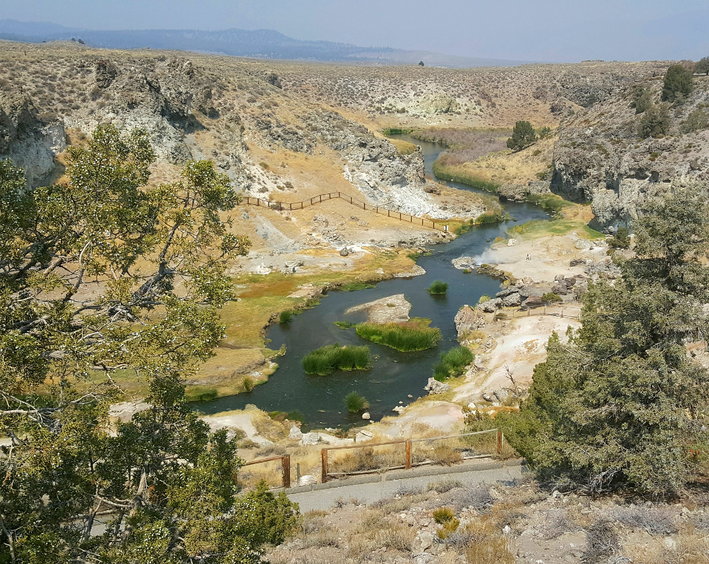
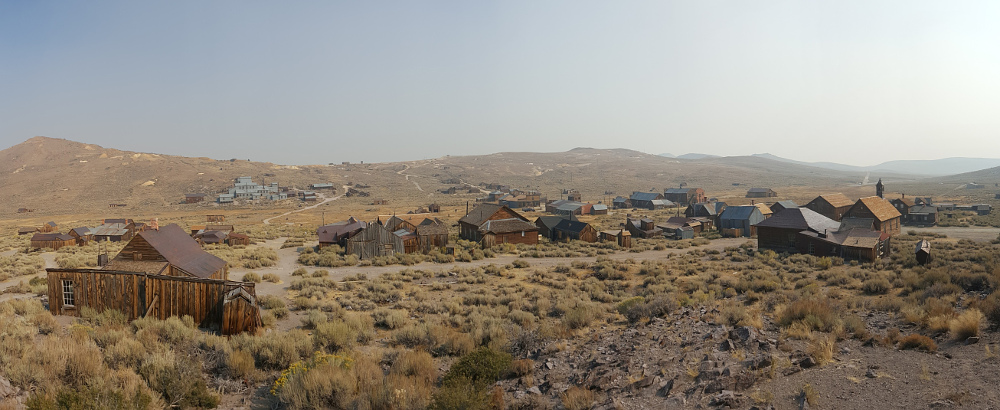
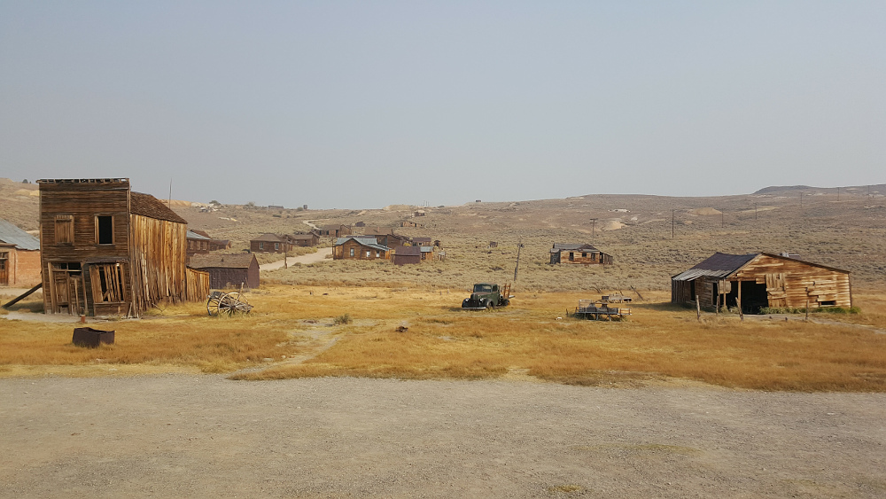

# 18.9.2016 - Město duchů Bodie, Mono Lake, stanujeme v národního parku Yosemite

## 8:00

Vstávám první a v kávovaru, který máme k dispozici v kuchyňce, vařím ranní kávu.

Ostatní postupně vstávají také.

## 10:00

Vydáváme se na cestu do našeho dnešního cíle, města duchů v Kalifornii [Bodie](http://www.ghosttowngallery.com/htme/bodie.htm).

## 11:40

Ve městečku Bishop stavíme u benzinky pro benzín a WC. U stojanů s benzinem jsou dlouhé fronty, tak jedeme dál. Zkusíme jinou benzinku.

## 12:30

Cestou se zastavujeme u [Hot Creek](http://www.fs.usda.gov/recarea/inyo/recarea/?recid=20414), bývalého vulkánu kde dosud vyvěrají horké prameny.

## 12:55

Už směřujeme k dalšímu místu, vodopádu [Rainbow falls](http://www.visitmammoth.com/trip-ideas/hiking-rainbow-falls).

## 13:15

Projíždíme oblastí Mammoth Lakes, kde jsou cyklotraily, které mi připomínají ty v Jedovnici, v Čechách.

## 13:20

Rainbow Falls vzdáváme, protože je sucho a je pravděpodobné, že vodopád bude vyschlý, a taky nemáme už moc času.

## 14:00

Jedeme už směrem k Bodie a v dáli vidíme řízený lesní požár, který plní okolní vzduch popelem a způsobuje, že jsou obloha i vzduch zamlžené a není vidět moc daleko.

## 14:15

U jezera Mono Lake zastavujeme u Shellky a konečně bereme benzín.

## 14:25

Máme velmi zastřenou vyhlídku na Mono Lake.

## 15:20

Už jsme ve měste duchů, Bodie. Zamlžený opar od lesního požáru, co jsme viěli před tím, krásně dokresluje atmosféru města duchů.

Znovu zde potkáváme onen mladý Belgicko-Kanadský pár, který jsme potkali včera v Udolí smrti.

## 16:50

Opouštíme Bodie a míříme na cestu do národního parku Yosemite.

## 17:35

Děláme si krátkou zastávku u vyhlídky na Mono Lake.

## 17:40

Před vjezdem do Yosemit si v místní hospůdce dáváme vydatnou večeři.

## 18:40

Jsme po jídle a ještě kupujeme zásoby v místním obchodě.

## 18:55

Už vyrážíme do Yosemit cestou Tioga Pass.

Vypadává signál mobilní sítě. Dostáváme se mimo dosah civilizace.

## 19:05

Vjíždíme branou do národního parku Yosemite.

## 20:55

Jsme u tábořiště pro výletníky poblíž North Pines Campground.

Boris parkuje auto a my ostatní stavíme stany, ve kterých budeme dnešní noc spát.

## 22:00

Ukazuje se, že se musíme zaregistrovat, tak Boris odchází vyplnit naše jména do místního seznamu. Vrací se s cedulkou, kterou připevňujeme na stan a jdeme konečně spát.

