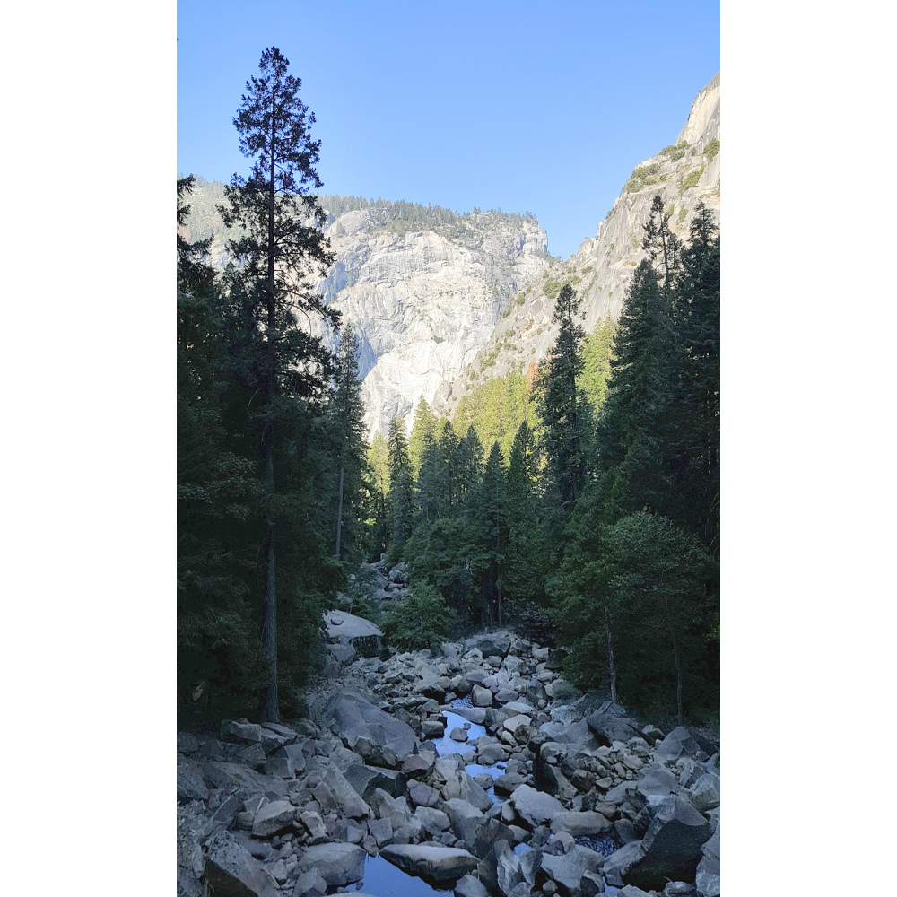
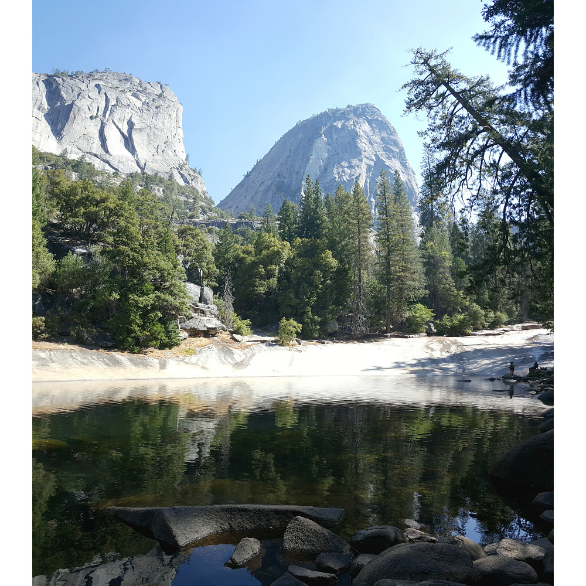
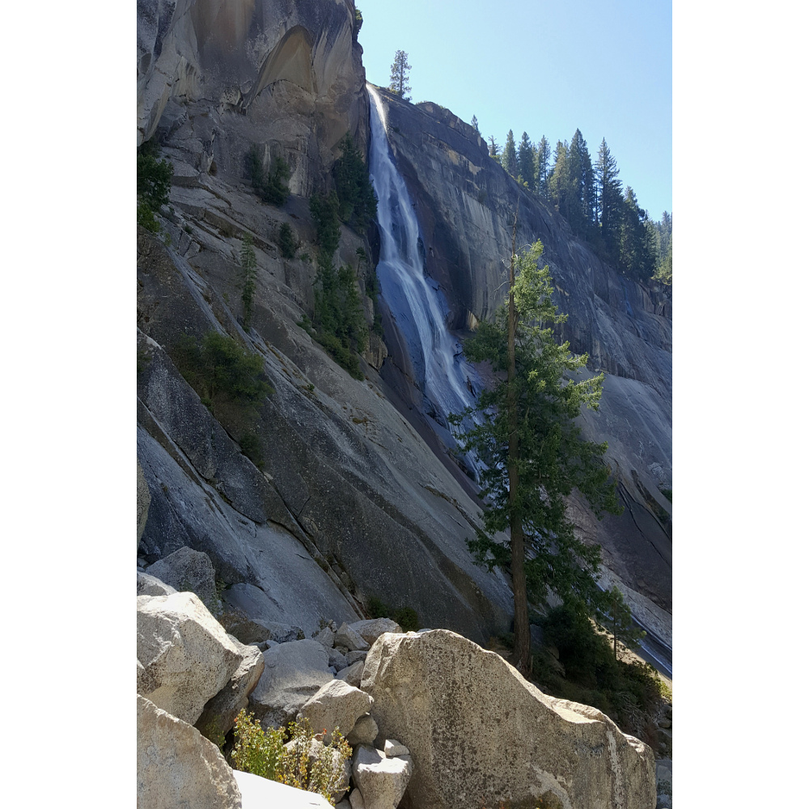
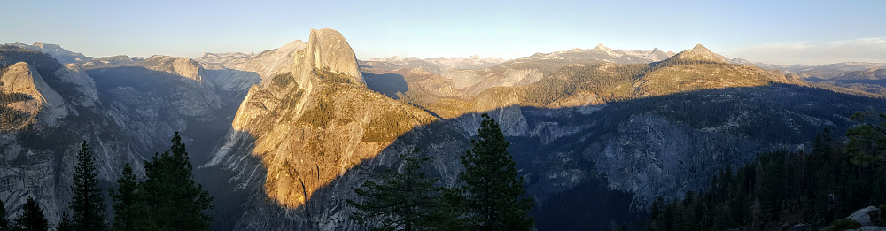

# 19.9.2016 - Yosemity, vodopády Vernal Fall a Nevada Fall, Glacier Point, není signál

   * 6:00

Začíná se svítat nad Yosemitským údolím a ozývat mluvení a periodický smích z některého z vedlejších stanů.

   * 6:30

Tábořištěm zaznívá "Shut up there, bitches!", což mluvení i smích tlumí.

   * 8:00

Vstáváme, balíme stany.

   * 8:45

Parkujeme u Half Dome Campground, jedno z mála míst, kde lze parkovat déle než 30 minut.

Rozhodujeme se, že výlet na [Half Dome](https://cs.wikipedia.org/wiki/Half_Dome) už nestíháme, tak volíme kratší trail k vodopádům [Vernal Fall a Nevada Fall](https://www.nps.gov/yose/planyourvisit/vernalnevadatrail.htm), který nás k Half Dome alespoň přiblíží.

   * 10:40

Stojíme pod Vernal Fall, kde vycházející slunce ukázalo duhu v tříštivých kapkách dopadající vody, o kterou jsme přišli u Rainbow Fall.

.jpg)

   * 10:50

Jsme na vyhlídce u Vernal Fall, kde si děláme první pauzu na svačinu.

   * 12:10

Jsme pod vodopádem Nevada Fall a míříme nad něj.

   * 12:50

Z vyhlídky nad Nevada Fall máme nádherný výhled na údolí a na Half Dome, který jsme před chvilkou minuli.

   * 13:20

Nastupujeme na cestu John Muir Trail, která nás přivede zpět do údolí a k autu. A koho cestou nepotkáváme, námi oblíbený Belgicko-Kanadský pár :).

   * 15:00

Jsme dole u místa zvaného Happy Isles a Boris zalézá do studených vod říčky Merced River, abych se tu vykoupal.

Po několika tempech a jednom kolečku vystupuje ze studené vody a na tváři má blažený výraz.

   * 15:30

Nastupujeme na místní kyvadlový autobus Yosemite Shuttle a míříme k na 20 minut trvající cestu k návštěvnickému centru za lovem zasloužené magnetky.

   * 16:13

Náhodou jsem narazil na free Wifi, a tak se na pár minut připojuju do civilizovaného světa.

   * 16:20

Jedeme od návštěvnického centra k autu. Bereme autobus, který ovšem jede jiným směrem, než potřebujeme, z důvodu dočasného rozdělení linky na 3 dílčí kvůli rekonstrukcím na místních silnicích.

   * 17:10

Jsme konečne u auta a odjíždíme z parku. Za volant si sedá Boris a jedeme zkusit štěstí k [Glacier Point](https://www.nps.gov/yose/planyourvisit/glacierpoint.htm), místu, odkud je výhled do údolí a Half Dome v celé jeho kráse, a doufáme, že nám nezapadne slunce.

   * 18:10

Jsme u Glacier Point, kde poslední paprsky zapadajícího slunce vrhají dlouhé stíny do Yosemitského údolí, nad nímž se tyčí krásně osvětlený Half Dome.

   * 19:00

Slunce už definitivně zapadlo, a tak se ujímám řízení a vyrážíme z parku směrem k městu Fresno, kde chceme dnes přespat.

   * 20:00

Opouštíme hranice národního parku Yosemity. Uvědomujeme si, že s vyjímkou $24 za stany jsme tu byli zcela zdarma a neplatili žádné permity.

   * 20:30

Ve městešku Oakhurst bereme benzín a kupujeme si něco na zub.

Opět naskakuje signál mobilní sítě a jsme zase součástí civilizace.

   * 21:50

Konečně přijíždíme k našemu hotelu University Square Hotel ve městě Fresno, kde už na nás čekají sprchy a postele.

   * 22:30

Ostatní jdou spát, já ještě píšu deník.

   * 0:45

Jdu konečně spát i já.

