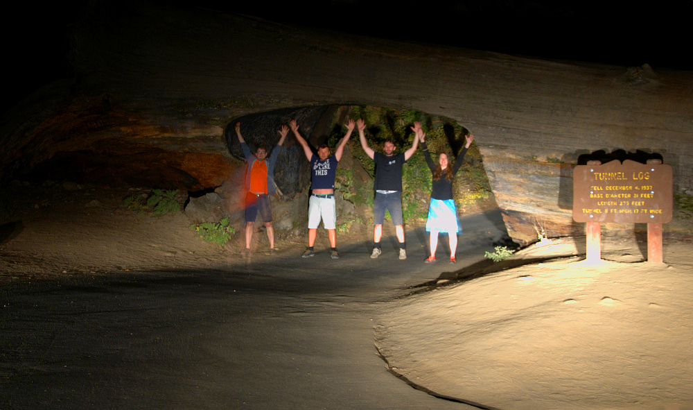

# 20.9.2016 - Americká snídaně, národní park Sequoia, Generál Sherman, pachatelé se vrací na místo činu

   * 9:30

Vstáváme.

Zjišťijeme, že hotelem nabízená snídaně končila v 9:00, smůla.

   * 10:55

Sbalení opouštíme hotel a hledáme, čím nahradit promarněnou snídani v hotelu. Boris vyslovuje myšlenku, dát si v nedalekém Denny's "pořádnou americkou snídani", která se všem líbí.

Za volantem zůstávám já.

   * 11:05

Vstupujeme do Denny's s nadějí na vydatnou snídani.

   * 12:30

Přecpaní a přesycení odjíždíme k nedalekému obchodu nakoupit zásoby vody a nějaké jídlo.

   * 13:10

Máme nakokupeno a vydáváme se na cestu k našemu dnešnímu cíli, národnímu pakru [Sequoia](https://cs.wikipedia.org/wiki/N%C3%A1rodn%C3%AD_park_Sequoia) a v něm největšímu žijícímu stromu na planetě, Generálu Shermanovi.

   * 15:20

Vjíždíme do národního parku Sequoia.

   * 16:55

Po nesčetných serpentýnách přijíždíme konečně k parkovišti nedaleko Generála Shermana.

   * 17:00

Konečně vidíme největší strom na světě a u něj spousta lidí stavějící se do fronty, aby se u něj mohla vyfotit.

Vydáváme se na místní trail s názvem [Congress Trail](http://www.redwoodhikes.com/SequoiaNP/Congress.html), který nás provede částí lesa, kde je spousta sekvojí v čele se skupinou stromů rostoucích pohromadě zvanou The Senate.

   * 18:55

Park je už vylidněný, tak jdeme ke Generálu Shermanovi pořídit pár fotek bez lidí.

   * 19:00

Jsme zpět u auta a vyrážíme k padlému stromu, ve kterém byl vyřezán otvor, aby jím mohla projet auta, abychom si tam udělali společnou fotku.

   * 19:15

Jsem u padlého stromu zvaného [The Tunnel Log](http://www.roadsideamerica.com/story/21675) a využíváme světel u auta, aby nám posvítila na vytouženou fotku.

   * 19:20

Už jsme na cestě zpět do Fresna najít ubytování pro dnešní noc.

   * 19:45

Projíždíme branou parku a opouštíme tak jeho hranice.

   * 20:00

Zastavujeme u krajnice a Boris se hrdinně, riziku sežrání medvědem navzdory, vrhá z auta pro šišku pinie pro Renču. Ta má radost, zatímco Boris má ruce od smůly.

   * 20:20

Po krátké cestě národním parkem King's Canyon opouštíme i ten a míříme do Fresa.

   * 22:15

Jsme zpět ve Fresnu a u stejného hotelu jako včera, University Square Hotel.

   * 0:30

Najedení a s odhodláním zítra ráno vstát a tentokrát stihnout snídani jdeme spát a uzavíráme tak dnešní den.

