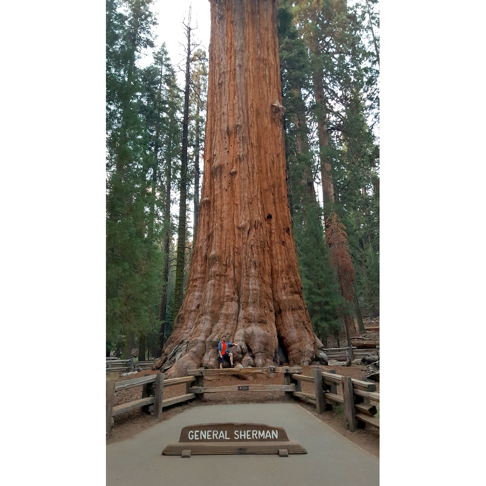

# 20.9.2016 - Americká snídaně, národní park Sequoia, Generál Sherman, návrat

## 9:30

Pomalu vstáváme.

Po pár minutách zjišťujeme, že hotelem nabízená snídaně končila v 9:00, smůla.

## 10:55

Sbalení opouštíme hotel a hledáme, čím nahradit promarněnou snídani v hotelu. Boris vyslovuje myšlenku, dát si v nedalekém Denny's "pořádnou americkou snídani", která se všem líbí.

Za volantem zůstávám já.

## 11:05

Vstupujeme do Denny's s nadějí na vydatnou snídani.

## 12:30

Přecpaní a přesycení se pomalu suneme k autu a odjíždíme k nedalekému obchodu nakoupit zásoby vody a nějaké jídlo.

## 13:10

Máme nakoupeno a vydáváme se na cestu k našemu dnešnímu cíli, národnímu parku [Sequoia](https://cs.wikipedia.org/wiki/N%C3%A1rodn%C3%AD_park_Sequoia) a v něm největšímu žijícímu stromu na planetě, Generálu Shermanovi.

## 15:20

Vjíždíme do národního parku Sequoia.

## 16:55

Po nesčetných serpentinách přijíždíme konečně k parkovišti nedaleko Generála Shermana.

## 17:00

Konečně vidíme největší strom na světě a u něj spoustu lidí stavějící se do fronty, aby se u něj mohli vyfotit.

Vydáváme se na místní trail s názvem [Congress Trail](http://www.redwoodhikes.com/SequoiaNP/Congress.html), který by nás měl provést částí lesa, kde je spousta sekvojí v čele se skupinou stromů rostoucích pohromadě zvanou The Senate.

## 18:55

Park je už vylidněný, a tak jdeme ke Generálu Shermanovi pořídit ony vytoužené fotky bez lidí.

## 19:00

Jsme zpět u auta a vyrážíme k padlému stromu, ve kterém byl vyřezán otvor, aby jím mohla projet auta, abychom si tam udělali společnou fotku.

## 19:15

Zastavujeme u padlého stromu zvaného [The Tunnel Log](http://www.roadsideamerica.com/story/21675) a využíváme svítidel auta, aby nám poskytla potřebné světlo na vytouženou fotku.

## 19:20

Už jsme na cestě zpět do Fresna najít ubytování pro dnešní noc.

## 19:45

Projíždíme branou parku a opouštíme tak jeho hranice.

## 20:00

Zastavujeme u krajnice a Boris se hrdinně, riziku sežrání medvědem navzdory, vrhá z auta pro šišku pinie pro Renču. Ta má radost, zatímco Boris má ruce od smůly :).

## 20:20

Po krátké cestě národním parkem King's Canyon opouštíme i ten a míříme do Fresna.

## 22:15

Jsme zpět ve Fresnu a ne náhodou u stejného hotelu jako včera, University Square Hotel.

## 0:30

Najedení a s odhodláním zítra ráno vstát a tentokrát snídani stihnout jdeme spát a uzavíráme tak dnešní den.
