# 22.9.2016 - Promarněný steak, San Francisco, americká pizza, náhrada za steak, Golden Gate Park 

## 10:00.

Vstáváme.

Rýmička naštěstí trochu ustoupila a můžu se tak těšit na své vysněné San Francisco.

Při pokusu udělat online rezervaci v restauraci House of Prime Ribs, na jejíž dokonalý steak se celý výlet po USA těším, zklamaně zjišťuji, že mají na příští 2 týdny obsazeno. Lehce frustrovaný si uvědomuji, že vzhledem k tomu, že jsme na poslední chvíli nevěděli, kdy v San Franciscu nakonec budeme, a že tedy dělat rezervaci dopředu nemělo smysl, vzdávám se bez výčitek myšlenky na opakovaný zážitek z nejlepšího steaku, který jsem tu před čtyřmi lety zažil.

## 11:30

Všichni společně vyrážíme směr San Francisco.

## 11:45

Jsme u nedaleké zastávky nadzemky BART zvané MacArthur, kde v automatu kupujeme jízdenky.

## 12:00

Nastupujeme do vlaku BART a odjíždíme na zastávku Powell St. v centru San Francisca.

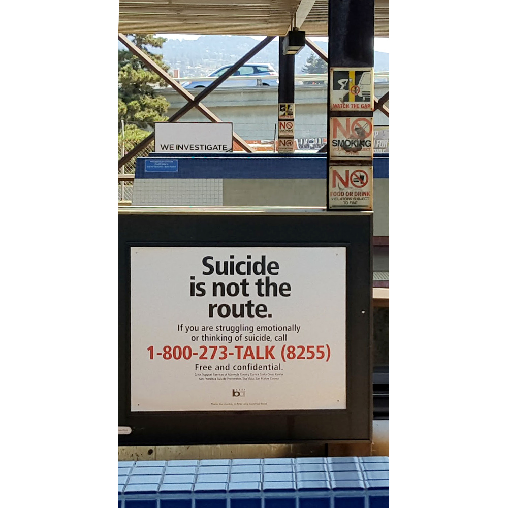

## 12:25

Jsme na stanici Powell St.

Rozdělujeme se: Renča s Čermisem jdou po vlastní ose, zatímco já a Boris míříme do japonské čtvrti (Japantown) najít čajovnu a dát si čaj.

## 13:00

Zastavujeme se v občerstvení Irving Pizza, abychom tu konečně ochutnali americkou pizzu.

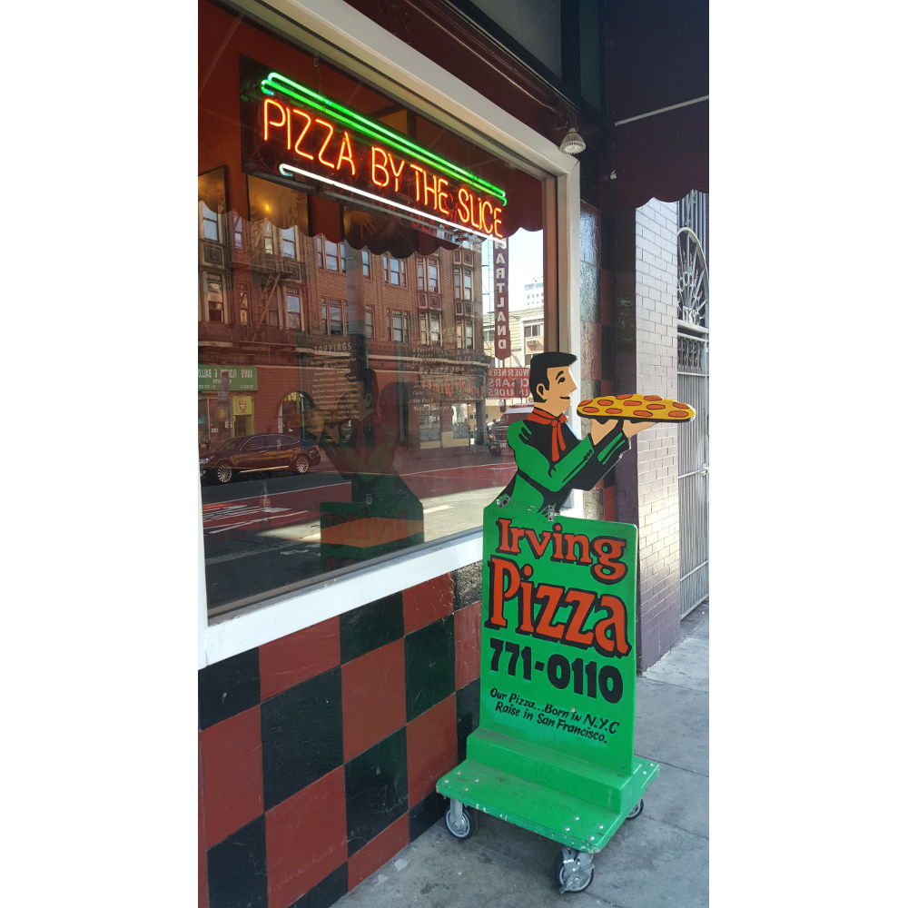

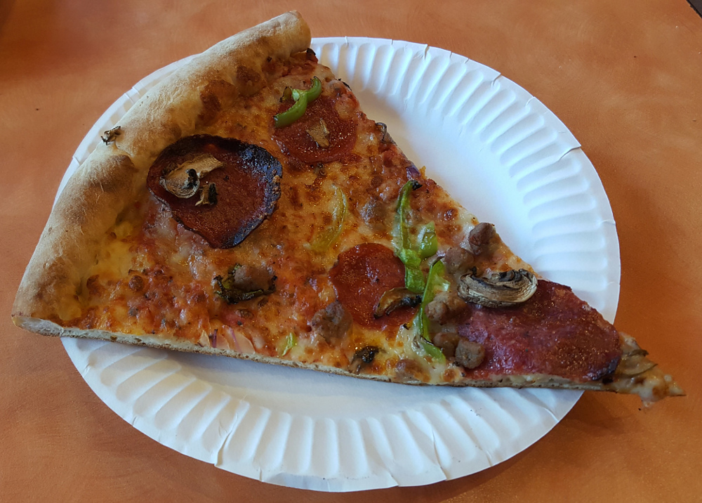

Překvapuje mě, jak dobrá je. Ačkoliv její těsto je "buchtové", je nadýchané, lehké a křupavé.

## 13:20

Cestou do japonské čtvrti procházíme kolem zajímavé sakrální stavby, katedrály nanebevzetí Svaté Marie (Cathedral of Saint Mary of the Assumption).

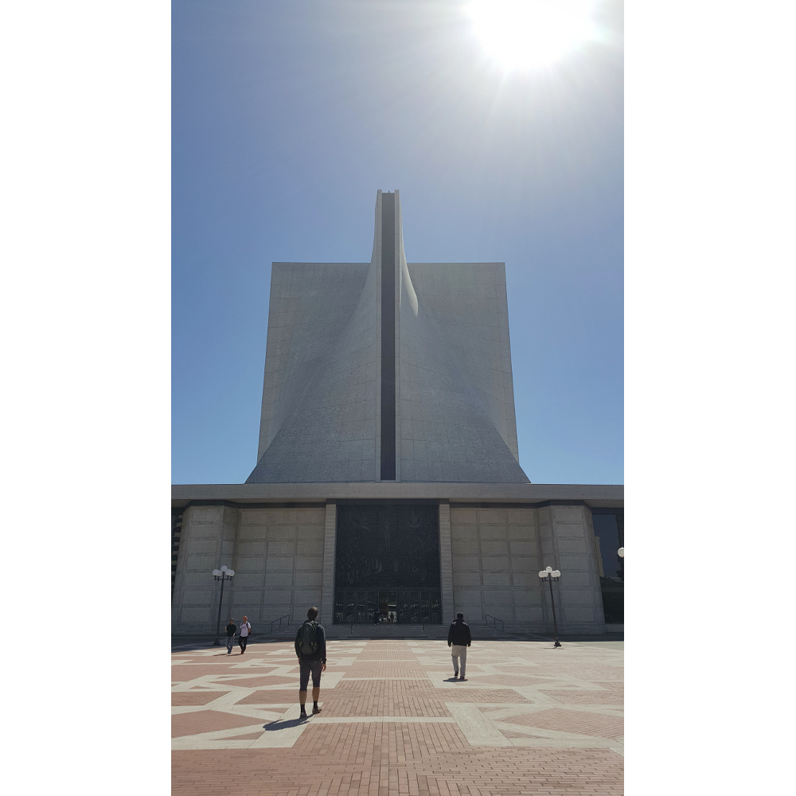

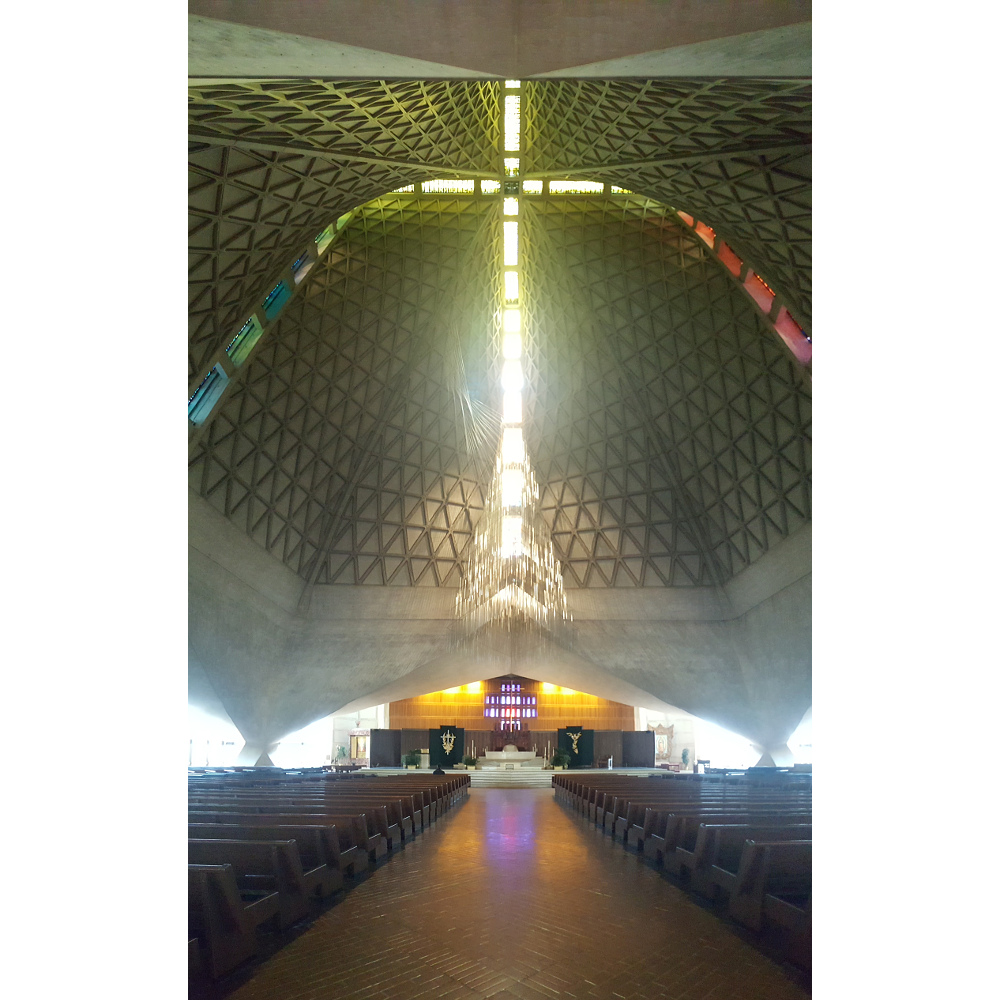

## 14:10

Dorazili jsme do japonské čtvrti a chvíli stojíme za okny restaurace Benihana, kde místní kuchař připravuje lidem jídlo způsobem zvaným Teppanyaki, tedy přímo u stolu. Po chvíli žasnutí rozhodujeme se dát si oběd tu a nechat si jídlo připravit stejným způsobem a odnést si skvělý zážitek.

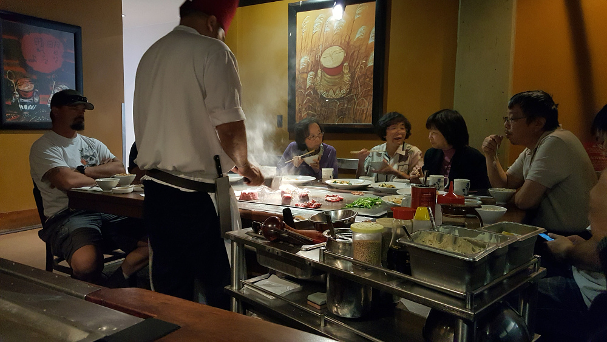

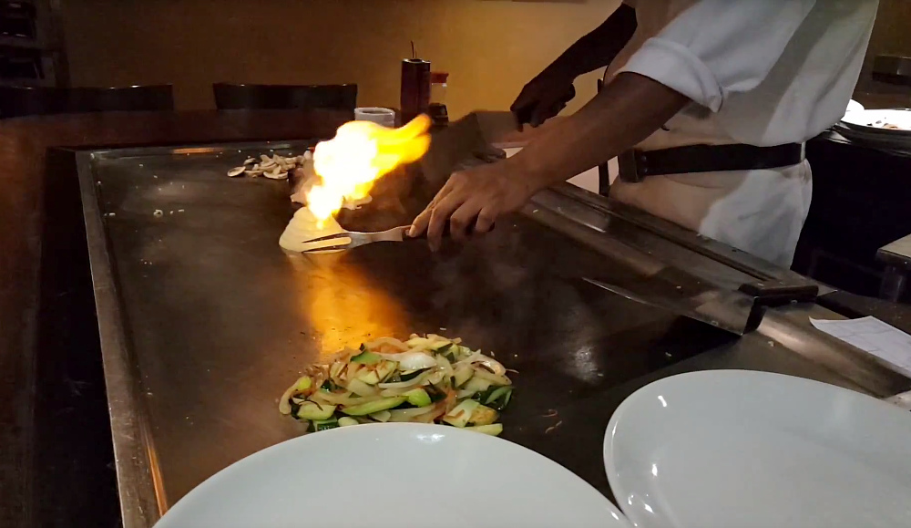

Tento zážitek se pro mě nakonec ukazuje jako adekvátní náhrada za promarněný steak a vrací mi radost, o kterou jsem ráno přišel :).

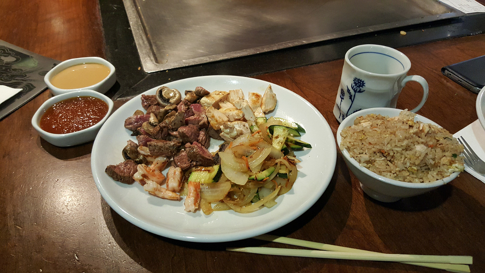

Já i Boris si vychutnáváme a bavíme se u choreografie a show, kterou nám kuchař předvádí, stejně jako z vůní a chutí, které se z pokrmu linou.

## 15:40

Spokojení a nadšení odcházíme směrem do pakru Golden Gate Park, kde je ona japonská čajová zahrada, kde si chceee v klidu dát zelený čaj.

Cestou procházíme přes pozemky místní univerzity San Francisco University, od které je pěkný výhled na záliv i město.

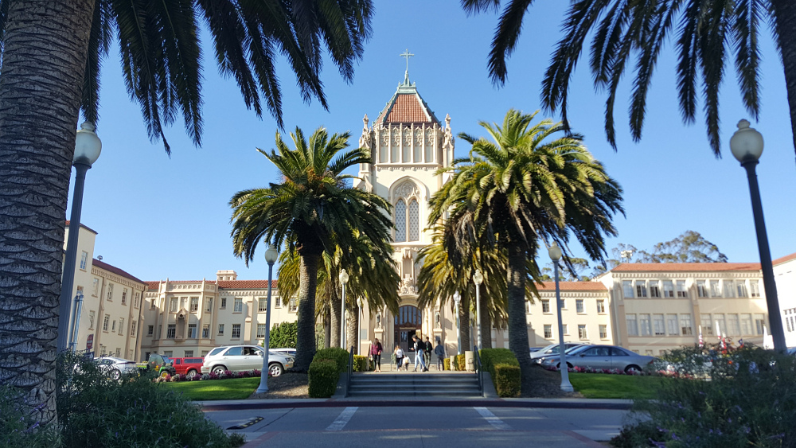

## 17:05

Vstupujeme do východní části parku Golden Gate Park.

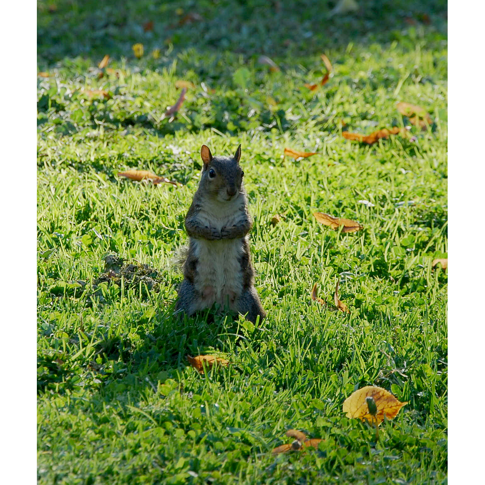

## 17:45

Procházíme branou do japonské čajové zahrady, kde zjišťujeme, že místní čajovna za 15 minut zavírá. Dáváme si tedy alespoň "točený" čaj. Ten je i tak příjemný a zahřívá mě na tělě.

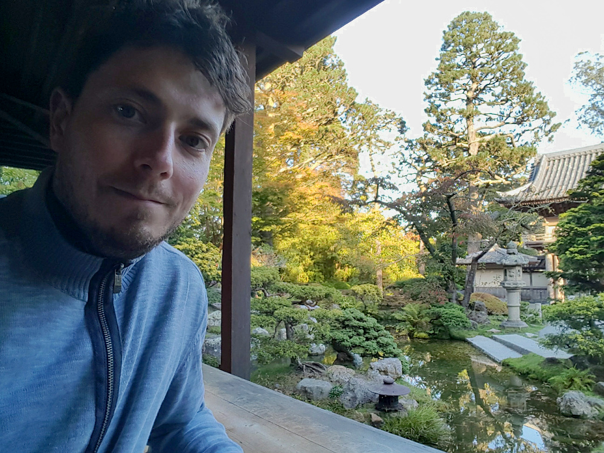

Příjemně unavený a nasycený zážitky rozhoduji se už zamířít už zpět na hotel a odpojuji se tak od Borise, který ještě pokračuje v prohlídce města.

## 18:10

Na nedaleké zastávce nastupuji na autobus a vydávám se na cestu měste zpět na hotel.

## 21:30

Jsem zpět na hotelu v Oaklandu, kde už Čermis s Renčou koukají v pyžamu na televizi.

## 0:00

Zhasínáme světla a odcházíme do říše snů.
