# 23.9.2016 - San Francisco, Cable Car, Lombard Street, Pier 39, vězení Alcatraz

## 10:00

Vstáváme.

## 11:10

Vyrážíme na druhé kolo prohlídky San Francisca.

## 12:00

Stojíme v centru San Francisca na Powell St. a kupujeme lístky na projížďku lanovou tramvají [Cable Car](https://en.wikipedia.org/wiki/San_Francisco_cable_car_system).

## 12:05

Stavíme se do fronty u točny na zastávce Powell St., která je dlouhá asi 150 lidí.

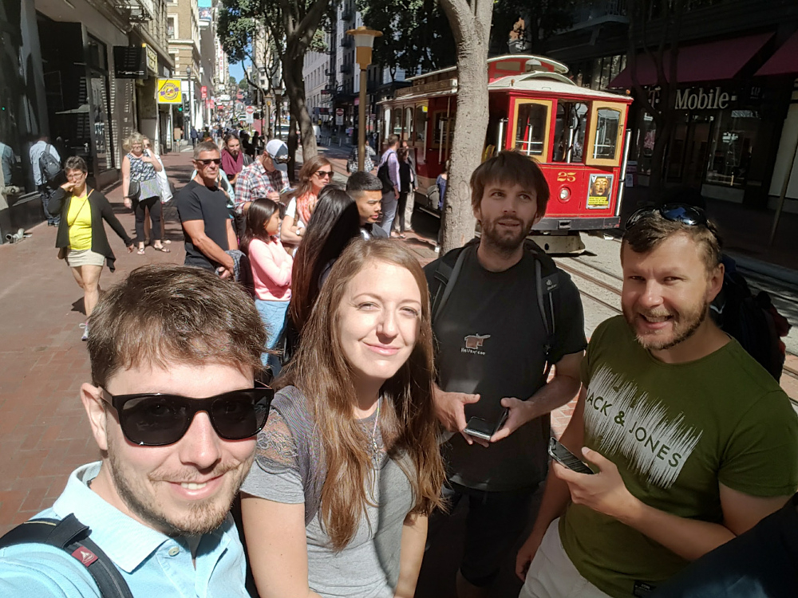

Čermis odhaduje dobu, než se ve frontě posuneme k nastoupení, na 20 minut.

## 12:13

Boris čekání ve frontě vzdává, odpojuje se od nás a vyráží pěšky.

## 12:25

Fronta se pousunula asi o 15 lidí a Čermis vzdává, načež se domlouváme na tom, že popojdeme pěšky a pak nastoupíme o kus dál.

## 13:05

Naše chůze nás přivádí do čínské čtvrti Chinatown, kterou si procházíme a prohlížíme, než dojdeme na křižovatku Powell St. a Jackon St., kde bychom mohli mít šanci nastoupit na Cable Car, které tu má zastávku.

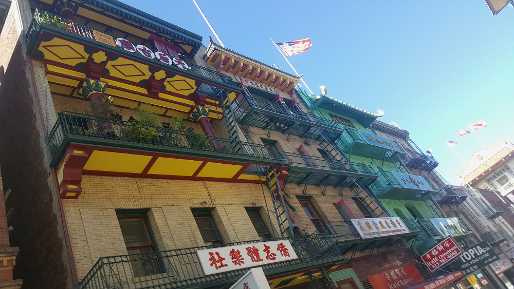

## 13:40

Po prohlídce čínské čtvrti nakonec nastupujeme o zastávku dříve a užíváme si jízdu ulicemi San Franciscem.

## 13:55

Vyskakujeme z Cable Car na zastávce u druhé nejzakroucenější ulici světa [Lombard Street](https://cs.wikipedia.org/wiki/Lombard_Street_a_Vermont_Street).

Tu scházíme dolů a prohížíme si výhled na východní San Francisco spolu s věží [Coit Tower](https://cs.wikipedia.org/wiki/Coit_Tower).

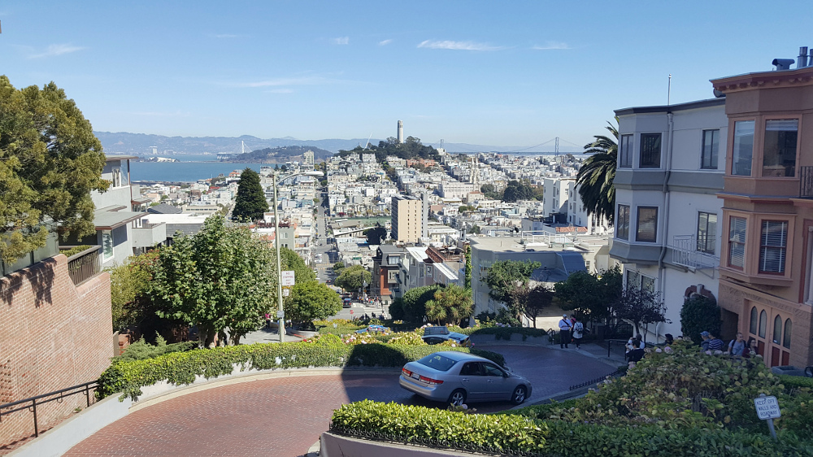

Pak už míříme na sever k nábřeží San Francisco Bay. Cestou se nám otevírá výhled na záliv, ve kterém leží ostrov Alcatraz se slavným vězením, kam se večer chystáme na prohlídku. 

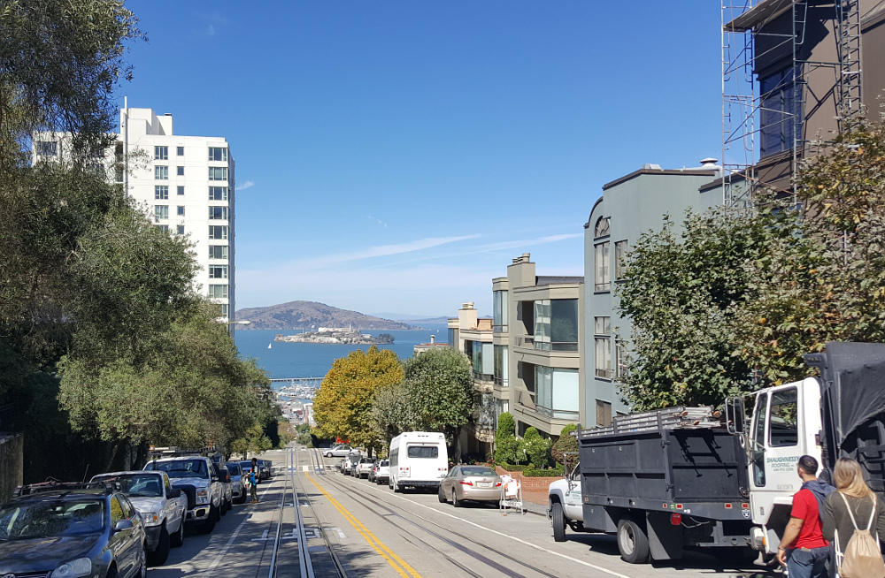

Procházíme kolem několika lanových tramvají, jimž se podařilo dostat se do zácpy.

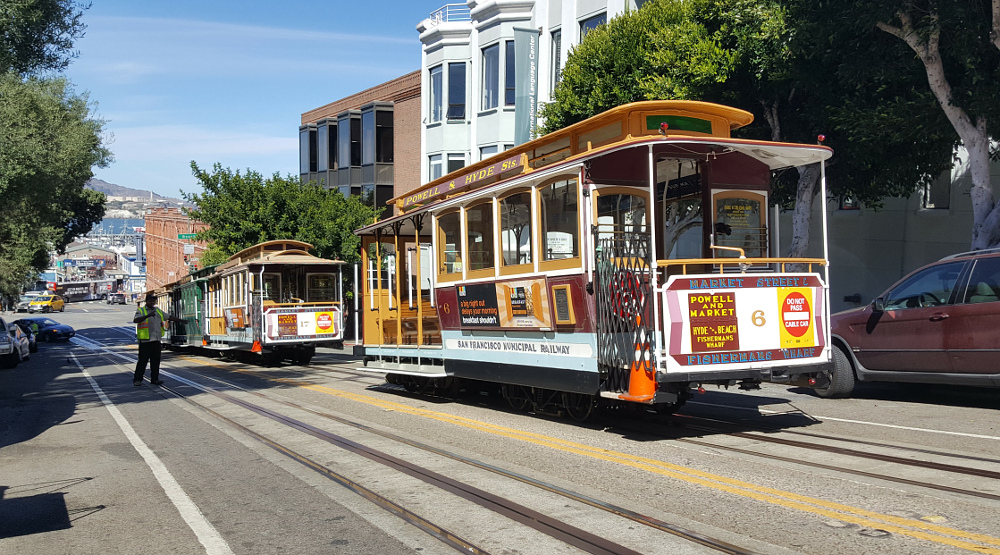

Potkáváme místního umělce, který tu vodovými barvami ručně kreslí známé ikony San Francisca, jako most Golden Gate Bridge, domy Painted Ladies nebo Cable Car. Jeho práce se nám moc líbí, tak si od něj pár vybraných kousků kupujeme a na památku se s ním zvěčňujeme na fotce.

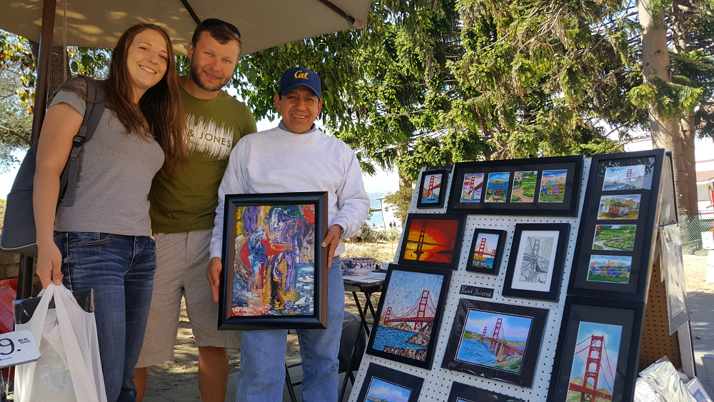

## 17:30

Jsme na nejznámějším molu Pier 39 a v rychlosti si ho procházíme.

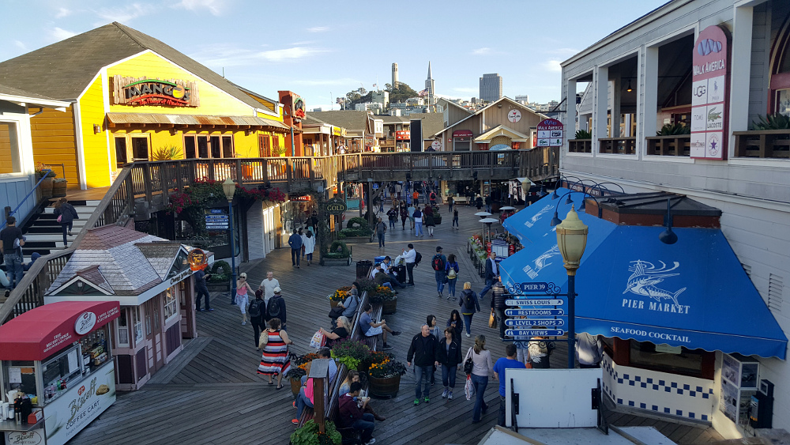

## 18:00

Na molu Pier 33 se stavíme do fronty na přívoz, který nás má dovézt na ostrov [Alcatraz](https://cs.wikipedia.org/wiki/Alcatraz), kde leží dnes už nefungující věznice.

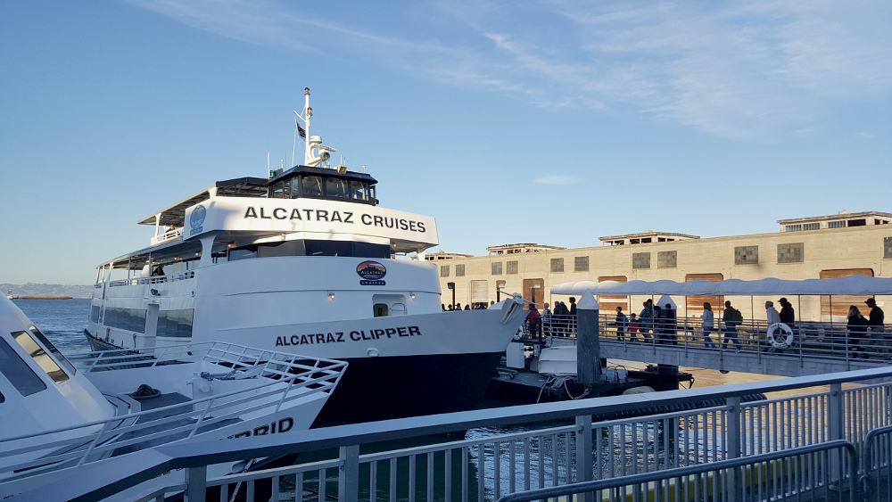

Na palubě lodi již po páté potkáváme náš oblíbený Belgicko-Kanadský pár a tak si s nimi děláme společnou fotku. Je to až neuvěřitelná náhoda, neboť jsme my i oni dělali svoje rezervace na tento  přívoz před dvěma až třemi měsíci, když jsme se ještě neznali.

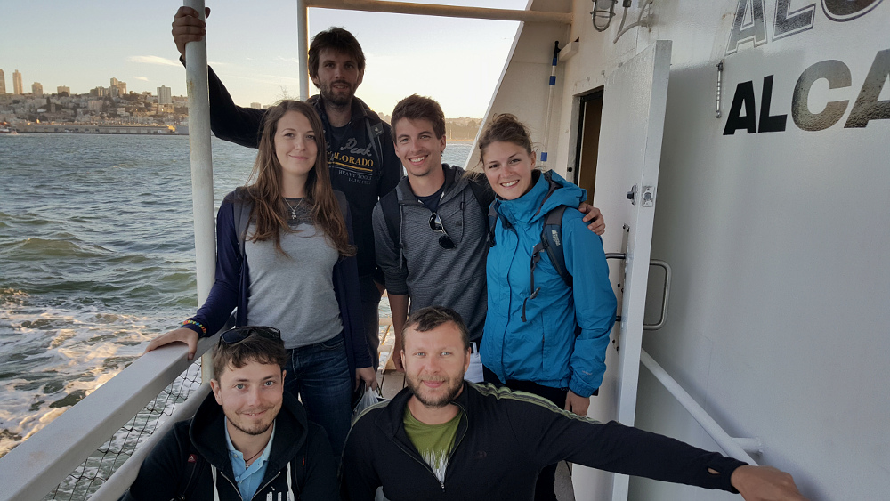

Během plavby na ostrov Alcatraz se nám pěkně ukazuje most Golden Gate Bridge.

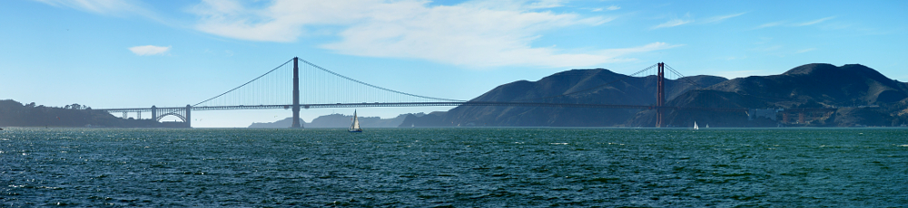

## 18:55

Vyloďujeme se na Alcatrazu a vyrážíme na jeho prohlídku komentovanou elektronickým průvodcem, který nás provádí prostorami vězení i jeho historií a který je namluvený skutečnými hlídači a bývalými vězni, co tu byli.

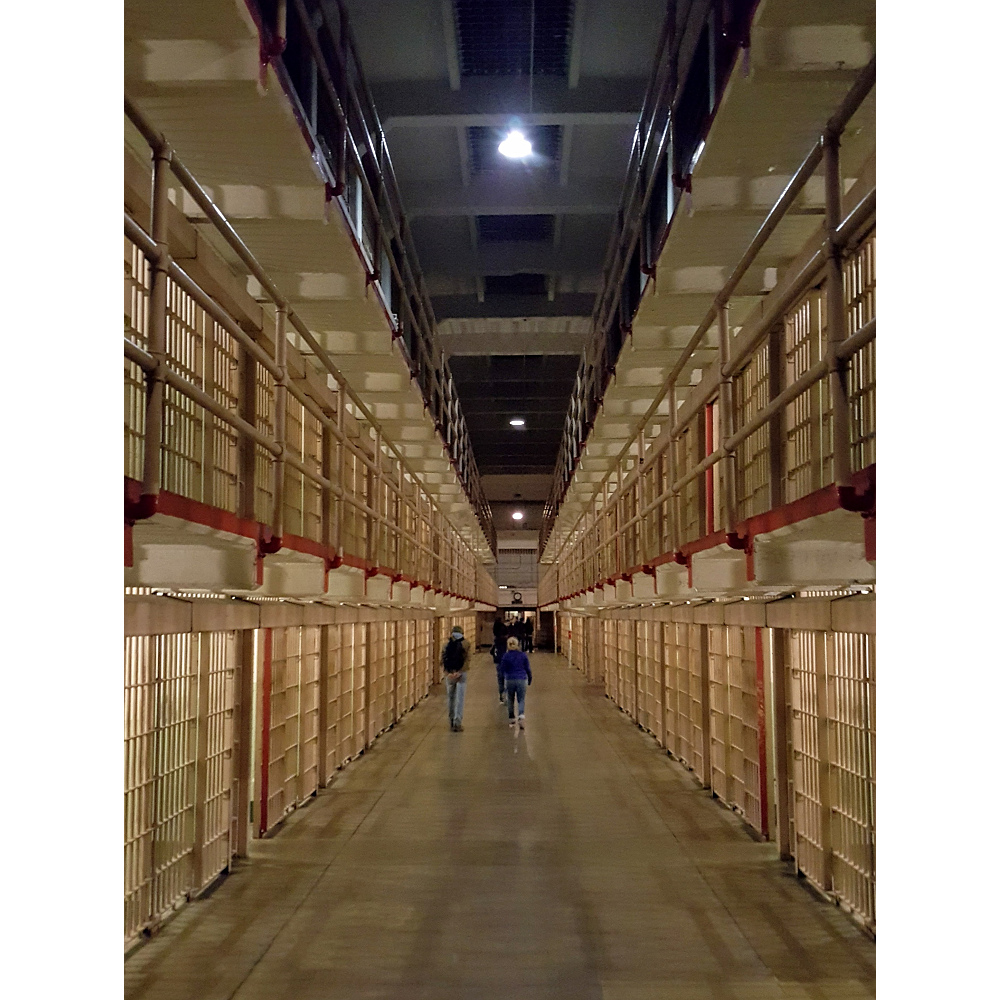

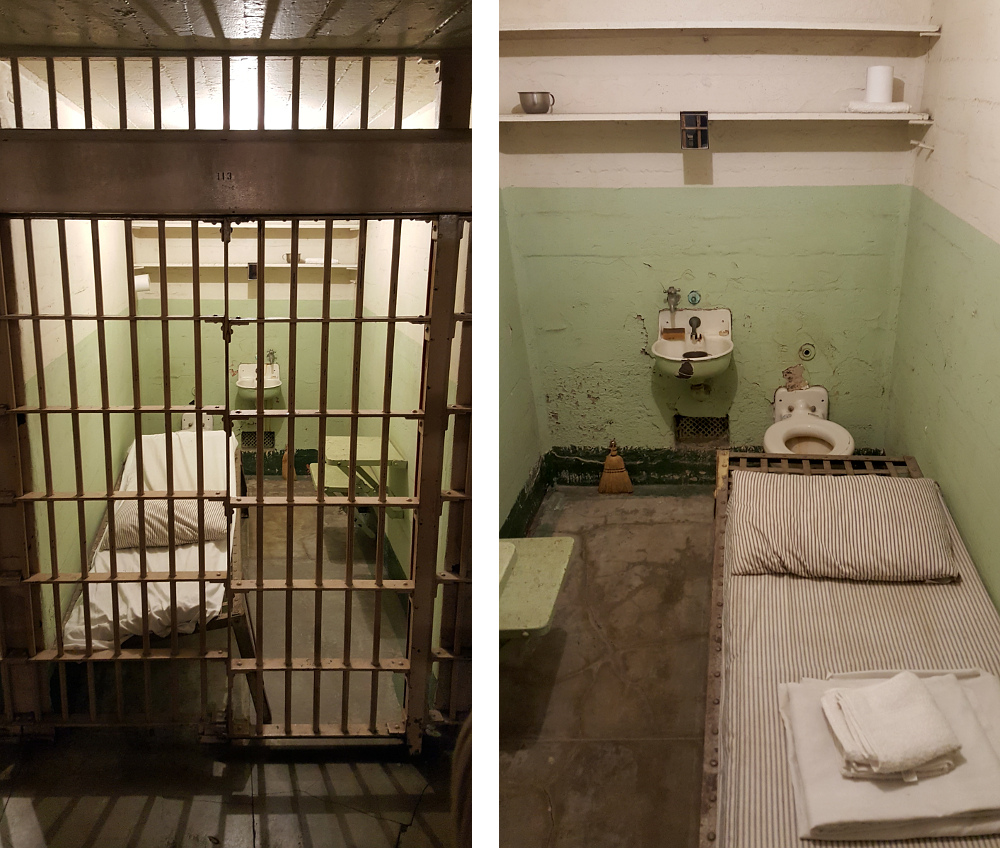

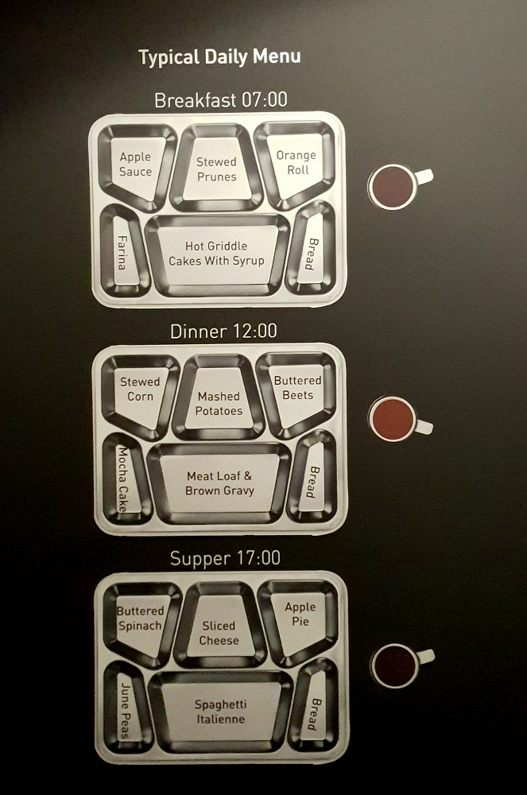

Z ostrova je nádherný výhled na noční San Francisco i na most Golden Gate Bridge.

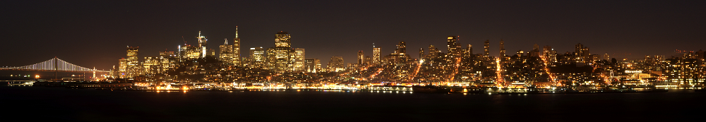

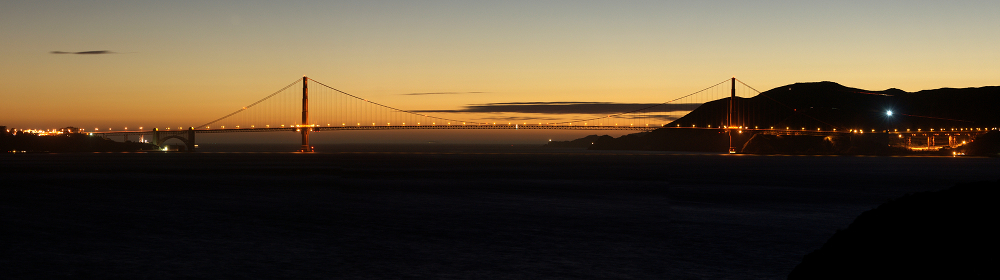

## 21:25

Plni dojmů odjíždíme posledním přívozem zpět na pevninu do San Francisca.

## 21:50

Přistáváme u pevniny a jdeme pěšky přes celé nábřeží až k zastávce BARTa Embarcadero, odkud se chceme nechat dovézt vlakem až na naši zastávku u hotelu.

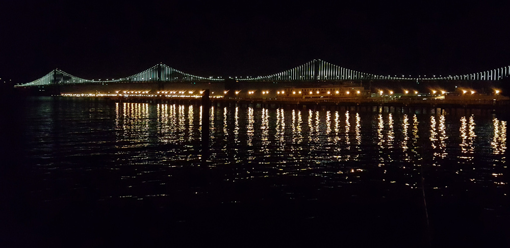

## 23:00

Jsme konečně v Oaklandu a jdeme na hotel.

Děláme si mezipřistání v nedalekém obchodě, kde si kupujeme něco na zub.

## 0:00

Jdeme všichni spát, abychom zítra vstali brzy a stihli slabý provoz přes most Golden Gate Bridge a mohli si ho tak v klidu projet autem.

