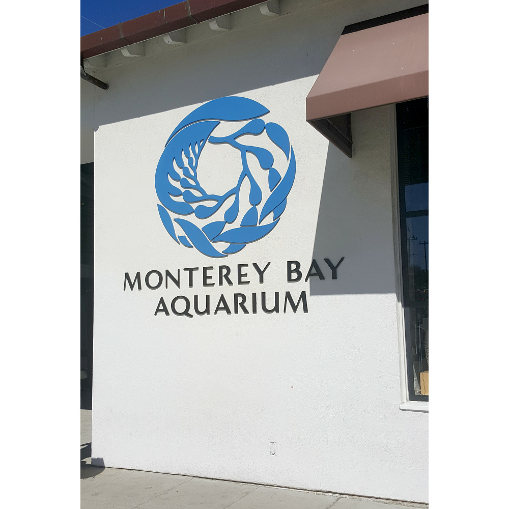

# 24.9.2016 - Golden Gate Bridge, Monterey Bay Aquarium, 17 Miles Drive, první koupání v Pacifiku

## 7:00

Vstávám jako první, abych svým pomalým probouzením ostatní při brzkém odjezdu nezdržoval.

## 7:30

Vstávájí i ostatní.

## 8:25

Jsme sbalení, odubytovaní a nasedáme do auta a jedeme se podívat na Golden Gate Bridge v San Franciscu.

Dnes řídí Boris.

## 8:40

Mostem Richmond-San Rafael Bridge přejíždíme záliv San Francisco Bay.

## 9:05

Parkujeme u Golden Gate Bridge na placeném parkovišti.

Člověk, který parkoval vedle nás, právě odjíždí a laskavě nám přenechává svůj parkovací lístek, abychom nemuseli zbytečně platit $10 za parkování.

## 9:10

Už koukáme na Golden Gate Bridge.

## 9:55

Odjíždíme dále na naší cestě, projíždíme San Francisco a míříme do obřího akvária [Monterey Bay Aquarium](https://en.wikipedia.org/wiki/Monterey_Bay_Aquarium).

## 10:40

Cestou stavíme u benzínky Shell a doplňujeme autu benzín a nám kafe.

## 13:15

Jsme v Monterey, parkujeme a hledáme restauraci, kde bychom si dali oběd.

## 13:30

Zasedáme ke stolu v hospůdce Sly McFly's.

## 14:30

Najedení vstupujeme do akvária.

## 17:00

Z reproduktorů napříč budovami akvária zaznívá hlášení, že akvárium právě zavírá, a prosí nás i ostatní zbývající návštěvníky, abychom šli pryč.

Cestou k autu se ještě stavujeme v místním obchodě a kupujeme jídlo na večer.

Konečně nasedáme do auta a vyrážíme směrem do města Santa Maria, kde máme pro dnešek zamluvené ubytování.

Cestu jsme plánujeme tak, aby vedla scénickou 17 mil dlouhou trasou [17 Miles Drive](https://en.wikipedia.org/wiki/17-Mile_Drive), na které je toho hodně k vidění.

## 18:10

Vjíždíme na začátek trasy 17 Miles Drive.

## 18:20

Zastavujeme u pláže s přístupem k vodám Pacifiku, kam nakonec všichni s výjimkou Renči skáčeme vstříc vlnám a přílivu a poprvé se tak koupeme v oceánu.

## 18:45

Jedeme dál a Renča nám z mapy předčítá podrobnosti o jednotlivých zájmových bodech na trase.

## 19:00

Zastavujeme u vyhlídky na Pacifik s lavičkami, kde si při západu slunce sedáme k večeři. Sice z konzervy, ale moc dobrou a chutnou :)

## 19:30

Opouštíme 17 Miles Drive a míříme k našemu dnešnímu hotelu ve městě Santa Maria.

## 19:40

Cestou tankujeme benzín u benzínky 76.

## 22:40

Jsme na hotelu a těšíme se na postel.

## 0:00

Jdeme spát.
