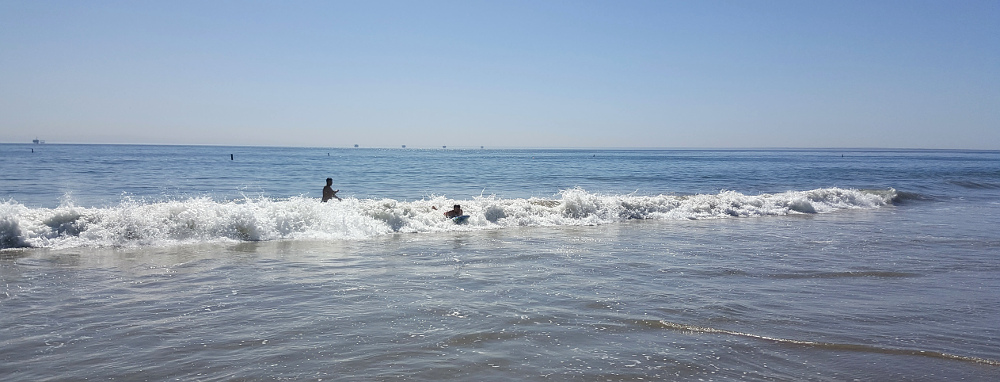
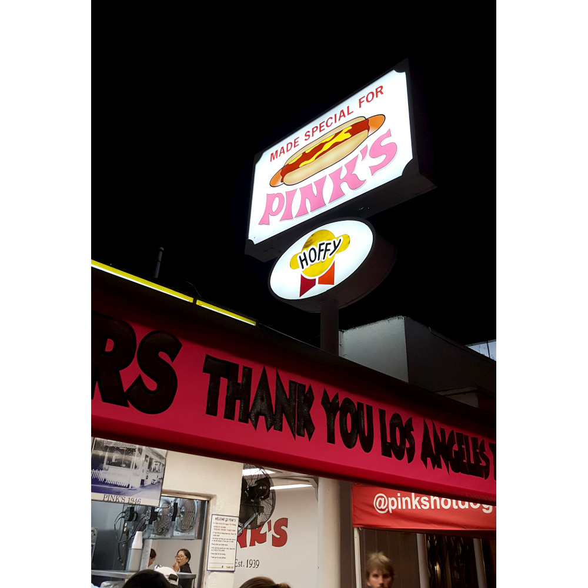
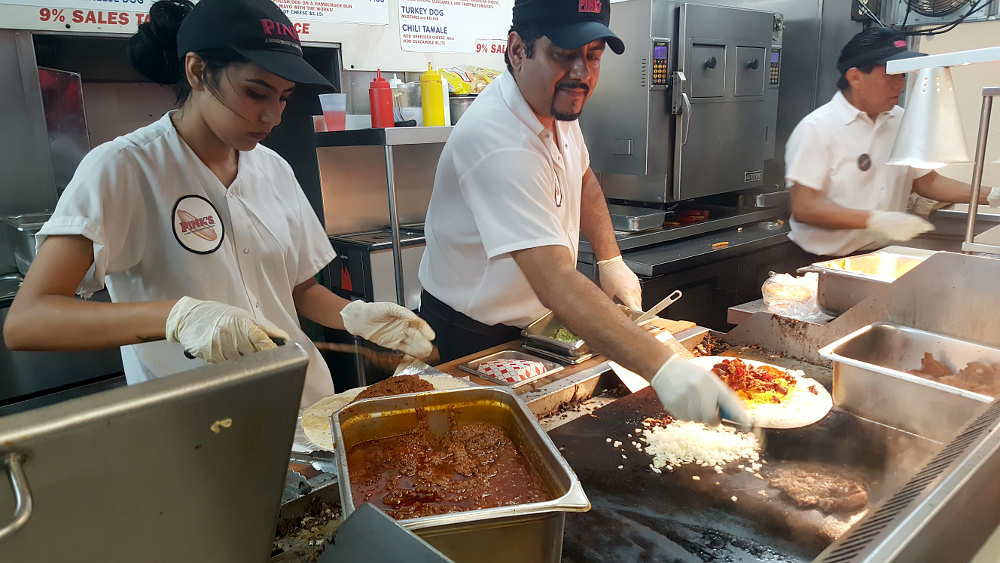
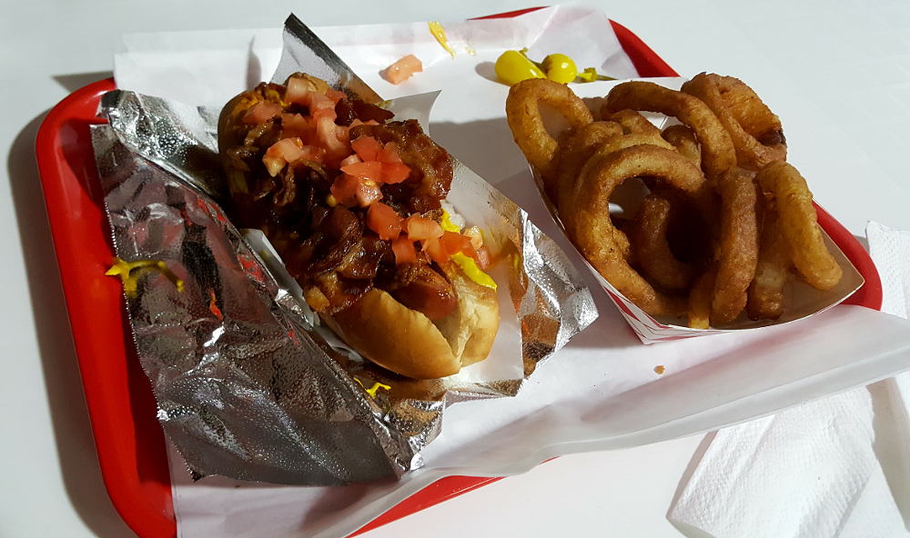
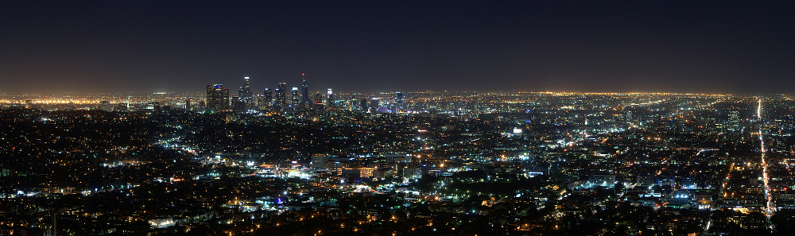

# 25.9.2016 - Pláž u Santa Barbary, příjezd do Los Angeles, Pink's Hot Dog, noční Los Angeles

## 10:30

Vstáváme a Renča rozhořčeně prohlašuje: "Jaktože už je zase půl jedenáctý!?" :).

## 11:00

Odcházíme z pokoje a ještě na parkovišti hotelu, kde máme dosah k připojení k internetu, hledáme ubytování v Los Angeles na naše poslední dvě noci, než poletíme zpět do České Republiky.

## 11:35

Hotovo, na Bookingu jsme našli motel El Rancho za přijatelnou cenu a kvalitu, a tak vyrážíme na pláž poblíž Santa Barbary, která leží na naší cestě do Los Angeles.

## 13:20

Cestou zastavujeme u benzínky Seven Eleven, bereme benzín, kupujeme kafe a hot dogy, které jsme se rozhodli sníst na nedaleké pláži.

## 13:35

Parkujeme nedaleko od pláže Carpinteria State Beach, kterou jsme cestou zahlédli a rozhodli se navštívit a znovu se vykoupat.

Převlékáme se do plavek a hurá ná pláž!

Čermis si od jednoho z místních půjčuje surfovací desku (nikoliv však prkno :)) a nechává se od něj instruovat, jak se nechat unášet vlnami. Úplně mu září oči a má čistou radost z toho, jak skáče do vln na surfovací desce a zkouší vlny jednu za druhou a snaží se surfovat co nejdál :)

## 15:55

Jsme zpět u auta, oklepáváme jemný písek, opatrně oplachujeme citlivá místa od slané mořské vody a vyrážíme do Los Angeles.

## 16:10

Z auta vidíme hejno asi 6 delfínů, kteří plavou nedaleko pobřeží :).

## 17:35

Po několika desítkách minut na sedmiproudové dálnici konečně sjíždíme do ulic Los Angeles.

## 18:00

Přijíždíme k motelu El Rancho, ubytováváme se a konečně se osvěžujeme ve sprše a smýváme tak poslední zbytky mořské vody.

## 19:15

S Borisem a Čermisem jsme se rozhodli vyrazit na večerní prohlídku města a cestou se najíst u [Pink's Hot Dog](http://www.pinkshollywood.com/), údajně nejlepším hot dogem v Americe.

Renča raději už zůstává na pokoji, aby si odpočinula a nabrala síly na zítřejší výlet do města.

## 19:45

Parkujeme u Pink's a stavíme se do fronty na hot dog.

## 21:10

Jedeme ke hvězdárně a planetáriu [Griffith Observatory](https://en.wikipedia.org/wiki/Griffith_Observatory), odkud má být nádherný výhled na Los Angeles z ptačí perspektivy.

## 21:40

Jsme na vyhlídce a připouštím: legendy nelhaly, je odtud opravdu krásný výhled na Los Angeles, až se mi tají dech.

## 22:00

Hvězdárna zavírá a jsme nuceni ji opustit a jet pryč, tak se vydáváme zpět k autu.

## 22:40

Jsme zpět na hotelu.

## 1:00

Jdeme spát.
