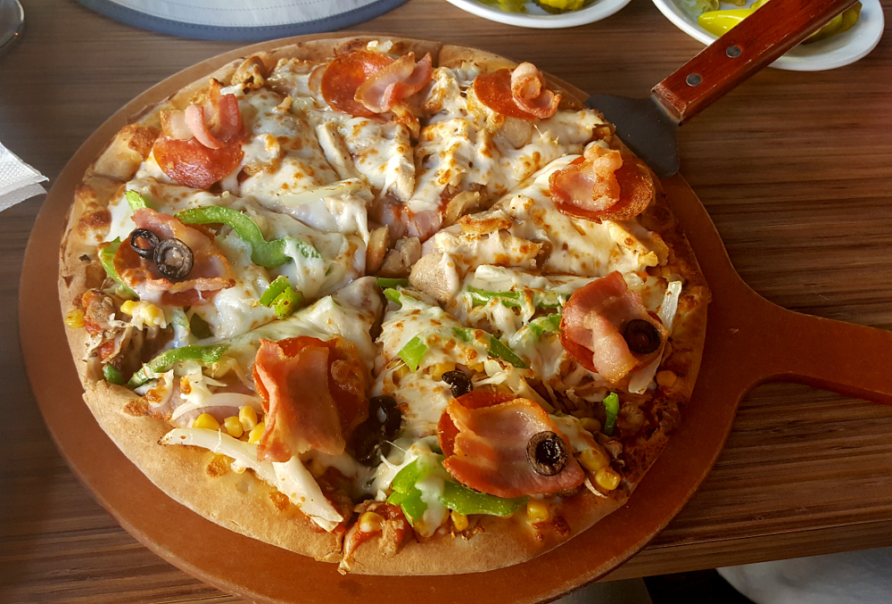

# 26.9.2016 - Los Angeles, City Hall, Little Tokyo, Hollywood, Beverly Hills, konečně steak

## 10:00

Vstáváme.

## 11:30

Jedeme do centra Los Angeles, Downtown na prohlídku centra města. Počasí slibuje horký suchý slunečný den. Pro dnešek mám řízení auta na starosti já.

## 12:00

Parkujeme auto přímo v centru Downtownu a jdeme si prohlédnout nedalekou radnici města, City Hall.

## 13:00

Na vstupu procházíme bezpečnostní kontrolou a systémem výtahů stoupáme vzhůru do 26. patra, kde je ochoz s vyhlídkou na město do všech čtyř stran.

## 13:10

Po schodech jdeme do 27. patra, kde je výhled na Downtown spolu s budovou magazínu Los Angeles Times.

V dáli je Hollywood a většinu města Los Angeles zalitá sluncem pod modrou oblohou. Teplota dosahuje 40 °C a nastává tak vůbec nejteplejší den naší výpravy.
 
 

## 13:50

Jsem zase na ulici a pomalu se blížíme do japonské čtvrti Little Tokyo.

Cestou potkáváme budovu losangeleské policie LAPD.

## 14:00

Jsme v japonské čtvrti, kde objevujeme cukrárnu Cafe Dulce, kde mají neodolatelné donuty, tak si dáváme sladkou svačinku.

## 14:15

Dostáváme hlad a jelikož Čermisovi s Renčou ještě z jejich plánu zvývá ochutnat pizzu, na internetu nacházím nedalekou pizzerii Mr. Pizza, kde si dáváme pizzu k obědu.

## 15:15

Najedení opouštíme pizzerii a jdeme k autu a míříme k chodníku slávy v Hollywoodu.

## 15:40

Cestou se zastavujeme u Renčiny povinné a vysněné zastávky - vily, kde se točil její oblíbený seriál z dětství, Čarodějky (Charmed).

## 16:15

Už jsme na Hollywood Boulevard, parkujeme auto a rozcházíme se na individuální prohlídku hvězd na chodníku.

Mimo jiné nacházím Arnolda Schwarzeneggera nebo Leonadra Nimoye :)

## 18:15

Scházíme se všichni u auta, vyměňujeme si zážitky a jedeme se podívat do uliček Beverly Hills.

## 19:00

Po prohlídce Beverly Hills hledáme poslední cíl dnešního dne a vlastně i celé výpravy - steak.

## 19:20

Nejprve zkoušíme JR's Barbeque, ale to se ukazuje jako nehodné našeho zájmu.

## 19:55

Nalézáme mnohem přitažlivější alternativu, Woodranch BBQ & Grill.

To se nejprve tváří podezřele prázdné, což nikdy nevěstí dobrou restauraci, ale pak se dozvídáme, že právě v tuto chvíli probíhá první duel Donalda Trumpa a Hillary Clinton v televizní debatě v rámci voleb nového amerického prezidenta, a tudíž máme velkou kliku, že je tu pro nás místo. Spokojení si objednáváme, někteří steak a někteří žebra.

## 21:45

Najedení a velmi spokojení odcházíme s tím, že jsme si pochutnali, a výrážíme autem zpět na hotel balit a vyspat se na zítřejší cestu domů.

## 22:30

Jsme na hotelu a balíme kufry.

## 0:30

Jdeme spát.
