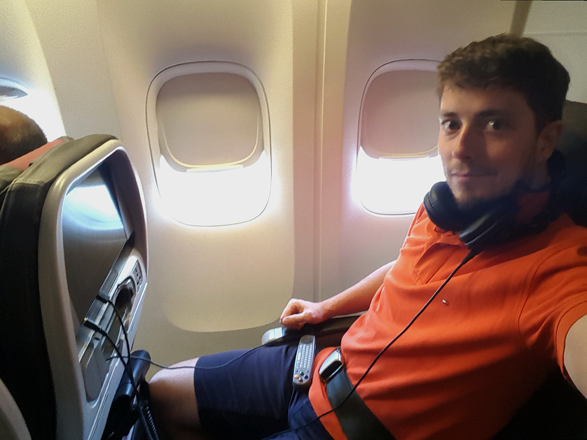

# 27.9.2016 - Vracení stanu, vracení auta, odlet domů

## 10:30

Vstáváme a připravujeme se na cestu domů. Většinu věcí, které by mohly zvednout celkovou hmotnost mého kufru a jsou nahraditelné, nechávám buď Borisovi nebo koši na pokoji. Loučím se tak se sprchovým gelem, pastou na zuby a podobně.
 
Stan, který jsme koupili s Borisem napůl přenechávám jemu, protože zůstává v USA další týden, a mohl by ho potřebovat.

## 11:00

Sbalení opouštíme pokoj a pouštíme se autem na cestu k nejbližšího Walmartu při cestě na letiště, aby tam Renča s Čermisem mohli vrátit stan a dostat za něj zpět peníze.

## 11:40

Přijíždíme do Walmartu v Torrance, Renča s Čermisem jdou dovnitř na zákaznické oddělení, zatímco já hledám poštovní schránku, kam bychom mohli hodit poslední pohledy. Od ochotné ostrahy Walmartu zjišťuji, že tu není :). Ale jedna je za rohem na poštovním úřadu. Renča a Čermis se úspěšně vracejí a můžeme tak pokračovat v cestě.

## 12:00

V nedaleké benzínce Shell se pokouším zastavit u stojanu a naposledy natankovat, ale je tu hodně aut a kroužení sem a tam nikam nevede - místo u stojanu se mi obsadit nedaří. Jedeme tedy dále.

## 12:15

Jsme u benzínky ARCO o pár mil dále, kde už nic nenechávám náhodě a stavím se do frony u jednoho stojanu, kterou se rychle dostáváme k tankování plné nádrže.

## 12:30

Cestou k letišti si děláme poslední zastávku u poštovního úřadu v Torrance, kde posíláme poslední pohledy domů.

## 13:00

Přijíždíme k půjčovně aut Thrifty Car Rental na mezinárodním letišti Los Angeles, kde naposledy důkladně úklízíme auto a definitivně se s ním loučíme. Tachometr ukazuje, že jsme na naší cestě najeli bezmála 4000 mil.

Vracíme auto a nastupujeme na letištní kyvadlový autobus, který nás veze na terminál č. 4.

## 13:50

Jsme konečně na letišti.

## 14:20

V automatu u odbavení si sami vyřizujeme letenky (odlet do Londýna by měl být v 18:00) a palubní lístky a odevzdáváme kufry do služeb British Airways. Bohužel se ukazuje, že i přes veškeré mé snahy redukovat jeho obsah na minimum můj kufr má 2 kg nadváhu, takže mi nezbývá nic jiného, než si za extra váhu připlatit. British Airways mi účtují $84 jako za samostatné další zavazadlo do 23 kg. To mě ty magnetky přišly na pěkně draho :)

## 17:45

Už sedím pohodlně na svém místě v letadle a moc se těším, až přistanu v Praze a konečně se zase uvidím se svou milovanou Kseni :)

## 18:25

S ledadlem se odlepujeme od amerického kontinentu a vydáváme se na svou cestu zpět do Evropy.
